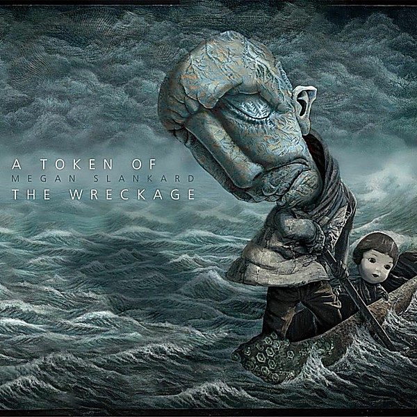

# A Token of the Wreckage

By **Megan Slankard**

## Album Data

- **Catalog:** Beets
- **Format:** Digital, Album
- **Album:** A Token of the Wreckage
- **Artist:** Megan Slankard
- **Albumartist:** Megan Slankard
- **Genre:** Unknown
- **MusicBrainz Album Artist ID:** 
- **MusicBrainz Album ID:** 
- **MusicBrainz Release Group ID:** 
- **Year:** 2011
- **Catalog #:** 
- **Label:** 
- **Total Tracks:** 00

## Album Tracks

### Track 01 - Bones Live Forever

- **Artist:** Megan Slankard
- **Format:** MP3
- **Genre:** Unknown
- **Length:** 3:09
- **MusicBrainz Track ID:** 
- **Title:** Bones Live Forever
- **Track:** 01
- **Year:** 2015

## See also

- [Running on Machinery](Running_on_Machinery.md)
