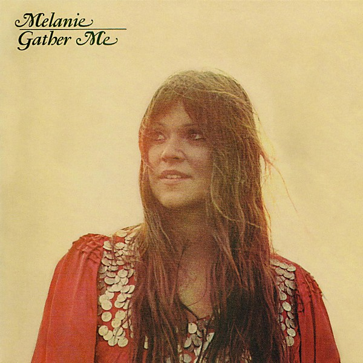

# Gather Me

By **Melanie**

## Album Data

- **Catalog:** Beets
- **Format:** Digital, Album
- **Album:** Gather Me
- **Artist:** Melanie
- **Albumartist:** Melanie
- **Genre:** Pop
- **MusicBrainz Album Artist ID:** 
- **MusicBrainz Album ID:** 
- **MusicBrainz Release Group ID:** 
- **Year:** 1971
- **Catalog #:** 
- **Label:** 
- **Total Tracks:** 00

## Album Tracks

### Track 00 - Brand New Key

- **Artist:** Melanie
- **Format:** AAC
- **Genre:** Pop
- **Length:** 2:24
- **MusicBrainz Track ID:** 
- **Title:** Brand New Key
- **Track:** 00
- **Year:** 1971

## See also

- [Roon: Gather Me](../../Roon/Melanie/Gather_Me.md)
- [Roon: Melanie](../../Roon/Melanie/Melanie.md)
- [Roon: Photograph](../../Roon/Melanie/Photograph-_Double_Exposure.md)
- [Roon: Stoneground Words](../../Roon/Melanie/Stoneground_Words.md)
- [Roon: What Have They Done to My Song](../../Roon/Melanie/What_Have_They_Done_to_My_Song.md)
