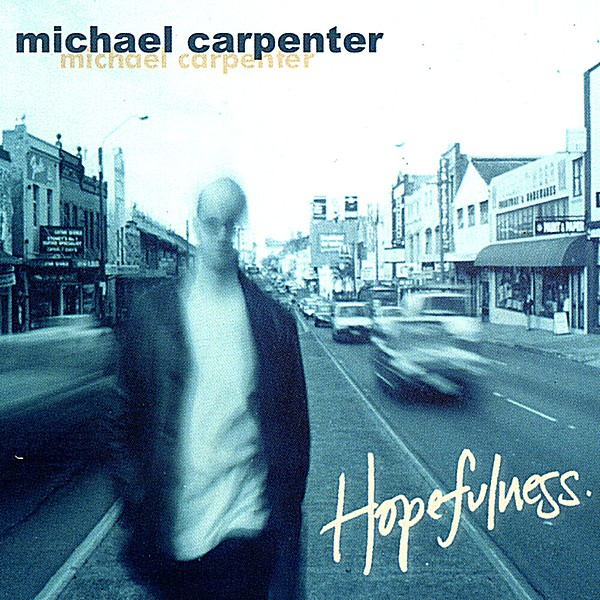

# Hopefulness

By **Michael Carpenter**

## Album Data

- **Catalog:** Beets
- **Format:** Digital, Album
- **Album:** Hopefulness
- **Artist:** Michael Carpenter
- **Albumartist:** Michael Carpenter
- **Genre:** Power Pop
- **MusicBrainz Album Artist ID:** 
- **MusicBrainz Album ID:** 
- **MusicBrainz Release Group ID:** 
- **Year:** 2001
- **Catalog #:** 
- **Label:** Not Lame Recordings
- **Total Tracks:** 12

## Album Tracks

### Track 01 - Kailee Anne

- **Artist:** Michael Carpenter
- **Format:** MP3
- **Genre:** Power Pop
- **Length:** 2:53
- **MusicBrainz Track ID:** 
- **Title:** Kailee Anne
- **Track:** 01
- **Year:** 2001

### Track 02 - Hopefulness

- **Artist:** Michael Carpenter
- **Format:** MP3
- **Genre:** Power Pop
- **Length:** 2:58
- **MusicBrainz Track ID:** 
- **Title:** Hopefulness
- **Track:** 02
- **Year:** 2001

### Track 03 - Believes Again

- **Artist:** Michael Carpenter
- **Format:** MP3
- **Genre:** Power Pop
- **Length:** 3:41
- **MusicBrainz Track ID:** 
- **Title:** Believes Again
- **Track:** 03
- **Year:** 2001

### Track 04 - Is This Love I'm Feeling?

- **Artist:** Michael Carpenter
- **Format:** MP3
- **Genre:** Power Pop
- **Length:** 4:10
- **MusicBrainz Track ID:** 
- **Title:** Is This Love I'm Feeling?
- **Track:** 04
- **Year:** 2001

### Track 05 - Love SP Strong

- **Artist:** Michael Carpenter
- **Format:** MP3
- **Genre:** Power Pop
- **Length:** 3:23
- **MusicBrainz Track ID:** 
- **Title:** Love SP Strong
- **Track:** 05
- **Year:** 2001

### Track 06 - Since I Found You

- **Artist:** Michael Carpenter
- **Format:** MP3
- **Genre:** Power Pop
- **Length:** 4:57
- **MusicBrainz Track ID:** 
- **Title:** Since I Found You
- **Track:** 06
- **Year:** 2001

### Track 07 - Someday (Smile Again)

- **Artist:** Michael Carpenter
- **Format:** MP3
- **Genre:** Power Pop
- **Length:** 4:57
- **MusicBrainz Track ID:** 
- **Title:** Someday (Smile Again)
- **Track:** 07
- **Year:** 2001

### Track 08 - You Won't See

- **Artist:** Michael Carpenter
- **Format:** MP3
- **Genre:** Power Pop
- **Length:** 4:50
- **MusicBrainz Track ID:** 
- **Title:** You Won't See
- **Track:** 08
- **Year:** 2001

### Track 09 - Faith

- **Artist:** Michael Carpenter
- **Format:** MP3
- **Genre:** Power Pop
- **Length:** 3:30
- **MusicBrainz Track ID:** 
- **Title:** Faith
- **Track:** 09
- **Year:** 2001

### Track 10 - Never Be Alone

- **Artist:** Michael Carpenter
- **Format:** MP3
- **Genre:** Power Pop
- **Length:** 4:08
- **MusicBrainz Track ID:** 
- **Title:** Never Be Alone
- **Track:** 10
- **Year:** 2001

### Track 11 - You Need a Mess of Help to Stand Alone

- **Artist:** Michael Carpenter
- **Format:** MP3
- **Genre:** Power Pop
- **Length:** 5:37
- **MusicBrainz Track ID:** 
- **Title:** You Need a Mess of Help to Stand Alone
- **Track:** 11
- **Year:** 2001

### Track 12 - [Untitled Track]

- **Artist:** Michael Carpenter
- **Format:** MP3
- **Genre:** Power Pop
- **Length:** 3:10
- **MusicBrainz Track ID:** 
- **Title:** [Untitled Track]
- **Track:** 12
- **Year:** 2001

## See also

- [Baby](Baby.md)
