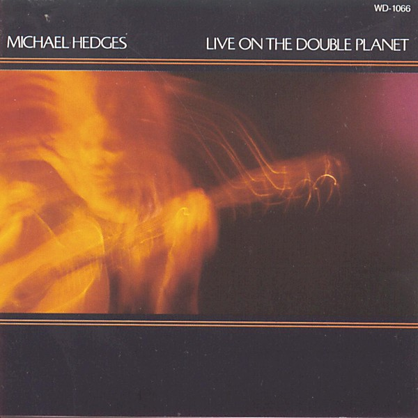

# Live at SUNY Binghamton, 5 May

By **Michael Hedges**

## Album Data

- **Catalog:** Beets
- **Format:** Digital, Album
- **Album:** Live at SUNY Binghamton, 5 May
- **Artist:** Michael Hedges
- **Albumartist:** Michael Hedges
- **Genre:** Contemporary Classical
- **MusicBrainz Album Artist ID:** 
- **MusicBrainz Album ID:** 
- **MusicBrainz Release Group ID:** 
- **Year:** 0000
- **Catalog #:** 
- **Label:** 
- **Total Tracks:** 00

## Album Tracks

### Track 04 - Silent Anticipations

- **Artist:** Michael Hedges
- **Format:** MP3
- **Genre:** Contemporary Classical
- **Length:** 3:09
- **MusicBrainz Track ID:** 
- **Title:** Silent Anticipations
- **Track:** 04
- **Year:** 0000

### Track 06 - Watching My Life Go By

- **Artist:** Michael Hedges
- **Format:** MP3
- **Genre:** Contemporary Classical
- **Length:** 5:04
- **MusicBrainz Track ID:** 
- **Title:** Watching My Life Go By
- **Track:** 06
- **Year:** 0000

### Track 09 - Streamlined Man

- **Artist:** Michael Hedges
- **Format:** MP3
- **Genre:** Contemporary Classical
- **Length:** 3:36
- **MusicBrainz Track ID:** 
- **Title:** Streamlined Man
- **Track:** 09
- **Year:** 0000

### Track 12 - The Funky Avacado

- **Artist:** Michael Hedges
- **Format:** MP3
- **Genre:** Jazz
- **Length:** 3:32
- **MusicBrainz Track ID:** 
- **Title:** The Funky Avacado
- **Track:** 12
- **Year:** 0000

### Track 15 - Because It's There

- **Artist:** Michael Hedges
- **Format:** MP3
- **Genre:** Rock
- **Length:** 4:56
- **MusicBrainz Track ID:** 
- **Title:** Because It's There
- **Track:** 15
- **Year:** 0000

## See also

- [Live 07/23/95 Enid, OK](Live_07-23-95_Enid__OK.md)
- [The Road to Return](The_Road_to_Return.md)
- [Roon: Aerial Boundaries](../../Roon/Michael_Hedges/Aerial_Boundaries.md)
- [Roon: Beyond Boundaries](../../Roon/Michael_Hedges/Beyond_Boundaries-_Guitar_Solos.md)
- [Roon: Breakfast In The Field](../../Roon/Michael_Hedges/Breakfast_In_The_Field.md)
- [Roon: Live On The Double Planet](../../Roon/Michael_Hedges/Live_On_The_Double_Planet.md)
- [Roon: Oracle](../../Roon/Michael_Hedges/Oracle.md)
- [Roon: Platinum & Gold Collection](../../Roon/Michael_Hedges/Platinum_and_Gold_Collection.md)
- [Roon: Pure Michael Hedges](../../Roon/Michael_Hedges/Pure_Michael_Hedges.md)
- [Roon: Taproot](../../Roon/Michael_Hedges/Taproot.md)
- [Roon: Torched](../../Roon/Michael_Hedges/Torched.md)
- [Roon: Watching My Life Go By](../../Roon/Michael_Hedges/Watching_My_Life_Go_By.md)
