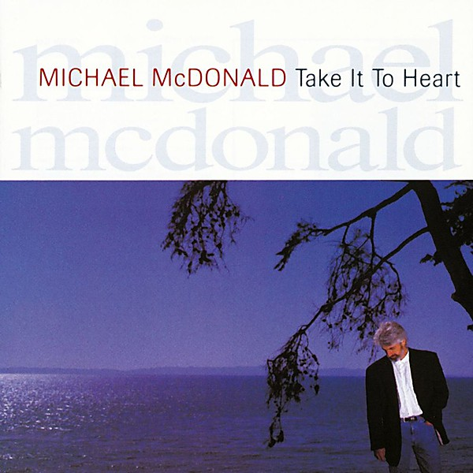

# Take It To Heart

By **Michael McDonald**

## Album Data

- **Catalog:** Beets
- **Format:** Digital, Album
- **Album:** Take It To Heart
- **Artist:** Michael Mcdonald
- **Albumartist:** Michael McDonald
- **Genre:** Blue-Eyed Soul
- **MusicBrainz Album Artist ID:** [cacbe57b-02d0-4d21-be86-c8a3a5ea6e1e](https://musicbrainz.org/artist/cacbe57b-02d0-4d21-be86-c8a3a5ea6e1e)
- **MusicBrainz Album ID:** [21529910-104d-448e-a94b-5b234772725a](https://musicbrainz.org/release/21529910-104d-448e-a94b-5b234772725a)
- **MusicBrainz Release Group ID:** [a8c6f4f5-e77b-4833-b492-11bdabd35f04](https://musicbrainz.org/release-group/a8c6f4f5-e77b-4833-b492-11bdabd35f04)
- **Year:** 1990
- **Catalog #:** 
- **Label:** Reprise
- **Total Tracks:** 11

## Album Tracks

### Track 01 - All We Got

- **Artist:** Michael McDonald
- **Format:** MP3
- **Genre:** Pop
- **Length:** 5:46
- **MusicBrainz Track ID:** [9b4e8480-2cd5-48ad-84b9-526cebc14840](https://musicbrainz.org/recording/9b4e8480-2cd5-48ad-84b9-526cebc14840)
- **Title:** All We Got
- **Track:** 01
- **Year:** 1990

### Track 02 - Get the Word Started

- **Artist:** Michael McDonald
- **Format:** MP3
- **Genre:** Blue-Eyed Soul
- **Length:** 5:41
- **MusicBrainz Track ID:** [2a0be8bc-b917-4ece-bcb5-f3f42fa16238](https://musicbrainz.org/recording/2a0be8bc-b917-4ece-bcb5-f3f42fa16238)
- **Title:** Get the Word Started
- **Track:** 02
- **Year:** 1990

### Track 03 - Love Can Break Your Heart

- **Artist:** Michael McDonald
- **Format:** MP3
- **Genre:** Blue-Eyed Soul
- **Length:** 4:55
- **MusicBrainz Track ID:** [4383358c-0ee1-4b22-a400-955ee4667862](https://musicbrainz.org/recording/4383358c-0ee1-4b22-a400-955ee4667862)
- **Title:** Love Can Break Your Heart
- **Track:** 03
- **Year:** 1990

### Track 04 - Take It to Heart

- **Artist:** Michael McDonald
- **Format:** MP3
- **Genre:** Blue-Eyed Soul
- **Length:** 5:57
- **MusicBrainz Track ID:** [bdd954a0-b764-45f1-bc8e-5507344c054e](https://musicbrainz.org/recording/bdd954a0-b764-45f1-bc8e-5507344c054e)
- **Title:** Take It to Heart
- **Track:** 04
- **Year:** 1990

### Track 05 - Tear It Up

- **Artist:** Michael McDonald
- **Format:** MP3
- **Genre:** Pop
- **Length:** 4:27
- **MusicBrainz Track ID:** [4d3ac617-ef3f-4ef9-ae13-ca73cf9ca728](https://musicbrainz.org/recording/4d3ac617-ef3f-4ef9-ae13-ca73cf9ca728)
- **Title:** Tear It Up
- **Track:** 05
- **Year:** 1990

### Track 06 - Lonely Talk

- **Artist:** Michael McDonald
- **Format:** MP3
- **Genre:** Blue-Eyed Soul
- **Length:** 4:41
- **MusicBrainz Track ID:** [12e2eac9-c4b1-45de-b020-ab86a0c1be00](https://musicbrainz.org/recording/12e2eac9-c4b1-45de-b020-ab86a0c1be00)
- **Title:** Lonely Talk
- **Track:** 06
- **Year:** 1990

### Track 07 - Searchin' for Understanding

- **Artist:** Michael McDonald
- **Format:** MP3
- **Genre:** Blue-Eyed Soul
- **Length:** 3:44
- **MusicBrainz Track ID:** [7323f234-bc2e-4d44-8aad-145a26cb566d](https://musicbrainz.org/recording/7323f234-bc2e-4d44-8aad-145a26cb566d)
- **Title:** Searchin' for Understanding
- **Track:** 07
- **Year:** 1990

### Track 08 - Homeboy

- **Artist:** Michael McDonald
- **Format:** MP3
- **Genre:** Blue-Eyed Soul
- **Length:** 4:37
- **MusicBrainz Track ID:** [cd33faaa-1ae0-43ae-a0ce-175a5efc3986](https://musicbrainz.org/recording/cd33faaa-1ae0-43ae-a0ce-175a5efc3986)
- **Title:** Homeboy
- **Track:** 08
- **Year:** 1990

### Track 09 - No Amount of Reason

- **Artist:** Michael McDonald
- **Format:** MP3
- **Genre:** Blue-Eyed Soul
- **Length:** 4:39
- **MusicBrainz Track ID:** [e18a75fb-a3d1-420d-a744-b2d252760ec7](https://musicbrainz.org/recording/e18a75fb-a3d1-420d-a744-b2d252760ec7)
- **Title:** No Amount of Reason
- **Track:** 09
- **Year:** 1990

### Track 10 - One Step Away

- **Artist:** Michael McDonald
- **Format:** MP3
- **Genre:** Blue-Eyed Soul
- **Length:** 4:14
- **MusicBrainz Track ID:** [513d00af-ebfe-4d9d-81e9-2371d3d587c5](https://musicbrainz.org/recording/513d00af-ebfe-4d9d-81e9-2371d3d587c5)
- **Title:** One Step Away
- **Track:** 10
- **Year:** 1990

### Track 11 - You Show Me

- **Artist:** Michael McDonald
- **Format:** MP3
- **Genre:** Blue-Eyed Soul
- **Length:** 5:02
- **MusicBrainz Track ID:** [bb469a9d-5998-448c-8815-4197b1bd5dec](https://musicbrainz.org/recording/bb469a9d-5998-448c-8815-4197b1bd5dec)
- **Title:** You Show Me
- **Track:** 11
- **Year:** 1990

