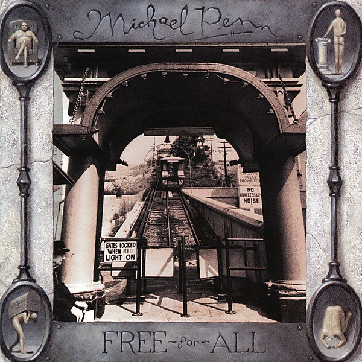

# Free-for-All

By **Michael Penn**

## Album Data

- **Catalog:** Beets
- **Format:** Digital, Album
- **Album:** Free-for-All
- **Artist:** Michael Penn
- **Albumartist:** Michael Penn
- **Genre:** Rock
- **MusicBrainz Album Artist ID:** 
- **MusicBrainz Album ID:** 
- **MusicBrainz Release Group ID:** 
- **Year:** 1992
- **Catalog #:** 9692-2-R
- **Label:** BMG
- **Total Tracks:** 11

## Album Tracks

### Track 01 - No Myth

- **Artist:** Michael Penn
- **Format:** AAC
- **Genre:** Pop Rock
- **Length:** 4:10
- **MusicBrainz Track ID:** [75fc8af1-dad1-4ccb-9041-8cf1b9a08a54](https://musicbrainz.org/recording/75fc8af1-dad1-4ccb-9041-8cf1b9a08a54)
- **Title:** No Myth
- **Track:** 01
- **Year:** 1989

### Track 02 - Half Harvest

- **Artist:** Michael Penn
- **Format:** AAC
- **Genre:** Mathcore
- **Length:** 4:05
- **MusicBrainz Track ID:** [1311126c-a1aa-4d75-aaf1-c56a8a574e48](https://musicbrainz.org/recording/1311126c-a1aa-4d75-aaf1-c56a8a574e48)
- **Title:** Half Harvest
- **Track:** 02
- **Year:** 1989

### Track 03 - This & That

- **Artist:** Michael Penn
- **Format:** AAC
- **Genre:** Pop Rock
- **Length:** 3:31
- **MusicBrainz Track ID:** [385caef7-7dfc-4c8d-9314-869c0c913ec4](https://musicbrainz.org/recording/385caef7-7dfc-4c8d-9314-869c0c913ec4)
- **Title:** This & That
- **Track:** 03
- **Year:** 1989

### Track 04 - Brave New World

- **Artist:** Michael Penn
- **Format:** AAC
- **Genre:** Rock
- **Length:** 4:32
- **MusicBrainz Track ID:** [ba3e265d-a5fd-423f-8df6-a7664bacbfab](https://musicbrainz.org/recording/ba3e265d-a5fd-423f-8df6-a7664bacbfab)
- **Title:** Brave New World
- **Track:** 04
- **Year:** 1989

### Track 05 - Innocent One

- **Artist:** Michael Penn
- **Format:** AAC
- **Genre:** Alternative Rock
- **Length:** 3:16
- **MusicBrainz Track ID:** [850446e6-c04a-46e4-8d98-be17163f6970](https://musicbrainz.org/recording/850446e6-c04a-46e4-8d98-be17163f6970)
- **Title:** Innocent One
- **Track:** 05
- **Year:** 1989

### Track 06 - Disney's a Snow Cone / Bedlam Boys

- **Artist:** Michael Penn
- **Format:** AAC
- **Genre:** Folk Rock
- **Length:** 5:11
- **MusicBrainz Track ID:** [faf49629-3bc1-4cdf-8e31-26d64bef590d](https://musicbrainz.org/recording/faf49629-3bc1-4cdf-8e31-26d64bef590d)
- **Title:** Disney's a Snow Cone / Bedlam Boys
- **Track:** 06
- **Year:** 1989

### Track 07 - Invisible

- **Artist:** Michael Penn
- **Format:** AAC
- **Genre:** Rock
- **Length:** 3:45
- **MusicBrainz Track ID:** [de1dc801-2eb7-4fdb-a0a1-5a447f626835](https://musicbrainz.org/recording/de1dc801-2eb7-4fdb-a0a1-5a447f626835)
- **Title:** Invisible
- **Track:** 07
- **Year:** 1989

### Track 08 - Cupid's Got a Brand New Gun

- **Artist:** Michael Penn
- **Format:** AAC
- **Genre:** Rock
- **Length:** 3:27
- **MusicBrainz Track ID:** [8fd25ae8-9afe-47b1-ab77-369ae61fc589](https://musicbrainz.org/recording/8fd25ae8-9afe-47b1-ab77-369ae61fc589)
- **Title:** Cupid's Got a Brand New Gun
- **Track:** 08
- **Year:** 1989

### Track 09 - Big House

- **Artist:** Michael Penn
- **Format:** AAC
- **Genre:** Rock
- **Length:** 2:56
- **MusicBrainz Track ID:** [c10f1c8f-e043-4e99-962a-c03d1b2a9e94](https://musicbrainz.org/recording/c10f1c8f-e043-4e99-962a-c03d1b2a9e94)
- **Title:** Big House
- **Track:** 09
- **Year:** 1989

### Track 10 - Battle Room

- **Artist:** Michael Penn
- **Format:** AAC
- **Genre:** Rock
- **Length:** 3:37
- **MusicBrainz Track ID:** [94f7a23a-88d3-4bd6-8069-6762ebd46164](https://musicbrainz.org/recording/94f7a23a-88d3-4bd6-8069-6762ebd46164)
- **Title:** Battle Room
- **Track:** 10
- **Year:** 1989

### Track 11 - Evenfall

- **Artist:** Michael Penn
- **Format:** AAC
- **Genre:** Rock
- **Length:** 3:54
- **MusicBrainz Track ID:** [6a7afd69-b51f-457a-be9c-63b5a24cd15a](https://musicbrainz.org/recording/6a7afd69-b51f-457a-be9c-63b5a24cd15a)
- **Title:** Evenfall
- **Track:** 11
- **Year:** 1989

## See also

- [March](March.md)
- [MP4 (Days Since a Lost Time Accident)](MP4_Days_Since_a_Lost_Time_Accident.md)
- [Resigned](Resigned.md)
