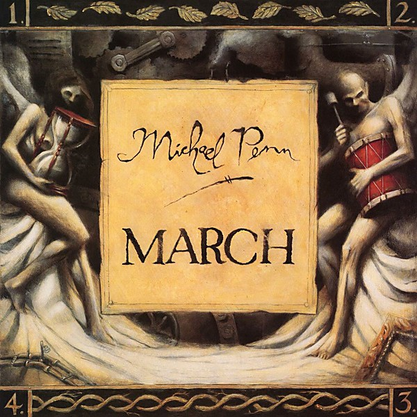

# March

By **Michael Penn**

## Album Data

- **Catalog:** Beets
- **Format:** Digital, Album
- **Album:** March
- **Artist:** Michael Penn
- **Albumartist:** Michael Penn
- **Genre:** Folk Rock
- **MusicBrainz Album Artist ID:** [cfc33e02-9a17-4285-9cb8-b814a9430551](https://musicbrainz.org/artist/cfc33e02-9a17-4285-9cb8-b814a9430551)
- **MusicBrainz Album ID:** [48d044fa-c2fb-49ac-8c3a-755e57c74716](https://musicbrainz.org/release/48d044fa-c2fb-49ac-8c3a-755e57c74716)
- **MusicBrainz Release Group ID:** [39082fb9-42a3-37e1-9bab-d5430a73426a](https://musicbrainz.org/release-group/39082fb9-42a3-37e1-9bab-d5430a73426a)
- **Year:** 1989
- **Catalog #:** EK 69354
- **Label:** Epic
- **Total Tracks:** 10

## Album Tracks

### Track 01 - Lucky One

- **Artist:** Michael Penn
- **Format:** AAC
- **Genre:** Rock
- **Length:** 3:58
- **MusicBrainz Track ID:** [230a3085-490d-4e43-bfc1-978b273d61cd](https://musicbrainz.org/recording/230a3085-490d-4e43-bfc1-978b273d61cd)
- **Title:** Lucky One
- **Track:** 01
- **Year:** 2000

### Track 02 - Whole Truth

- **Artist:** Michael Penn
- **Format:** AAC
- **Genre:** Rock
- **Length:** 4:10
- **MusicBrainz Track ID:** [f13b5081-4491-44d8-bc67-5ea4a602ec3d](https://musicbrainz.org/recording/f13b5081-4491-44d8-bc67-5ea4a602ec3d)
- **Title:** Whole Truth
- **Track:** 02
- **Year:** 2000

### Track 03 - High Time

- **Artist:** Michael Penn
- **Format:** AAC
- **Genre:** Rock
- **Length:** 4:22
- **MusicBrainz Track ID:** [763f2073-7c3a-4ad7-89ed-559cb905fd95](https://musicbrainz.org/recording/763f2073-7c3a-4ad7-89ed-559cb905fd95)
- **Title:** High Time
- **Track:** 03
- **Year:** 2000

### Track 04 - Beautiful

- **Artist:** Michael Penn
- **Format:** AAC
- **Genre:** Indie Pop
- **Length:** 3:50
- **MusicBrainz Track ID:** [1bd0a8a6-517c-4076-8e75-de6d728a39c4](https://musicbrainz.org/recording/1bd0a8a6-517c-4076-8e75-de6d728a39c4)
- **Title:** Beautiful
- **Track:** 04
- **Year:** 2000

### Track 05 - Footdown

- **Artist:** Michael Penn
- **Format:** AAC
- **Genre:** Rock
- **Length:** 3:37
- **MusicBrainz Track ID:** [c30cd60a-a37f-4d8d-911e-f2509f7dc8ef](https://musicbrainz.org/recording/c30cd60a-a37f-4d8d-911e-f2509f7dc8ef)
- **Title:** Footdown
- **Track:** 05
- **Year:** 2000

### Track 07 - Don't Let Me Go

- **Artist:** Michael Penn
- **Format:** AAC
- **Genre:** Rock
- **Length:** 4:41
- **MusicBrainz Track ID:** [00b4c95d-fa92-4be6-9d2c-f6fcc7453bfd](https://musicbrainz.org/recording/00b4c95d-fa92-4be6-9d2c-f6fcc7453bfd)
- **Title:** Don't Let Me Go
- **Track:** 07
- **Year:** 2000

### Track 08 - Out of Its Misery

- **Artist:** Michael Penn
- **Format:** AAC
- **Genre:** Rock
- **Length:** 3:45
- **MusicBrainz Track ID:** [092a2454-003e-4702-b148-68a5a2bf2b40](https://musicbrainz.org/recording/092a2454-003e-4702-b148-68a5a2bf2b40)
- **Title:** Out of Its Misery
- **Track:** 08
- **Year:** 2000

### Track 09 - Trampoline

- **Artist:** Michael Penn
- **Format:** AAC
- **Genre:** Rock
- **Length:** 3:46
- **MusicBrainz Track ID:** [8e160a94-12da-47eb-9bc8-ccd60132faa4](https://musicbrainz.org/recording/8e160a94-12da-47eb-9bc8-ccd60132faa4)
- **Title:** Trampoline
- **Track:** 09
- **Year:** 2000

### Track 10 - Bucket Brigade

- **Artist:** Michael Penn
- **Format:** AAC
- **Genre:** Rock
- **Length:** 3:34
- **MusicBrainz Track ID:** [1e02a9f3-96c0-482a-92ac-db15d4615ddc](https://musicbrainz.org/recording/1e02a9f3-96c0-482a-92ac-db15d4615ddc)
- **Title:** Bucket Brigade
- **Track:** 10
- **Year:** 2000

### Track 06 - Perfect Candidate

- **Artist:** Michael Penn feat. Aimee Mann
- **Format:** AAC
- **Genre:** Indie Pop
- **Length:** 3:47
- **MusicBrainz Track ID:** [f2aa08e7-7716-4f99-b307-0063a00451ac](https://musicbrainz.org/recording/f2aa08e7-7716-4f99-b307-0063a00451ac)
- **Title:** Perfect Candidate
- **Track:** 06
- **Year:** 2000

## See also

- [Free-for-All](Free-for-All.md)
- [MP4 (Days Since a Lost Time Accident)](MP4_Days_Since_a_Lost_Time_Accident.md)
- [Resigned](Resigned.md)
