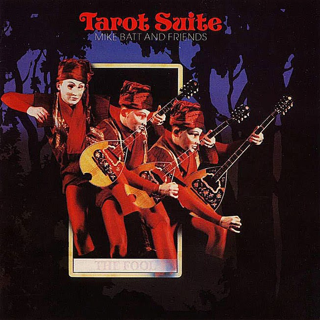

# Tarot Suite

By **Mike Batt and Friends**

## Album Data

- **Catalog:** Beets
- **Format:** Digital, Album
- **Album:** Tarot Suite
- **Artist:** Mike Batt And Friends
- **Albumartist:** Mike Batt and Friends
- **Genre:** Progressive Rock
- **MusicBrainz Album Artist ID:** [aee192be-14ee-45cf-9222-78dc21374443](https://musicbrainz.org/artist/aee192be-14ee-45cf-9222-78dc21374443)
- **MusicBrainz Album ID:** [a4d497c9-7e2a-4e1e-bd5d-d7ff13f3226e](https://musicbrainz.org/release/a4d497c9-7e2a-4e1e-bd5d-d7ff13f3226e)
- **MusicBrainz Release Group ID:** [c9f1b8e9-d454-3c59-8b2c-dd60f9c385ce](https://musicbrainz.org/release-group/c9f1b8e9-d454-3c59-8b2c-dd60f9c385ce)
- **Year:** 1979
- **Catalog #:** EPC 86099
- **Label:** Epic
- **Total Tracks:** 10

## Album Tracks

### Track 01 - Introduction (The Journey of a Fool)

- **Artist:** Mike Batt and Friends
- **Format:** ALAC
- **Genre:** Progressive Rock
- **Length:** 4:31
- **MusicBrainz Track ID:** [a953b3b3-7096-46c2-bfb4-e5ec35249c8c](https://musicbrainz.org/recording/a953b3b3-7096-46c2-bfb4-e5ec35249c8c)
- **Title:** Introduction (The Journey of a Fool)
- **Track:** 01
- **Year:** 1979

### Track 02 - Imbecile

- **Artist:** Mike Batt and Friends
- **Format:** ALAC
- **Genre:** Progressive Rock
- **Length:** 5:10
- **MusicBrainz Track ID:** [1d649f35-1489-4b00-8f81-8d6c17aeafe8](https://musicbrainz.org/recording/1d649f35-1489-4b00-8f81-8d6c17aeafe8)
- **Title:** Imbecile
- **Track:** 02
- **Year:** 1979

### Track 03 - Plainsong

- **Artist:** Mike Batt and Friends
- **Format:** ALAC
- **Genre:** Progressive Rock
- **Length:** 2:03
- **MusicBrainz Track ID:** [a0c094ef-44e5-4daf-81c1-22403387569f](https://musicbrainz.org/recording/a0c094ef-44e5-4daf-81c1-22403387569f)
- **Title:** Plainsong
- **Track:** 03
- **Year:** 1979

### Track 04 - Lady of the Dawn

- **Artist:** Mike Batt and Friends
- **Format:** ALAC
- **Genre:** Soft Rock
- **Length:** 4:04
- **MusicBrainz Track ID:** [5f676986-2730-4bf5-9e37-f3cfe777a094](https://musicbrainz.org/recording/5f676986-2730-4bf5-9e37-f3cfe777a094)
- **Title:** Lady of the Dawn
- **Track:** 04
- **Year:** 1979

### Track 05 - The Valley of Swords

- **Artist:** Mike Batt and Friends
- **Format:** ALAC
- **Genre:** Progressive Rock
- **Length:** 5:38
- **MusicBrainz Track ID:** [f6b7b0b9-b600-40f9-aaa5-d535b439237a](https://musicbrainz.org/recording/f6b7b0b9-b600-40f9-aaa5-d535b439237a)
- **Title:** The Valley of Swords
- **Track:** 05
- **Year:** 1979

### Track 06 - Losing Your Way in the Rain

- **Artist:** Mike Batt and Friends
- **Format:** ALAC
- **Genre:** Progressive Rock
- **Length:** 3:39
- **MusicBrainz Track ID:** [91771a20-e070-4518-bee0-684f2c002f57](https://musicbrainz.org/recording/91771a20-e070-4518-bee0-684f2c002f57)
- **Title:** Losing Your Way in the Rain
- **Track:** 06
- **Year:** 1979

### Track 07 - Tarota

- **Artist:** Mike Batt and Friends
- **Format:** ALAC
- **Genre:** Orchestral
- **Length:** 6:17
- **MusicBrainz Track ID:** [6e041f16-638f-43a3-8215-f9f6ff8f6b5a](https://musicbrainz.org/recording/6e041f16-638f-43a3-8215-f9f6ff8f6b5a)
- **Title:** Tarota
- **Track:** 07
- **Year:** 1979

### Track 08 - The Night of the Dead

- **Artist:** Mike Batt and Friends
- **Format:** ALAC
- **Genre:** Progressive Rock
- **Length:** 3:31
- **MusicBrainz Track ID:** [09b270c1-cdd9-4f8c-8360-7b4498d1271c](https://musicbrainz.org/recording/09b270c1-cdd9-4f8c-8360-7b4498d1271c)
- **Title:** The Night of the Dead
- **Track:** 08
- **Year:** 1979

### Track 09 - The Dead of the Night

- **Artist:** Mike Batt and Friends
- **Format:** ALAC
- **Genre:** Rock
- **Length:** 1:56
- **MusicBrainz Track ID:** [e54574b6-9dc9-414c-82bb-69b07ffa6d43](https://musicbrainz.org/recording/e54574b6-9dc9-414c-82bb-69b07ffa6d43)
- **Title:** The Dead of the Night
- **Track:** 09
- **Year:** 1979

### Track 10 - Run Like the Wind

- **Artist:** Mike Batt and Friends
- **Format:** ALAC
- **Genre:** Ambient
- **Length:** 4:28
- **MusicBrainz Track ID:** [57f5a380-b936-42e4-8bec-155ebd391438](https://musicbrainz.org/recording/57f5a380-b936-42e4-8bec-155ebd391438)
- **Title:** Run Like the Wind
- **Track:** 10
- **Year:** 1979

