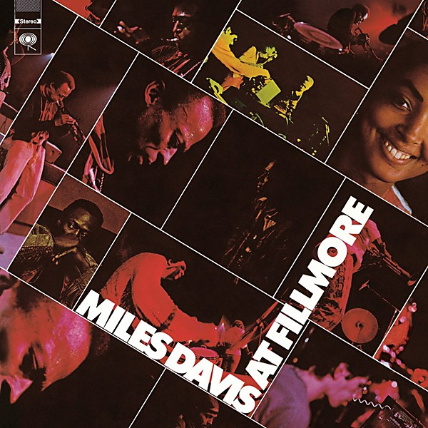

# Miles Davis at Fillmore

By **Miles Davis**

## Album Data

- **Catalog:** Beets
- **Format:** Digital, Album
- **Album:** Miles Davis at Fillmore
- **Artist:** Miles Davis
- **Albumartist:** Miles Davis
- **Genre:** Jazz
- **MusicBrainz Album Artist ID:** 
- **MusicBrainz Album ID:** 
- **MusicBrainz Release Group ID:** 
- **Year:** 1970
- **Catalog #:** 
- **Label:** 
- **Total Tracks:** 00

## Album Tracks

### Track 01 - Wednesday Miles

- **Artist:** Miles Davis
- **Format:** MP3
- **Genre:** Jazz
- **Length:** 23:50
- **MusicBrainz Track ID:** 
- **Title:** Wednesday Miles
- **Track:** 01
- **Year:** 1970

### Track 02 - Thursday Miles

- **Artist:** Miles Davis
- **Format:** MP3
- **Genre:** Jazz
- **Length:** 26:29
- **MusicBrainz Track ID:** 
- **Title:** Thursday Miles
- **Track:** 02
- **Year:** 1970

### Track 03 - Friday Miles

- **Artist:** Miles Davis
- **Format:** MP3
- **Genre:** Jazz
- **Length:** 27:29
- **MusicBrainz Track ID:** 
- **Title:** Friday Miles
- **Track:** 03
- **Year:** 1970

### Track 04 - Saturday Miles

- **Artist:** Miles Davis
- **Format:** MP3
- **Genre:** Jazz
- **Length:** 22:00
- **MusicBrainz Track ID:** 
- **Title:** Saturday Miles
- **Track:** 04
- **Year:** 1970

## See also

- [Bitches Brew](Bitches_Brew.md)
- [Roon: Bitches Brew](../../Roon/Miles_Davis/Bitches_Brew.md)
