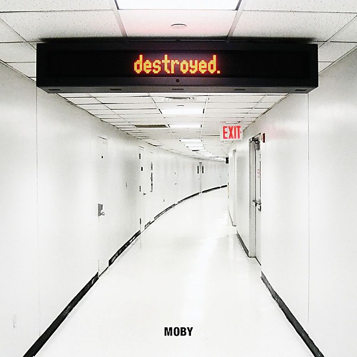

# Destroyed

By **Moby**

## Album Data

- **Catalog:** Beets
- **Format:** Digital, Album
- **Album:** Destroyed
- **Artist:** Moby
- **Albumartist:** Moby
- **Genre:** Deep House
- **MusicBrainz Album Artist ID:** 
- **MusicBrainz Album ID:** 
- **MusicBrainz Release Group ID:** 
- **Year:** 0000
- **Catalog #:** 
- **Label:** 
- **Total Tracks:** 00

## Album Tracks

### Track 06 - Moby_protect write(formt he uh

- **Artist:** Moby
- **Format:** AAC
- **Genre:** Techno
- **Length:** 5:44
- **MusicBrainz Track ID:** 
- **Title:** Moby_protect write(formt he uh
- **Track:** 06
- **Year:** 1993

## See also

- [Early Underground](Early_Underground.md)
- [Play](Play.md)
- [we are all made of stars](we_are_all_made_of_stars.md)
- [Roon: Go - The Very Best of Moby (Remixed)](../../Roon/Moby/Go_-_The_Very_Best_of_Moby_Remixed.md)
- [Roon: Moby](../../Roon/Moby/Moby.md)
- [Roon: Reprise (Reprise Version)](../../Roon/Moby/Reprise_Reprise_Version.md)
