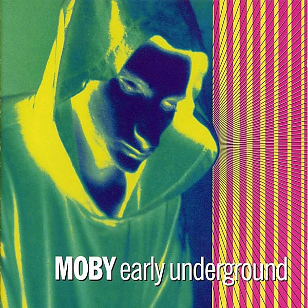

# Early Underground

By **Moby**

## Album Data

- **Catalog:** Beets
- **Format:** Digital, Album
- **Album:** Early Underground
- **Artist:** Moby
- **Albumartist:** Moby
- **Genre:** Techno
- **MusicBrainz Album Artist ID:** 
- **MusicBrainz Album ID:** 
- **MusicBrainz Release Group ID:** 
- **Year:** 1993
- **Catalog #:** 
- **Label:** 
- **Total Tracks:** 00

## Album Tracks

### Track 00 - Honey

- **Artist:** Moby
- **Format:** AAC
- **Genre:** Uk Garage
- **Length:** 3:30
- **MusicBrainz Track ID:** 
- **Title:** Honey
- **Track:** 00
- **Year:** 2000

### Track 00 - Natural Blues

- **Artist:** Moby
- **Format:** AAC
- **Genre:** Electronica
- **Length:** 4:13
- **MusicBrainz Track ID:** 
- **Title:** Natural Blues
- **Track:** 00
- **Year:** 1992

### Track 04 - Why Does My Heart Feel So Bad

- **Artist:** Moby
- **Format:** AAC
- **Genre:** Electronica
- **Length:** 4:24
- **MusicBrainz Track ID:** 
- **Title:** Why Does My Heart Feel So Bad
- **Track:** 04
- **Year:** 0000

## See also

- [Destroyed](Destroyed.md)
- [Play](Play.md)
- [we are all made of stars](we_are_all_made_of_stars.md)
- [Roon: Go - The Very Best of Moby (Remixed)](../../Roon/Moby/Go_-_The_Very_Best_of_Moby_Remixed.md)
- [Roon: Moby](../../Roon/Moby/Moby.md)
- [Roon: Reprise (Reprise Version)](../../Roon/Moby/Reprise_Reprise_Version.md)
