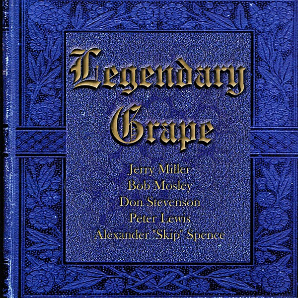

# Legendary Grape

By **Moby Grape**

## Album Data

- **Catalog:** Beets
- **Format:** Digital, Album
- **Album:** Legendary Grape
- **Artist:** Moby Grape
- **Albumartist:** Moby Grape
- **Genre:** Psychedelic Rock
- **MusicBrainz Album Artist ID:** [bf014765-46f0-4cd9-b658-c79c5c0166f8](https://musicbrainz.org/artist/bf014765-46f0-4cd9-b658-c79c5c0166f8)
- **MusicBrainz Album ID:** [e553c58a-f639-4c2f-ab6e-25dc705b2cb7](https://musicbrainz.org/release/e553c58a-f639-4c2f-ab6e-25dc705b2cb7)
- **MusicBrainz Release Group ID:** [232ea332-7063-3259-b19e-ad1b3bbc86b3](https://musicbrainz.org/release-group/232ea332-7063-3259-b19e-ad1b3bbc86b3)
- **Year:** 2005
- **Catalog #:** 108
- **Label:** DIG Music
- **Total Tracks:** 18

## Album Tracks

### Track 01 - All My Life

- **Artist:** Moby Grape
- **Format:** ALAC
- **Genre:** Psychedelic Rock
- **Length:** 3:36
- **MusicBrainz Track ID:** [202e678c-193b-49f2-8d4e-462bb209e015](https://musicbrainz.org/recording/202e678c-193b-49f2-8d4e-462bb209e015)
- **Title:** All My Life
- **Track:** 01
- **Year:** 2005

### Track 02 - Nightime Rider

- **Artist:** Moby Grape
- **Format:** ALAC
- **Genre:** Psychedelic Rock
- **Length:** 3:07
- **MusicBrainz Track ID:** [e03ec330-8222-4308-b6d3-256c803dc01d](https://musicbrainz.org/recording/e03ec330-8222-4308-b6d3-256c803dc01d)
- **Title:** Nightime Rider
- **Track:** 02
- **Year:** 2005

### Track 03 - Ride at Hell

- **Artist:** Moby Grape
- **Format:** ALAC
- **Genre:** Psychedelic Rock
- **Length:** 2:55
- **MusicBrainz Track ID:** [fb4d3505-644b-459d-9bf6-4a50b6168f30](https://musicbrainz.org/recording/fb4d3505-644b-459d-9bf6-4a50b6168f30)
- **Title:** Ride at Hell
- **Track:** 03
- **Year:** 2005

### Track 04 - On the Dime

- **Artist:** Moby Grape
- **Format:** ALAC
- **Genre:** Psychedelic Rock
- **Length:** 3:50
- **MusicBrainz Track ID:** [879606c7-d553-4d49-ae4f-f0b05aa700b6](https://musicbrainz.org/recording/879606c7-d553-4d49-ae4f-f0b05aa700b6)
- **Title:** On the Dime
- **Track:** 04
- **Year:** 2005

### Track 05 - Lady of the Night

- **Artist:** Moby Grape
- **Format:** ALAC
- **Genre:** Psychedelic Rock
- **Length:** 3:42
- **MusicBrainz Track ID:** [eafb16f0-a43d-4906-ae7a-3d8170ec6d58](https://musicbrainz.org/recording/eafb16f0-a43d-4906-ae7a-3d8170ec6d58)
- **Title:** Lady of the Night
- **Track:** 05
- **Year:** 2005

### Track 06 - Changing

- **Artist:** Moby Grape
- **Format:** ALAC
- **Genre:** Psychedelic Rock
- **Length:** 3:05
- **MusicBrainz Track ID:** [9ba069ca-6f1b-4176-9873-cd49599b2750](https://musicbrainz.org/recording/9ba069ca-6f1b-4176-9873-cd49599b2750)
- **Title:** Changing
- **Track:** 06
- **Year:** 2005

### Track 07 - Took It All Away

- **Artist:** Moby Grape
- **Format:** ALAC
- **Genre:** Psychedelic Rock
- **Length:** 3:06
- **MusicBrainz Track ID:** [be545fd9-6bbf-47e3-ad3d-43b3fcb6fa18](https://musicbrainz.org/recording/be545fd9-6bbf-47e3-ad3d-43b3fcb6fa18)
- **Title:** Took It All Away
- **Track:** 07
- **Year:** 2005

### Track 08 - Bitter Wind in Tanganika

- **Artist:** Moby Grape
- **Format:** ALAC
- **Genre:** Psychedelic Rock
- **Length:** 3:33
- **MusicBrainz Track ID:** [11a0e7de-6e1a-450d-b08d-d771a2f1e16e](https://musicbrainz.org/recording/11a0e7de-6e1a-450d-b08d-d771a2f1e16e)
- **Title:** Bitter Wind in Tanganika
- **Track:** 08
- **Year:** 2005

### Track 09 - Talk About Love

- **Artist:** Moby Grape
- **Format:** ALAC
- **Genre:** Psychedelic Rock
- **Length:** 1:57
- **MusicBrainz Track ID:** [ca4370c7-1316-4b4a-95e4-0a11ebf63492](https://musicbrainz.org/recording/ca4370c7-1316-4b4a-95e4-0a11ebf63492)
- **Title:** Talk About Love
- **Track:** 09
- **Year:** 2005

### Track 10 - You'll Never Know

- **Artist:** Moby Grape
- **Format:** ALAC
- **Genre:** Psychedelic Rock
- **Length:** 4:15
- **MusicBrainz Track ID:** [3eb8ce8c-25da-4a47-a7f3-156dd4d8906f](https://musicbrainz.org/recording/3eb8ce8c-25da-4a47-a7f3-156dd4d8906f)
- **Title:** You'll Never Know
- **Track:** 10
- **Year:** 2005

### Track 11 - You Can Depend on Me

- **Artist:** Moby Grape
- **Format:** ALAC
- **Genre:** Psychedelic Rock
- **Length:** 3:09
- **MusicBrainz Track ID:** [58137288-d5de-4f6c-b49a-f306897fa45c](https://musicbrainz.org/recording/58137288-d5de-4f6c-b49a-f306897fa45c)
- **Title:** You Can Depend on Me
- **Track:** 11
- **Year:** 2005

### Track 12 - Further on Up the Road

- **Artist:** Moby Grape
- **Format:** ALAC
- **Genre:** Psychedelic Rock
- **Length:** 3:01
- **MusicBrainz Track ID:** [6a291807-e9ed-4b6b-8068-46f3db873803](https://musicbrainz.org/recording/6a291807-e9ed-4b6b-8068-46f3db873803)
- **Title:** Further on Up the Road
- **Track:** 12
- **Year:** 2005

### Track 13 - It Don't Take Much

- **Artist:** Moby Grape
- **Format:** ALAC
- **Genre:** Psychedelic Rock
- **Length:** 3:20
- **MusicBrainz Track ID:** [8251fc9d-3342-47ef-b93a-64b660b53d6f](https://musicbrainz.org/recording/8251fc9d-3342-47ef-b93a-64b660b53d6f)
- **Title:** It Don't Take Much
- **Track:** 13
- **Year:** 2005

### Track 14 - Getting Used to Being Created Wrong

- **Artist:** Moby Grape
- **Format:** ALAC
- **Genre:** Psychedelic Rock
- **Length:** 2:33
- **MusicBrainz Track ID:** [6d1b9d0e-c765-4fa6-8482-968c10bd622b](https://musicbrainz.org/recording/6d1b9d0e-c765-4fa6-8482-968c10bd622b)
- **Title:** Getting Used to Being Created Wrong
- **Track:** 14
- **Year:** 2005

### Track 15 - Forty Feet Tall

- **Artist:** Moby Grape
- **Format:** ALAC
- **Genre:** Blues
- **Length:** 4:47
- **MusicBrainz Track ID:** [badfd403-d5e9-4535-92ec-7c8680303b32](https://musicbrainz.org/recording/badfd403-d5e9-4535-92ec-7c8680303b32)
- **Title:** Forty Feet Tall
- **Track:** 15
- **Year:** 2005

### Track 16 - Forbidden Love

- **Artist:** Moby Grape
- **Format:** ALAC
- **Genre:** Psychedelic Rock
- **Length:** 2:58
- **MusicBrainz Track ID:** [ef02a19d-c6e4-4b59-9283-7e3e13c7531c](https://musicbrainz.org/recording/ef02a19d-c6e4-4b59-9283-7e3e13c7531c)
- **Title:** Forbidden Love
- **Track:** 16
- **Year:** 2005

### Track 17 - Telephone Love

- **Artist:** Moby Grape
- **Format:** ALAC
- **Genre:** Psychedelic Rock
- **Length:** 2:33
- **MusicBrainz Track ID:** [752f9b2d-a00d-48cc-8441-52e99855712f](https://musicbrainz.org/recording/752f9b2d-a00d-48cc-8441-52e99855712f)
- **Title:** Telephone Love
- **Track:** 17
- **Year:** 2005

### Track 18 - Rodeo

- **Artist:** Moby Grape
- **Format:** ALAC
- **Genre:** Country
- **Length:** 4:14
- **MusicBrainz Track ID:** [91d7cdc1-0442-4ac4-8a7e-2f48dd94b9f4](https://musicbrainz.org/recording/91d7cdc1-0442-4ac4-8a7e-2f48dd94b9f4)
- **Title:** Rodeo
- **Track:** 18
- **Year:** 2005

## See also

- [Roon: Legendary Grape](../../Roon/Moby_Grape/Legendary_Grape.md)
- [Roon: Moby Grape 69' (With Bonus Tracks)](../../Roon/Moby_Grape/Moby_Grape_69_With_Bonus_Tracks.md)
- [Roon: Moby Grape (with Bonus Tracks)](../../Roon/Moby_Grape/Moby_Grape_with_Bonus_Tracks.md)
- [Roon: Wow (CD W/Bonus Tracks)](../../Roon/Moby_Grape/Wow_CD_W-Bonus_Tracks.md)
