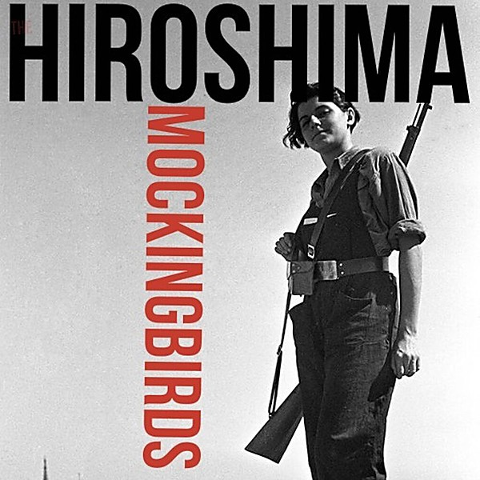

# Mockingbirds

By **Mockingbirds**

## Album Data

- **Catalog:** Beets
- **Format:** Digital, Album
- **Album:** Mockingbirds
- **Artist:** Mockingbirds
- **Albumartist:** Mockingbirds
- **Genre:** Ska
- **MusicBrainz Album Artist ID:** 
- **MusicBrainz Album ID:** 
- **MusicBrainz Release Group ID:** 
- **Year:** 1996
- **Catalog #:** 
- **Label:** Not Lame Recordings
- **Total Tracks:** 14

## Album Tracks

### Track 01 - Hey, Tristessa

- **Artist:** Mockingbirds
- **Format:** MP3
- **Genre:** Ska
- **Length:** 3:28
- **MusicBrainz Track ID:** 
- **Title:** Hey, Tristessa
- **Track:** 01
- **Year:** 1996

### Track 02 - Baby, You're a Star

- **Artist:** Mockingbirds
- **Format:** MP3
- **Genre:** Ska
- **Length:** 2:51
- **MusicBrainz Track ID:** 
- **Title:** Baby, You're a Star
- **Track:** 02
- **Year:** 1996

### Track 03 - Angels and Helicopters

- **Artist:** Mockingbirds
- **Format:** MP3
- **Genre:** Ska
- **Length:** 3:28
- **MusicBrainz Track ID:** 
- **Title:** Angels and Helicopters
- **Track:** 03
- **Year:** 1996

### Track 04 - Porno Star

- **Artist:** Mockingbirds
- **Format:** MP3
- **Genre:** Ska
- **Length:** 3:25
- **MusicBrainz Track ID:** 
- **Title:** Porno Star
- **Track:** 04
- **Year:** 1996

### Track 05 - Alfred Hitchcock

- **Artist:** Mockingbirds
- **Format:** MP3
- **Genre:** Ska
- **Length:** 4:35
- **MusicBrainz Track ID:** 
- **Title:** Alfred Hitchcock
- **Track:** 05
- **Year:** 1996

### Track 06 - Submarine

- **Artist:** Mockingbirds
- **Format:** MP3
- **Genre:** Ska
- **Length:** 3:22
- **MusicBrainz Track ID:** 
- **Title:** Submarine
- **Track:** 06
- **Year:** 1996

### Track 07 - Outlaw Song

- **Artist:** Mockingbirds
- **Format:** MP3
- **Genre:** Ska
- **Length:** 3:32
- **MusicBrainz Track ID:** 
- **Title:** Outlaw Song
- **Track:** 07
- **Year:** 1996

### Track 08 - Michael

- **Artist:** Mockingbirds
- **Format:** MP3
- **Genre:** Ska
- **Length:** 4:16
- **MusicBrainz Track ID:** 
- **Title:** Michael
- **Track:** 08
- **Year:** 1996

### Track 09 - On the Patio

- **Artist:** Mockingbirds
- **Format:** MP3
- **Genre:** Ska
- **Length:** 4:40
- **MusicBrainz Track ID:** 
- **Title:** On the Patio
- **Track:** 09
- **Year:** 1996

### Track 10 - Moovy

- **Artist:** Mockingbirds
- **Format:** MP3
- **Genre:** Ska
- **Length:** 3:12
- **MusicBrainz Track ID:** 
- **Title:** Moovy
- **Track:** 10
- **Year:** 1996

### Track 11 - Automatic Girl

- **Artist:** Mockingbirds
- **Format:** MP3
- **Genre:** Ska
- **Length:** 2:58
- **MusicBrainz Track ID:** 
- **Title:** Automatic Girl
- **Track:** 11
- **Year:** 1996

### Track 12 - Dream City Sunshine

- **Artist:** Mockingbirds
- **Format:** MP3
- **Genre:** Ska
- **Length:** 2:52
- **MusicBrainz Track ID:** 
- **Title:** Dream City Sunshine
- **Track:** 12
- **Year:** 1996

### Track 13 - Freeride

- **Artist:** Mockingbirds
- **Format:** MP3
- **Genre:** Ska
- **Length:** 3:48
- **MusicBrainz Track ID:** 
- **Title:** Freeride
- **Track:** 13
- **Year:** 1996

### Track 14 - Frank Mills

- **Artist:** Mockingbirds
- **Format:** MP3
- **Genre:** Ska
- **Length:** 2:09
- **MusicBrainz Track ID:** 
- **Title:** Frank Mills
- **Track:** 14
- **Year:** 1996

## See also

- [Roon: Mockingbirds](../../Roon/Mockingbirds/Mockingbirds.md)
