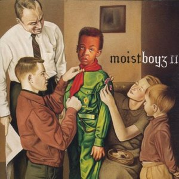

# Moistboyz I & II

By **Moistboyz**

## Album Data

- **Catalog:** Beets
- **Format:** Digital, Album
- **Album:** Moistboyz I & II
- **Artist:** Moistboyz
- **Albumartist:** Moistboyz
- **Genre:** Stoner Rock
- **MusicBrainz Album Artist ID:** [3867cba4-766a-4646-befd-010d053551ad](https://musicbrainz.org/artist/3867cba4-766a-4646-befd-010d053551ad)
- **MusicBrainz Album ID:** [ee259beb-e458-40ed-8e1d-7eddda5b0e56](https://musicbrainz.org/release/ee259beb-e458-40ed-8e1d-7eddda5b0e56)
- **MusicBrainz Release Group ID:** [1e7525b1-5b47-3e7b-b3d4-c97008ab8973](https://musicbrainz.org/release-group/1e7525b1-5b47-3e7b-b3d4-c97008ab8973)
- **Year:** 2005
- **Catalog #:** 
- **Label:** 
- **Total Tracks:** 17

## Album Tracks

### Track 01 - Carjack

- **Artist:** Moistboyz
- **Format:** ALAC
- **Genre:** Stoner Rock
- **Length:** 3:13
- **MusicBrainz Track ID:** [1876197d-87ae-4a31-85f0-b363300a1629](https://musicbrainz.org/recording/1876197d-87ae-4a31-85f0-b363300a1629)
- **Title:** Carjack
- **Track:** 01
- **Year:** 2005

### Track 02 - 1.0 (Fuck No)

- **Artist:** Moistboyz
- **Format:** ALAC
- **Genre:** Stoner Rock
- **Length:** 2:59
- **MusicBrainz Track ID:** [68a6fe17-ee0e-448b-a0e3-3519229c881e](https://musicbrainz.org/recording/68a6fe17-ee0e-448b-a0e3-3519229c881e)
- **Title:** 1.0 (Fuck No)
- **Track:** 02
- **Year:** 2005

### Track 03 - U Blow

- **Artist:** Moistboyz
- **Format:** ALAC
- **Genre:** Stoner Rock
- **Length:** 4:24
- **MusicBrainz Track ID:** [d60a1094-8293-4444-aad2-c3ec1fb55df0](https://musicbrainz.org/recording/d60a1094-8293-4444-aad2-c3ec1fb55df0)
- **Title:** U Blow
- **Track:** 03
- **Year:** 2005

### Track 04 - Supersoaker MD50

- **Artist:** Moistboyz
- **Format:** ALAC
- **Genre:** Stoner Rock
- **Length:** 2:09
- **MusicBrainz Track ID:** [d7242861-ebc3-4579-b09b-fd18cab38c1b](https://musicbrainz.org/recording/d7242861-ebc3-4579-b09b-fd18cab38c1b)
- **Title:** Supersoaker MD50
- **Track:** 04
- **Year:** 2005

### Track 05 - I Am the Jury

- **Artist:** Moistboyz
- **Format:** ALAC
- **Genre:** Stoner Rock
- **Length:** 3:27
- **MusicBrainz Track ID:** [2217c7ec-0872-4b03-8ed5-fd70dfc6c2fa](https://musicbrainz.org/recording/2217c7ec-0872-4b03-8ed5-fd70dfc6c2fa)
- **Title:** I Am the Jury
- **Track:** 05
- **Year:** 2005

### Track 06 - Adios Amigo

- **Artist:** Moistboyz
- **Format:** ALAC
- **Genre:** Stoner Rock
- **Length:** 2:38
- **MusicBrainz Track ID:** [6b2a4fc2-18be-4582-b560-724e31c61e6c](https://musicbrainz.org/recording/6b2a4fc2-18be-4582-b560-724e31c61e6c)
- **Title:** Adios Amigo
- **Track:** 06
- **Year:** 2005

### Track 07 - It Ain't Rude

- **Artist:** Moistboyz
- **Format:** ALAC
- **Genre:** Stoner Rock
- **Length:** 4:21
- **MusicBrainz Track ID:** [a3667d5e-223c-4eb8-8d13-6ba5a4eca531](https://musicbrainz.org/recording/a3667d5e-223c-4eb8-8d13-6ba5a4eca531)
- **Title:** It Ain't Rude
- **Track:** 07
- **Year:** 2005

### Track 08 - Secondhand Smoker

- **Artist:** Moistboyz
- **Format:** ALAC
- **Genre:** Stoner Rock
- **Length:** 3:05
- **MusicBrainz Track ID:** [2b4c3c22-2ae5-4f76-a371-63955a6b6aaa](https://musicbrainz.org/recording/2b4c3c22-2ae5-4f76-a371-63955a6b6aaa)
- **Title:** Secondhand Smoker
- **Track:** 08
- **Year:** 2005

### Track 09 - Lazy and Cool

- **Artist:** Moistboyz
- **Format:** ALAC
- **Genre:** Grunge
- **Length:** 2:52
- **MusicBrainz Track ID:** [4e31701f-b26d-4382-9024-22bce6eb7a24](https://musicbrainz.org/recording/4e31701f-b26d-4382-9024-22bce6eb7a24)
- **Title:** Lazy and Cool
- **Track:** 09
- **Year:** 2005

### Track 10 - Rock, Stock, Barrel

- **Artist:** Moistboyz
- **Format:** ALAC
- **Genre:** Stoner Rock
- **Length:** 3:06
- **MusicBrainz Track ID:** [12ae375c-3e2a-4788-82ca-d63188d8e447](https://musicbrainz.org/recording/12ae375c-3e2a-4788-82ca-d63188d8e447)
- **Title:** Rock, Stock, Barrel
- **Track:** 10
- **Year:** 2005

### Track 11 - Man of the Year

- **Artist:** Moistboyz
- **Format:** ALAC
- **Genre:** Stoner Rock
- **Length:** 2:15
- **MusicBrainz Track ID:** [66acb7a0-7cab-462a-a191-6caad4240062](https://musicbrainz.org/recording/66acb7a0-7cab-462a-a191-6caad4240062)
- **Title:** Man of the Year
- **Track:** 11
- **Year:** 2005

### Track 12 - American Made and Duty-Free

- **Artist:** Moistboyz
- **Format:** ALAC
- **Genre:** Rock
- **Length:** 3:05
- **MusicBrainz Track ID:** [28546c66-a5dc-4b05-95c8-a6eafb63b7d2](https://musicbrainz.org/recording/28546c66-a5dc-4b05-95c8-a6eafb63b7d2)
- **Title:** American Made and Duty-Free
- **Track:** 12
- **Year:** 2005

### Track 13 - Crank

- **Artist:** Moistboyz
- **Format:** ALAC
- **Genre:** Stoner Rock
- **Length:** 2:47
- **MusicBrainz Track ID:** [e78688bd-192e-4a37-95f9-1b634fbe8646](https://musicbrainz.org/recording/e78688bd-192e-4a37-95f9-1b634fbe8646)
- **Title:** Crank
- **Track:** 13
- **Year:** 2005

### Track 14 - Powervice

- **Artist:** Moistboyz
- **Format:** ALAC
- **Genre:** Stoner Rock
- **Length:** 1:11
- **MusicBrainz Track ID:** [d88c85f8-1e48-4096-b136-c94bfc55d186](https://musicbrainz.org/recording/d88c85f8-1e48-4096-b136-c94bfc55d186)
- **Title:** Powervice
- **Track:** 14
- **Year:** 2005

### Track 15 - Keep the Fire Alive

- **Artist:** Moistboyz
- **Format:** ALAC
- **Genre:** Stoner Rock
- **Length:** 4:24
- **MusicBrainz Track ID:** [96cef2e6-6c20-4b8a-bc94-ad72a594c8ba](https://musicbrainz.org/recording/96cef2e6-6c20-4b8a-bc94-ad72a594c8ba)
- **Title:** Keep the Fire Alive
- **Track:** 15
- **Year:** 2005

### Track 16 - Good Morning America

- **Artist:** Moistboyz
- **Format:** ALAC
- **Genre:** Stoner Rock
- **Length:** 3:41
- **MusicBrainz Track ID:** [0626c06f-6755-43bd-8c5f-3ccaecbf9de9](https://musicbrainz.org/recording/0626c06f-6755-43bd-8c5f-3ccaecbf9de9)
- **Title:** Good Morning America
- **Track:** 16
- **Year:** 2005

### Track 17 - My War

- **Artist:** Moistboyz
- **Format:** ALAC
- **Genre:** Stoner Rock
- **Length:** 2:47
- **MusicBrainz Track ID:** [c070d6e5-6565-4fc6-aba7-5e0b5211cb10](https://musicbrainz.org/recording/c070d6e5-6565-4fc6-aba7-5e0b5211cb10)
- **Title:** My War
- **Track:** 17
- **Year:** 2005

## See also

- [IV](IV.md)
