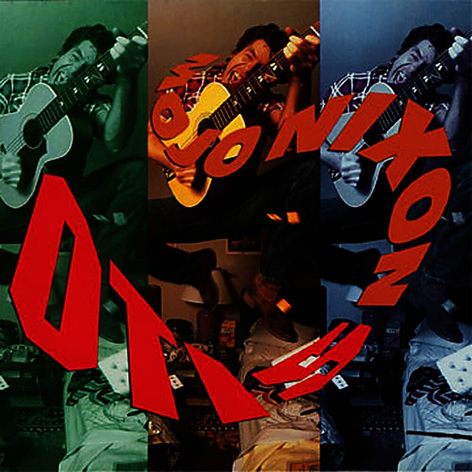

# Otis

By **Mojo Nixon**

## Album Data

- **Catalog:** Beets
- **Format:** Digital, Album
- **Album:** Otis
- **Artist:** Mojo Nixon
- **Albumartist:** Mojo Nixon
- **Genre:** Psychobilly
- **MusicBrainz Album Artist ID:** [51c97459-9a39-413b-9aef-9dc36e97e615](https://musicbrainz.org/artist/51c97459-9a39-413b-9aef-9dc36e97e615)
- **MusicBrainz Album ID:** [a57b6297-3705-38c1-94b9-6f0e9c3c737d](https://musicbrainz.org/release/a57b6297-3705-38c1-94b9-6f0e9c3c737d)
- **MusicBrainz Release Group ID:** [250c1e6d-d7a3-3cfe-b7f4-5c2eba494902](https://musicbrainz.org/release-group/250c1e6d-d7a3-3cfe-b7f4-5c2eba494902)
- **Year:** 2005
- **Catalog #:** 
- **Label:** Mojo Nixon
- **Total Tracks:** 12

## Album Tracks

### Track 01 - Destroy All Lawyers

- **Artist:** Mojo Nixon
- **Format:** ALAC
- **Genre:** Psychobilly
- **Length:** 3:00
- **MusicBrainz Track ID:** [d9882c68-1e60-4879-990a-b6aab7be698a](https://musicbrainz.org/recording/d9882c68-1e60-4879-990a-b6aab7be698a)
- **Title:** Destroy All Lawyers
- **Track:** 01
- **Year:** 2005

### Track 02 - I Wanna Race Bigfoot Trucks

- **Artist:** Mojo Nixon
- **Format:** ALAC
- **Genre:** Psychobilly
- **Length:** 3:45
- **MusicBrainz Track ID:** [c8aa38d5-10cc-4d89-b058-0e4438c416d9](https://musicbrainz.org/recording/c8aa38d5-10cc-4d89-b058-0e4438c416d9)
- **Title:** I Wanna Race Bigfoot Trucks
- **Track:** 02
- **Year:** 2005

### Track 03 - Ain't High Falutin'

- **Artist:** Mojo Nixon
- **Format:** ALAC
- **Genre:** Psychobilly
- **Length:** 3:16
- **MusicBrainz Track ID:** [c55a2e4b-cbc5-4d29-8244-c33b971e14df](https://musicbrainz.org/recording/c55a2e4b-cbc5-4d29-8244-c33b971e14df)
- **Title:** Ain't High Falutin'
- **Track:** 03
- **Year:** 2005

### Track 04 - Shane's Dentist

- **Artist:** Mojo Nixon
- **Format:** ALAC
- **Genre:** Psychobilly
- **Length:** 2:04
- **MusicBrainz Track ID:** [5a1196e5-d87e-4c6c-b9de-b863847c530a](https://musicbrainz.org/recording/5a1196e5-d87e-4c6c-b9de-b863847c530a)
- **Title:** Shane's Dentist
- **Track:** 04
- **Year:** 2005

### Track 05 - Rabies Baby

- **Artist:** Mojo Nixon
- **Format:** ALAC
- **Genre:** Psychobilly
- **Length:** 3:30
- **MusicBrainz Track ID:** [d3b31c93-6db2-4205-95cc-2797f77a82f2](https://musicbrainz.org/recording/d3b31c93-6db2-4205-95cc-2797f77a82f2)
- **Title:** Rabies Baby
- **Track:** 05
- **Year:** 2005

### Track 06 - Put a Sex Mo-Sheen in the White House

- **Artist:** Mojo Nixon
- **Format:** ALAC
- **Genre:** Psychobilly
- **Length:** 4:20
- **MusicBrainz Track ID:** [7094a573-e659-42bc-9d34-92ed76411d25](https://musicbrainz.org/recording/7094a573-e659-42bc-9d34-92ed76411d25)
- **Title:** Put a Sex Mo-Sheen in the White House
- **Track:** 06
- **Year:** 2005

### Track 07 - Star Spangled Mojo

- **Artist:** Mojo Nixon
- **Format:** ALAC
- **Genre:** Psychobilly
- **Length:** 1:23
- **MusicBrainz Track ID:** [1ff79332-6f2d-41e4-9c34-143a653ae5f2](https://musicbrainz.org/recording/1ff79332-6f2d-41e4-9c34-143a653ae5f2)
- **Title:** Star Spangled Mojo
- **Track:** 07
- **Year:** 2005

### Track 08 - You Can Dress 'em Up (But You Can't Take 'em Out)

- **Artist:** Mojo Nixon
- **Format:** ALAC
- **Genre:** Psychobilly
- **Length:** 2:51
- **MusicBrainz Track ID:** [0ac94bf9-375f-434c-b725-aedf1e30feca](https://musicbrainz.org/recording/0ac94bf9-375f-434c-b725-aedf1e30feca)
- **Title:** You Can Dress 'em Up (But You Can't Take 'em Out)
- **Track:** 08
- **Year:** 2005

### Track 09 - Don Henley Must Die

- **Artist:** Mojo Nixon
- **Format:** ALAC
- **Genre:** Psychobilly
- **Length:** 4:19
- **MusicBrainz Track ID:** [d2f57c49-c437-49c8-b19f-33a1517fd6a4](https://musicbrainz.org/recording/d2f57c49-c437-49c8-b19f-33a1517fd6a4)
- **Title:** Don Henley Must Die
- **Track:** 09
- **Year:** 2005

### Track 10 - Perry Mason of Love

- **Artist:** Mojo Nixon
- **Format:** ALAC
- **Genre:** Psychobilly
- **Length:** 5:46
- **MusicBrainz Track ID:** [fffcac36-0977-4930-8406-f43b94dca2dc](https://musicbrainz.org/recording/fffcac36-0977-4930-8406-f43b94dca2dc)
- **Title:** Perry Mason of Love
- **Track:** 10
- **Year:** 2005

### Track 11 - Took Out the Trash and Never Came Back

- **Artist:** Mojo Nixon
- **Format:** ALAC
- **Genre:** Psychobilly
- **Length:** 4:42
- **MusicBrainz Track ID:** [4e93d981-667e-4c3d-b96f-f17f1fde2a09](https://musicbrainz.org/recording/4e93d981-667e-4c3d-b96f-f17f1fde2a09)
- **Title:** Took Out the Trash and Never Came Back
- **Track:** 11
- **Year:** 2005

### Track 12 - Gonna Be a New World

- **Artist:** Mojo Nixon
- **Format:** ALAC
- **Genre:** Psychobilly
- **Length:** 3:53
- **MusicBrainz Track ID:** [db9a8e21-aed9-46eb-80e0-816563396388](https://musicbrainz.org/recording/db9a8e21-aed9-46eb-80e0-816563396388)
- **Title:** Gonna Be a New World
- **Track:** 12
- **Year:** 2005

