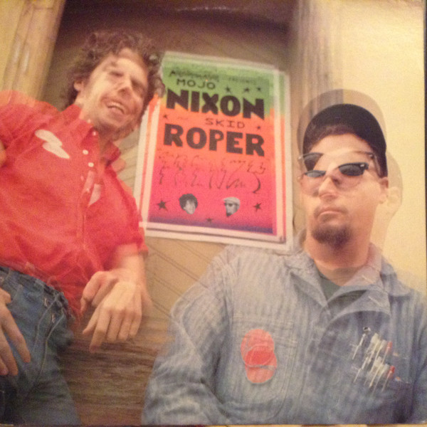

# Frenzy

By **Mojo Nixon & Skid Roper**

## Album Data

- **Catalog:** Beets
- **Format:** Digital, Album
- **Album:** Frenzy
- **Artist:** Mojo Nixon & Skid Roper
- **Albumartist:** Mojo Nixon & Skid Roper
- **Genre:** Psychobilly
- **MusicBrainz Album Artist ID:** [51c97459-9a39-413b-9aef-9dc36e97e615](https://musicbrainz.org/artist/51c97459-9a39-413b-9aef-9dc36e97e615)
- **MusicBrainz Album ID:** [47bb2e57-778a-4b03-b8d6-7205d7630efe](https://musicbrainz.org/release/47bb2e57-778a-4b03-b8d6-7205d7630efe)
- **MusicBrainz Release Group ID:** [b4696caa-344c-3871-beb0-e29690e8ac88](https://musicbrainz.org/release-group/b4696caa-344c-3871-beb0-e29690e8ac88)
- **Year:** 1986
- **Catalog #:** 72127-1
- **Label:** Restless Records
- **Total Tracks:** 14

## Album Tracks

### Track 01 - The Amazing Bigfoot Diet

- **Artist:** Mojo Nixon & Skid Roper
- **Format:** MP3
- **Genre:** Psychobilly
- **Length:** 3:01
- **MusicBrainz Track ID:** [c3908bf0-c6f1-496e-823b-47e858c2ea9d](https://musicbrainz.org/recording/c3908bf0-c6f1-496e-823b-47e858c2ea9d)
- **Title:** The Amazing Bigfoot Diet
- **Track:** 01
- **Year:** 1986

### Track 02 - Stuffin’ Martha’s Muffin

- **Artist:** Mojo Nixon & Skid Roper
- **Format:** MP3
- **Genre:** Psychobilly
- **Length:** 2:57
- **MusicBrainz Track ID:** [01188d20-2529-455a-9d95-815b8565dd40](https://musicbrainz.org/recording/01188d20-2529-455a-9d95-815b8565dd40)
- **Title:** Stuffin’ Martha’s Muffin
- **Track:** 02
- **Year:** 1986

### Track 03 - I Hate Banks

- **Artist:** Mojo Nixon & Skid Roper
- **Format:** MP3
- **Genre:** Psychobilly
- **Length:** 3:39
- **MusicBrainz Track ID:** [ff8d0dd1-8c9d-4335-80f0-6965c249676d](https://musicbrainz.org/recording/ff8d0dd1-8c9d-4335-80f0-6965c249676d)
- **Title:** I Hate Banks
- **Track:** 03
- **Year:** 1986

### Track 04 - Feeling Existential

- **Artist:** Mojo Nixon & Skid Roper
- **Format:** MP3
- **Genre:** Psychobilly
- **Length:** 2:54
- **MusicBrainz Track ID:** [3996366f-8d81-446f-8af2-f5b39833d9fe](https://musicbrainz.org/recording/3996366f-8d81-446f-8af2-f5b39833d9fe)
- **Title:** Feeling Existential
- **Track:** 04
- **Year:** 1986

### Track 05 - Be My Lover

- **Artist:** Mojo Nixon & Skid Roper
- **Format:** MP3
- **Genre:** Psychobilly
- **Length:** 3:19
- **MusicBrainz Track ID:** [48c7fad9-e59d-407b-9ea7-1c8e974f1ac6](https://musicbrainz.org/recording/48c7fad9-e59d-407b-9ea7-1c8e974f1ac6)
- **Title:** Be My Lover
- **Track:** 05
- **Year:** 1986

### Track 06 - Where the Hell’s My Money?

- **Artist:** Mojo Nixon & Skid Roper
- **Format:** MP3
- **Genre:** Psychobilly
- **Length:** 6:58
- **MusicBrainz Track ID:** [4b6fec61-f0f0-4526-829a-90c24888670a](https://musicbrainz.org/recording/4b6fec61-f0f0-4526-829a-90c24888670a)
- **Title:** Where the Hell’s My Money?
- **Track:** 06
- **Year:** 1986

### Track 07 - Gonna Put My Face on a Nuclear Bomb

- **Artist:** Mojo Nixon & Skid Roper
- **Format:** MP3
- **Genre:** Psychobilly
- **Length:** 2:39
- **MusicBrainz Track ID:** [f67527fd-c01c-4b06-914f-c758e9769261](https://musicbrainz.org/recording/f67527fd-c01c-4b06-914f-c758e9769261)
- **Title:** Gonna Put My Face on a Nuclear Bomb
- **Track:** 07
- **Year:** 1986

### Track 08 - Ain’t Got No Boss

- **Artist:** Mojo Nixon & Skid Roper
- **Format:** MP3
- **Genre:** Psychobilly
- **Length:** 4:00
- **MusicBrainz Track ID:** [ba2c8625-1583-459d-9229-da0b6a2e912d](https://musicbrainz.org/recording/ba2c8625-1583-459d-9229-da0b6a2e912d)
- **Title:** Ain’t Got No Boss
- **Track:** 08
- **Year:** 1986

### Track 09 - I’m Living With a Three‐Foot Anti‐Christ

- **Artist:** Mojo Nixon & Skid Roper
- **Format:** MP3
- **Genre:** Psychobilly
- **Length:** 3:46
- **MusicBrainz Track ID:** [10e9b78e-b5f6-4b68-9306-16649f1fa33e](https://musicbrainz.org/recording/10e9b78e-b5f6-4b68-9306-16649f1fa33e)
- **Title:** I’m Living With a Three‐Foot Anti‐Christ
- **Track:** 09
- **Year:** 1986

### Track 10 - Gonna Eat Them Words

- **Artist:** Mojo Nixon & Skid Roper
- **Format:** MP3
- **Genre:** Psychobilly
- **Length:** 3:07
- **MusicBrainz Track ID:** [e62e8f2b-5b9e-4a88-886f-6193bcf4bfc4](https://musicbrainz.org/recording/e62e8f2b-5b9e-4a88-886f-6193bcf4bfc4)
- **Title:** Gonna Eat Them Words
- **Track:** 10
- **Year:** 1986

### Track 11 - Twilight’s Last Gleaming

- **Artist:** Mojo Nixon & Skid Roper
- **Format:** MP3
- **Genre:** Psychobilly
- **Length:** 4:16
- **MusicBrainz Track ID:** [a0fc8875-0e41-44dd-b3b4-37f455347aee](https://musicbrainz.org/recording/a0fc8875-0e41-44dd-b3b4-37f455347aee)
- **Title:** Twilight’s Last Gleaming
- **Track:** 11
- **Year:** 1986

### Track 12 - 23 Mile Ride

- **Artist:** Mojo Nixon & Skid Roper
- **Format:** MP3
- **Genre:** Psychobilly
- **Length:** 1:38
- **MusicBrainz Track ID:** [93c8b5a5-885e-4ea7-b30d-6f6f6b75aecc](https://musicbrainz.org/recording/93c8b5a5-885e-4ea7-b30d-6f6f6b75aecc)
- **Title:** 23 Mile Ride
- **Track:** 12
- **Year:** 1986

### Track 13 - In A Gadda Da Vida

- **Artist:** Mojo Nixon & Skid Roper
- **Format:** MP3
- **Genre:** Psychobilly
- **Length:** 1:31
- **MusicBrainz Track ID:** [c3307bec-a0b1-4337-bc47-0ddef17801dd](https://musicbrainz.org/recording/c3307bec-a0b1-4337-bc47-0ddef17801dd)
- **Title:** In A Gadda Da Vida
- **Track:** 13
- **Year:** 1986

### Track 14 - The Ballad of Wendell Scott

- **Artist:** Mojo Nixon & Skid Roper
- **Format:** MP3
- **Genre:** Psychobilly
- **Length:** 2:44
- **MusicBrainz Track ID:** [bdc875fb-cfda-4ba0-8de8-b49dedfa5057](https://musicbrainz.org/recording/bdc875fb-cfda-4ba0-8de8-b49dedfa5057)
- **Title:** The Ballad of Wendell Scott
- **Track:** 14
- **Year:** 1986

