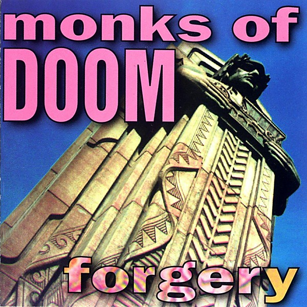

# Forgery

By **Monks of Doom**

## Album Data

- **Catalog:** Beets
- **Format:** Digital, Album
- **Album:** Forgery
- **Artist:** Monks Of Doom
- **Albumartist:** Monks of Doom
- **Genre:** Progressive Rock
- **MusicBrainz Album Artist ID:** [3eabadd7-5766-436d-a7d3-dd85bc209ffe](https://musicbrainz.org/artist/3eabadd7-5766-436d-a7d3-dd85bc209ffe)
- **MusicBrainz Album ID:** [e7b1d473-c5a4-47af-b324-c4df78441ffb](https://musicbrainz.org/release/e7b1d473-c5a4-47af-b324-c4df78441ffb)
- **MusicBrainz Release Group ID:** [4813bc8a-80c5-3818-b7f0-c2bb55c2d220](https://musicbrainz.org/release-group/4813bc8a-80c5-3818-b7f0-c2bb55c2d220)
- **Year:** 1992
- **Catalog #:** 004
- **Label:** 
- **Total Tracks:** 16

## Album Tracks

### Track 01 - Cherry Blossom Baptism

- **Artist:** Monks of Doom
- **Format:** ALAC
- **Genre:** Progressive Rock
- **Length:** 6:17
- **MusicBrainz Track ID:** [27761dbc-d078-4948-81d6-1646f201f75e](https://musicbrainz.org/recording/27761dbc-d078-4948-81d6-1646f201f75e)
- **Title:** Cherry Blossom Baptism
- **Track:** 01
- **Year:** 1991

### Track 02 - Riverbed

- **Artist:** Monks of Doom
- **Format:** ALAC
- **Genre:** Progressive Rock
- **Length:** 3:06
- **MusicBrainz Track ID:** [e69500ee-e686-483f-a495-d0ec3af68bd4](https://musicbrainz.org/recording/e69500ee-e686-483f-a495-d0ec3af68bd4)
- **Title:** Riverbed
- **Track:** 02
- **Year:** 1991

### Track 03 - Turn It on Himself

- **Artist:** Monks of Doom
- **Format:** ALAC
- **Genre:** Progressive Rock
- **Length:** 4:34
- **MusicBrainz Track ID:** [f6d1bdc4-b5b9-4952-bcb7-cf88aa5a05c9](https://musicbrainz.org/recording/f6d1bdc4-b5b9-4952-bcb7-cf88aa5a05c9)
- **Title:** Turn It on Himself
- **Track:** 03
- **Year:** 1991

### Track 04 - Geode I

- **Artist:** Monks of Doom
- **Format:** ALAC
- **Genre:** Progressive Rock
- **Length:** 2:24
- **MusicBrainz Track ID:** [87d25e92-e614-4458-a5f7-8e3b8123cab5](https://musicbrainz.org/recording/87d25e92-e614-4458-a5f7-8e3b8123cab5)
- **Title:** Geode I
- **Track:** 04
- **Year:** 1991

### Track 05 - Door to Success

- **Artist:** Monks of Doom
- **Format:** ALAC
- **Genre:** Progressive Rock
- **Length:** 4:11
- **MusicBrainz Track ID:** [b108b192-f08b-4b3c-940c-7d3a863a590e](https://musicbrainz.org/recording/b108b192-f08b-4b3c-940c-7d3a863a590e)
- **Title:** Door to Success
- **Track:** 05
- **Year:** 1991

### Track 06 - The Traveler

- **Artist:** Monks of Doom
- **Format:** ALAC
- **Genre:** Progressive Rock
- **Length:** 5:19
- **MusicBrainz Track ID:** [90fb47e5-4e0a-412b-b35f-a399a47050ee](https://musicbrainz.org/recording/90fb47e5-4e0a-412b-b35f-a399a47050ee)
- **Title:** The Traveler
- **Track:** 06
- **Year:** 1991

### Track 07 - (interlude)

- **Artist:** Monks of Doom
- **Format:** ALAC
- **Genre:** Progressive Rock
- **Length:** 0:21
- **MusicBrainz Track ID:** [b18c7161-bc3d-4c41-8541-c7e6ed75caf6](https://musicbrainz.org/recording/b18c7161-bc3d-4c41-8541-c7e6ed75caf6)
- **Title:** (interlude)
- **Track:** 07
- **Year:** 1991

### Track 08 - Argentine Dilemma

- **Artist:** Monks of Doom
- **Format:** ALAC
- **Genre:** Progressive Rock
- **Length:** 2:29
- **MusicBrainz Track ID:** [adae6950-b88f-496a-afe1-da1650ae9633](https://musicbrainz.org/recording/adae6950-b88f-496a-afe1-da1650ae9633)
- **Title:** Argentine Dilemma
- **Track:** 08
- **Year:** 1991

### Track 09 - The Better Angels of Our Nature

- **Artist:** Monks of Doom
- **Format:** ALAC
- **Genre:** Progressive Rock
- **Length:** 3:20
- **MusicBrainz Track ID:** [d54321f9-fea9-4193-ace0-09592d46980e](https://musicbrainz.org/recording/d54321f9-fea9-4193-ace0-09592d46980e)
- **Title:** The Better Angels of Our Nature
- **Track:** 09
- **Year:** 1991

### Track 10 - Going South

- **Artist:** Monks of Doom
- **Format:** ALAC
- **Genre:** Progressive Rock
- **Length:** 5:44
- **MusicBrainz Track ID:** [68341990-3c04-4229-8c2e-f5db7686c569](https://musicbrainz.org/recording/68341990-3c04-4229-8c2e-f5db7686c569)
- **Title:** Going South
- **Track:** 10
- **Year:** 1991

### Track 11 - Follow the Queen

- **Artist:** Monks of Doom
- **Format:** ALAC
- **Genre:** Progressive Rock
- **Length:** 2:34
- **MusicBrainz Track ID:** [125693c0-2f86-4b93-9da8-6f8740a567b9](https://musicbrainz.org/recording/125693c0-2f86-4b93-9da8-6f8740a567b9)
- **Title:** Follow the Queen
- **Track:** 11
- **Year:** 1991

### Track 12 - Hieroglyphic

- **Artist:** Monks of Doom
- **Format:** ALAC
- **Genre:** Progressive Rock
- **Length:** 3:02
- **MusicBrainz Track ID:** [a9666e82-f902-44f2-aba5-ae41c97a925c](https://musicbrainz.org/recording/a9666e82-f902-44f2-aba5-ae41c97a925c)
- **Title:** Hieroglyphic
- **Track:** 12
- **Year:** 1991

### Track 13 - The Harbor Incident

- **Artist:** Monks of Doom
- **Format:** ALAC
- **Genre:** Progressive Rock
- **Length:** 4:41
- **MusicBrainz Track ID:** [30ac2db1-04c5-4b2f-a399-d84401f91fd4](https://musicbrainz.org/recording/30ac2db1-04c5-4b2f-a399-d84401f91fd4)
- **Title:** The Harbor Incident
- **Track:** 13
- **Year:** 1991

### Track 14 - Miracle Mile

- **Artist:** Monks of Doom
- **Format:** ALAC
- **Genre:** Progressive Rock
- **Length:** 5:28
- **MusicBrainz Track ID:** [7c2e1627-1937-4896-8704-0f4065b329d2](https://musicbrainz.org/recording/7c2e1627-1937-4896-8704-0f4065b329d2)
- **Title:** Miracle Mile
- **Track:** 14
- **Year:** 1991

### Track 15 - Geode II

- **Artist:** Monks of Doom
- **Format:** ALAC
- **Genre:** Progressive Rock
- **Length:** 1:30
- **MusicBrainz Track ID:** [2eeac742-c658-4b8c-bf74-da5926294301](https://musicbrainz.org/recording/2eeac742-c658-4b8c-bf74-da5926294301)
- **Title:** Geode II
- **Track:** 15
- **Year:** 1991

### Track 16 - Circassian Beauty

- **Artist:** Monks of Doom
- **Format:** ALAC
- **Genre:** Progressive Rock
- **Length:** 6:51
- **MusicBrainz Track ID:** [e22a4208-4791-4b3c-bdcc-1c4cb3946570](https://musicbrainz.org/recording/e22a4208-4791-4b3c-bdcc-1c4cb3946570)
- **Title:** Circassian Beauty
- **Track:** 16
- **Year:** 1991

## See also

- [Meridian](Meridian.md)
- [The Cosmodemonic Telegraph Company](The_Cosmodemonic_Telegraph_Company.md)
- [The Insect God](The_Insect_God.md)
- [What's Left for Kicks?](Whats_Left_for_Kicks.md)
