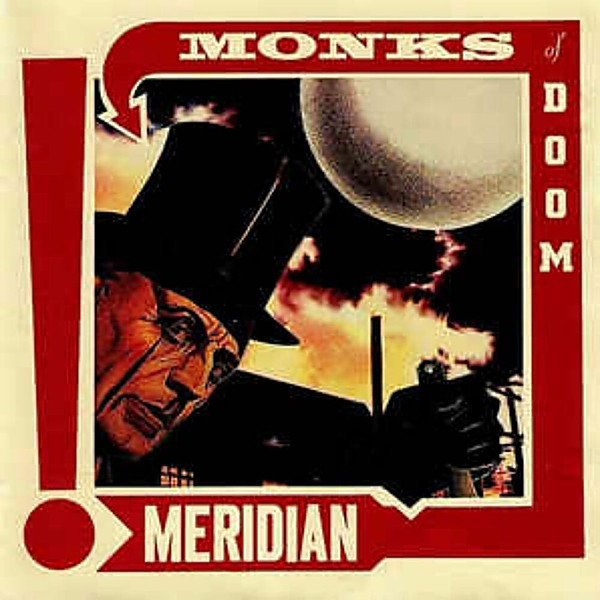

# Meridian

By **Monks of Doom**

## Album Data

- **Catalog:** Beets
- **Format:** Digital, Album
- **Album:** Meridian
- **Artist:** Monks Of Doom
- **Albumartist:** Monks of Doom
- **Genre:** Progressive Rock
- **MusicBrainz Album Artist ID:** [3eabadd7-5766-436d-a7d3-dd85bc209ffe](https://musicbrainz.org/artist/3eabadd7-5766-436d-a7d3-dd85bc209ffe)
- **MusicBrainz Album ID:** [fd0dc3ac-27ba-43bd-bee7-ef820f860f88](https://musicbrainz.org/release/fd0dc3ac-27ba-43bd-bee7-ef820f860f88)
- **MusicBrainz Release Group ID:** [92579f13-1e73-3aae-88d2-6ecc2f349555](https://musicbrainz.org/release-group/92579f13-1e73-3aae-88d2-6ecc2f349555)
- **Year:** 1991
- **Catalog #:** PITCH 13 CD
- **Label:** Pitch-A-Tent
- **Total Tracks:** 11

## Album Tracks

### Track 01 - Vaporize Your Crystals

- **Artist:** Monks of Doom
- **Format:** AAC
- **Genre:** Progressive Rock
- **Length:** 3:11
- **MusicBrainz Track ID:** [ad8765ed-effa-4354-a7a8-1067b82cabe5](https://musicbrainz.org/recording/ad8765ed-effa-4354-a7a8-1067b82cabe5)
- **Title:** Vaporize Your Crystals
- **Track:** 01
- **Year:** 1989

### Track 02 - The Vivian Girls

- **Artist:** Monks of Doom
- **Format:** AAC
- **Genre:** Progressive Rock
- **Length:** 2:18
- **MusicBrainz Track ID:** [b1852fd6-a7f8-4842-8b93-6b4c891b1245](https://musicbrainz.org/recording/b1852fd6-a7f8-4842-8b93-6b4c891b1245)
- **Title:** The Vivian Girls
- **Track:** 02
- **Year:** 1989

### Track 03 - All in Good Time

- **Artist:** Monks of Doom
- **Format:** AAC
- **Genre:** Progressive Rock
- **Length:** 4:13
- **MusicBrainz Track ID:** [aecd2227-755e-4e27-a41c-865423f1a82d](https://musicbrainz.org/recording/aecd2227-755e-4e27-a41c-865423f1a82d)
- **Title:** All in Good Time
- **Track:** 03
- **Year:** 1989

### Track 04 - Voodoo Vengeance

- **Artist:** Monks of Doom
- **Format:** AAC
- **Genre:** Progressive Rock
- **Length:** 3:48
- **MusicBrainz Track ID:** [6d55e285-8233-4d31-88ff-cac62f68adf2](https://musicbrainz.org/recording/6d55e285-8233-4d31-88ff-cac62f68adf2)
- **Title:** Voodoo Vengeance
- **Track:** 04
- **Year:** 1989

### Track 05 - Taste of Tendon

- **Artist:** Monks of Doom
- **Format:** AAC
- **Genre:** Progressive Rock
- **Length:** 3:36
- **MusicBrainz Track ID:** [6fda8445-6087-418e-85d8-3f57782c34b3](https://musicbrainz.org/recording/6fda8445-6087-418e-85d8-3f57782c34b3)
- **Title:** Taste of Tendon
- **Track:** 05
- **Year:** 1989

### Track 06 - Trapped

- **Artist:** Monks of Doom
- **Format:** AAC
- **Genre:** Progressive Rock
- **Length:** 3:11
- **MusicBrainz Track ID:** [25f9b34b-84e2-44ad-8353-3d7cc248673c](https://musicbrainz.org/recording/25f9b34b-84e2-44ad-8353-3d7cc248673c)
- **Title:** Trapped
- **Track:** 06
- **Year:** 1989

### Track 07 - The Evidence You Hide

- **Artist:** Monks of Doom
- **Format:** AAC
- **Genre:** Progressive Rock
- **Length:** 3:01
- **MusicBrainz Track ID:** [95147a70-cf14-4ced-9ec5-6da67ce94160](https://musicbrainz.org/recording/95147a70-cf14-4ced-9ec5-6da67ce94160)
- **Title:** The Evidence You Hide
- **Track:** 07
- **Year:** 1989

### Track 08 - Unexplained Murders

- **Artist:** Monks of Doom
- **Format:** AAC
- **Genre:** Progressive Rock
- **Length:** 3:12
- **MusicBrainz Track ID:** [2882930e-703f-41d7-b35e-29819149fb43](https://musicbrainz.org/recording/2882930e-703f-41d7-b35e-29819149fb43)
- **Title:** Unexplained Murders
- **Track:** 08
- **Year:** 1989

### Track 09 - The Beach of Deception

- **Artist:** Monks of Doom
- **Format:** AAC
- **Genre:** Progressive Rock
- **Length:** 3:19
- **MusicBrainz Track ID:** [5e55f281-0cd2-48dc-8b2b-37679a557cd1](https://musicbrainz.org/recording/5e55f281-0cd2-48dc-8b2b-37679a557cd1)
- **Title:** The Beach of Deception
- **Track:** 09
- **Year:** 1989

### Track 11 - Broadcast at Midday

- **Artist:** Monks of Doom
- **Format:** AAC
- **Genre:** Progressive Rock
- **Length:** 6:56
- **MusicBrainz Track ID:** [78351e01-9276-497e-b807-846b1ea033bd](https://musicbrainz.org/recording/78351e01-9276-497e-b807-846b1ea033bd)
- **Title:** Broadcast at Midday
- **Track:** 11
- **Year:** 1989

## See also

- [Forgery](Forgery.md)
- [The Cosmodemonic Telegraph Company](The_Cosmodemonic_Telegraph_Company.md)
- [The Insect God](The_Insect_God.md)
- [What's Left for Kicks?](Whats_Left_for_Kicks.md)
