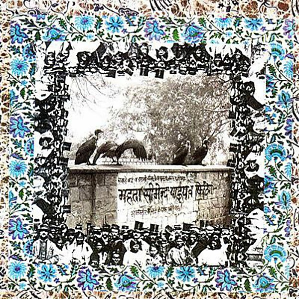

# The Cosmodemonic Telegraph Company

By **Monks of Doom**

## Album Data

- **Catalog:** Beets
- **Format:** Digital, Album
- **Album:** The Cosmodemonic Telegraph Company
- **Artist:** Monks Of Doom
- **Albumartist:** Monks of Doom
- **Genre:** Progressive Rock
- **MusicBrainz Album Artist ID:** [3eabadd7-5766-436d-a7d3-dd85bc209ffe](https://musicbrainz.org/artist/3eabadd7-5766-436d-a7d3-dd85bc209ffe)
- **MusicBrainz Album ID:** [57a70120-938f-426b-8629-8fbe5ddc4ddf](https://musicbrainz.org/release/57a70120-938f-426b-8629-8fbe5ddc4ddf)
- **MusicBrainz Release Group ID:** [2907eb4e-87ca-31c1-a3ff-d119df403dab](https://musicbrainz.org/release-group/2907eb4e-87ca-31c1-a3ff-d119df403dab)
- **Year:** 1989
- **Catalog #:** CZ047
- **Label:** C/Z Records
- **Total Tracks:** 05

## Album Tracks

### Track 01 - The Insect God

- **Artist:** Monks of Doom
- **Format:** AAC
- **Genre:** Progressive Rock
- **Length:** 7:24
- **MusicBrainz Track ID:** [d2430573-c02c-4381-8113-47df31eaba0a](https://musicbrainz.org/recording/d2430573-c02c-4381-8113-47df31eaba0a)
- **Title:** The Insect God
- **Track:** 01
- **Year:** 1992

### Track 02 - Chang

- **Artist:** Monks of Doom
- **Format:** AAC
- **Genre:** Rock
- **Length:** 3:09
- **MusicBrainz Track ID:** [a5b830a0-64b9-44a7-86ce-de3b73b82454](https://musicbrainz.org/recording/a5b830a0-64b9-44a7-86ce-de3b73b82454)
- **Title:** Chang
- **Track:** 02
- **Year:** 1992

### Track 03 - Let's Split

- **Artist:** Monks of Doom
- **Format:** AAC
- **Genre:** Progressive Rock
- **Length:** 1:32
- **MusicBrainz Track ID:** [baacbbb1-db19-4701-ad22-83ad76158e7c](https://musicbrainz.org/recording/baacbbb1-db19-4701-ad22-83ad76158e7c)
- **Title:** Let's Split
- **Track:** 03
- **Year:** 1992

### Track 04 - If It Don't Kill Me

- **Artist:** Monks of Doom
- **Format:** AAC
- **Genre:** Rock
- **Length:** 4:39
- **MusicBrainz Track ID:** [5c7280c2-6da3-44ab-84df-e4cb02b1cf8a](https://musicbrainz.org/recording/5c7280c2-6da3-44ab-84df-e4cb02b1cf8a)
- **Title:** If It Don't Kill Me
- **Track:** 04
- **Year:** 1992

### Track 05 - Who Are the Brain Police?

- **Artist:** Monks of Doom
- **Format:** AAC
- **Genre:** Progressive Rock
- **Length:** 3:41
- **MusicBrainz Track ID:** [387cd6a4-e409-4f18-8f87-8d9fa961744c](https://musicbrainz.org/recording/387cd6a4-e409-4f18-8f87-8d9fa961744c)
- **Title:** Who Are the Brain Police?
- **Track:** 05
- **Year:** 1992

## See also

- [Forgery](Forgery.md)
- [Meridian](Meridian.md)
- [The Insect God](The_Insect_God.md)
- [What's Left for Kicks?](Whats_Left_for_Kicks.md)
