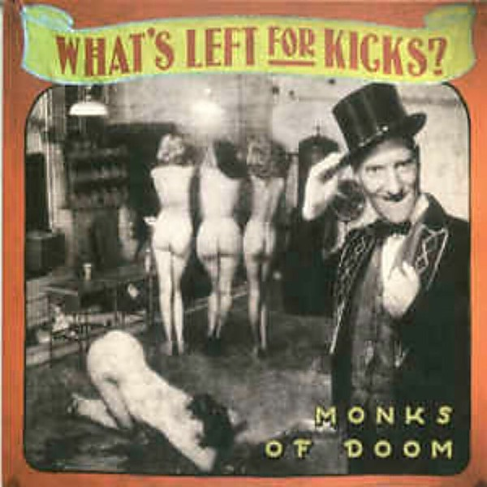

# What's Left for Kicks?

By Monks of Doom

## Album Data

- Catalog: Beets
- Format: Digital, Album
- Album: What's Left for Kicks?
- Artist: Monks Of Doom
- Albumartist: Monks of Doom
- Genre: Progressive Rock
- MusicBrainz Album Artist ID: 3eabadd7-5766-436d-a7d3-dd85bc209ffe
- MusicBrainz Album ID: 9326614c-d81f-40a8-9fb2-ebeaf8d7e825
- MusicBrainz Release Group ID: 56ff6aed-0e7c-3e29-a563-217a018c3219
- Year: 2006

