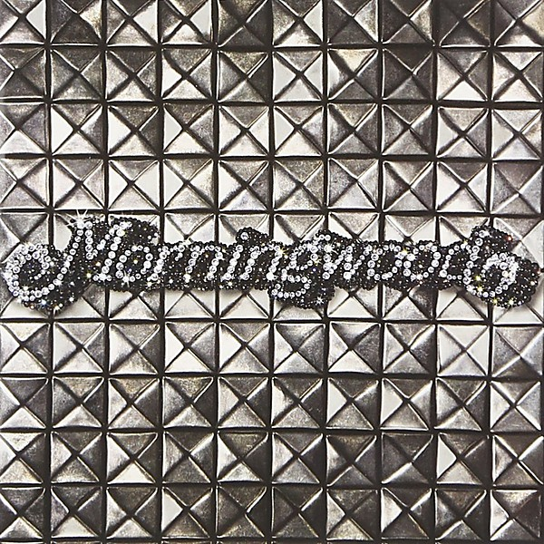

# Diamonds & Studs

By **Morningwood**

## Album Data

- **Catalog:** Beets
- **Format:** Digital, Album
- **Album:** Diamonds & Studs
- **Artist:** Morningwood
- **Albumartist:** Morningwood
- **Genre:** Indie Rock
- **MusicBrainz Album Artist ID:** 
- **MusicBrainz Album ID:** 
- **MusicBrainz Release Group ID:** 
- **Year:** 2009
- **Catalog #:** CDP 7243 8 64753 2 9
- **Label:** Capitol Records
- **Total Tracks:** 11

## Album Tracks

### Track 01 - Nü Rock

- **Artist:** Morningwood
- **Format:** ALAC
- **Genre:** Indie Rock
- **Length:** 2:30
- **MusicBrainz Track ID:** [9089c96b-37b1-4c33-8b6d-7c8dee3f6df5](https://musicbrainz.org/recording/9089c96b-37b1-4c33-8b6d-7c8dee3f6df5)
- **Title:** Nü Rock
- **Track:** 01
- **Year:** 2006

### Track 02 - Televisor

- **Artist:** Morningwood
- **Format:** ALAC
- **Genre:** Indie Rock
- **Length:** 3:37
- **MusicBrainz Track ID:** [33fcca65-7ed4-418f-adbb-041053429996](https://musicbrainz.org/recording/33fcca65-7ed4-418f-adbb-041053429996)
- **Title:** Televisor
- **Track:** 02
- **Year:** 2006

### Track 03 - Nth Degree

- **Artist:** Morningwood
- **Format:** ALAC
- **Genre:** Indie Rock
- **Length:** 3:55
- **MusicBrainz Track ID:** [0e762905-6c64-403a-b314-e5f95c9fd724](https://musicbrainz.org/recording/0e762905-6c64-403a-b314-e5f95c9fd724)
- **Title:** Nth Degree
- **Track:** 03
- **Year:** 2006

### Track 04 - Jetsetter

- **Artist:** Morningwood
- **Format:** ALAC
- **Genre:** Indie Rock
- **Length:** 3:54
- **MusicBrainz Track ID:** [f4dc0f3a-7808-489d-8bfc-576ba757ffa5](https://musicbrainz.org/recording/f4dc0f3a-7808-489d-8bfc-576ba757ffa5)
- **Title:** Jetsetter
- **Track:** 04
- **Year:** 2006

### Track 05 - Take Off Your Clothes

- **Artist:** Morningwood
- **Format:** ALAC
- **Genre:** Indie Rock
- **Length:** 3:17
- **MusicBrainz Track ID:** [9c1ab367-3f1f-47c3-8777-c2890a170fce](https://musicbrainz.org/recording/9c1ab367-3f1f-47c3-8777-c2890a170fce)
- **Title:** Take Off Your Clothes
- **Track:** 05
- **Year:** 2006

### Track 06 - Body 21

- **Artist:** Morningwood
- **Format:** ALAC
- **Genre:** Indie Rock
- **Length:** 3:37
- **MusicBrainz Track ID:** [32727a71-7f14-4a60-9b65-af7e2c2f7cec](https://musicbrainz.org/recording/32727a71-7f14-4a60-9b65-af7e2c2f7cec)
- **Title:** Body 21
- **Track:** 06
- **Year:** 2006

### Track 07 - Easy

- **Artist:** Morningwood
- **Format:** ALAC
- **Genre:** Indie Rock
- **Length:** 3:10
- **MusicBrainz Track ID:** [ad410ffa-470d-4645-91a7-c8ee7b26000a](https://musicbrainz.org/recording/ad410ffa-470d-4645-91a7-c8ee7b26000a)
- **Title:** Easy
- **Track:** 07
- **Year:** 2006

### Track 08 - Babysitter

- **Artist:** Morningwood
- **Format:** ALAC
- **Genre:** Indie Rock
- **Length:** 3:31
- **MusicBrainz Track ID:** [a61f172c-b40d-4874-a93c-2a1b8112b0c8](https://musicbrainz.org/recording/a61f172c-b40d-4874-a93c-2a1b8112b0c8)
- **Title:** Babysitter
- **Track:** 08
- **Year:** 2006

### Track 09 - New York Girls

- **Artist:** Morningwood
- **Format:** ALAC
- **Genre:** Indie Rock
- **Length:** 2:56
- **MusicBrainz Track ID:** [77119d59-44a6-4da0-b012-087f48243359](https://musicbrainz.org/recording/77119d59-44a6-4da0-b012-087f48243359)
- **Title:** New York Girls
- **Track:** 09
- **Year:** 2006

### Track 10 - Everybody Rules

- **Artist:** Morningwood
- **Format:** ALAC
- **Genre:** Indie Rock
- **Length:** 3:08
- **MusicBrainz Track ID:** [c8a32573-6919-4543-b9f7-02fb23ed113c](https://musicbrainz.org/recording/c8a32573-6919-4543-b9f7-02fb23ed113c)
- **Title:** Everybody Rules
- **Track:** 10
- **Year:** 2006

### Track 11 - Ride the Lights / [untitled]

- **Artist:** Morningwood
- **Format:** ALAC
- **Genre:** Indie Rock
- **Length:** 7:39
- **MusicBrainz Track ID:** [0f0ce5cd-c83c-45e3-8b13-1a1ba9ee5e2c](https://musicbrainz.org/recording/0f0ce5cd-c83c-45e3-8b13-1a1ba9ee5e2c)
- **Title:** Ride the Lights / [untitled]
- **Track:** 11
- **Year:** 2006

## See also

- [Morningwood](Morningwood.md)
- [Xmas 2007 Free Download](Xmas_2007_Free_Download.md)
- [CD: ](../../CD/Morningwood/Morningwood_index.md)
- [CD: Morningwood](../../CD/Morningwood/Morningwood.md)
- [Roon: Diamonds & Studs](../../Roon/Morningwood/Diamonds_and_Studs.md)
- [Roon: Morningwood](../../Roon/Morningwood/Morningwood.md)
