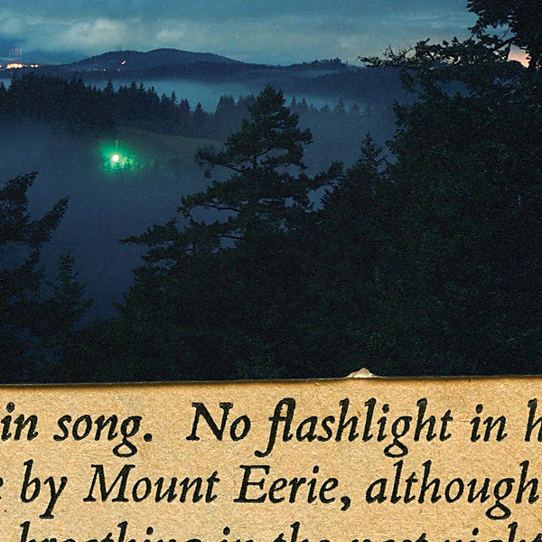

# No Flashlight

By **Mount Eerie**

## Album Data

- **Catalog:** Beets
- **Format:** Digital, Album
- **Album:** No Flashlight
- **Artist:** Mount Eerie
- **Albumartist:** Mount Eerie
- **Genre:** Noise Pop
- **MusicBrainz Album Artist ID:** [https](https://musicbrainz.org/artist/https)
- **MusicBrainz Album ID:** [https](https://musicbrainz.org/release/https)
- **MusicBrainz Release Group ID:** 
- **Year:** 2015
- **Catalog #:** MOSTLY IN A SMALL ROOM UPSTAIRS AT 418
- **Label:** Mount Eerie
- **Total Tracks:** 15

## Album Tracks

### Track 01 - I Know No One

- **Artist:** Mount Eerie
- **Format:** AAC
- **Genre:** Lo-Fi
- **Length:** 2:32
- **MusicBrainz Track ID:** [https](https://musicbrainz.org/recording/https)
- **Title:** I Know No One
- **Track:** 01
- **Year:** 2015

### Track 02 - I Hold Nothing

- **Artist:** Mount Eerie
- **Format:** AAC
- **Genre:** Lo-Fi
- **Length:** 5:00
- **MusicBrainz Track ID:** [https](https://musicbrainz.org/recording/https)
- **Title:** I Hold Nothing
- **Track:** 02
- **Year:** 2015

### Track 03 - the Moan

- **Artist:** Mount Eerie
- **Format:** AAC
- **Genre:** Indie Rock
- **Length:** 2:53
- **MusicBrainz Track ID:** [https](https://musicbrainz.org/recording/https)
- **Title:** the Moan
- **Track:** 03
- **Year:** 2015

### Track 04 - In The Bat's Mouth

- **Artist:** Mount Eerie
- **Format:** AAC
- **Genre:** Lo-Fi
- **Length:** 1:33
- **MusicBrainz Track ID:** [https](https://musicbrainz.org/recording/https)
- **Title:** In The Bat's Mouth
- **Track:** 04
- **Year:** 2015

### Track 05 - No Inside, No Out

- **Artist:** Mount Eerie
- **Format:** AAC
- **Genre:** Indie Rock
- **Length:** 1:52
- **MusicBrainz Track ID:** [https](https://musicbrainz.org/recording/https)
- **Title:** No Inside, No Out
- **Track:** 05
- **Year:** 2015

### Track 06 - (2 Lakes)

- **Artist:** Mount Eerie
- **Format:** AAC
- **Genre:** Sadcore
- **Length:** 1:09
- **MusicBrainz Track ID:** [https](https://musicbrainz.org/recording/https)
- **Title:** (2 Lakes)
- **Track:** 06
- **Year:** 2015

### Track 07 - Stop Singing

- **Artist:** Mount Eerie
- **Format:** AAC
- **Genre:** Crust Punk
- **Length:** 3:02
- **MusicBrainz Track ID:** [https](https://musicbrainz.org/recording/https)
- **Title:** Stop Singing
- **Track:** 07
- **Year:** 2015

### Track 08 - No Flashlight

- **Artist:** Mount Eerie
- **Format:** AAC
- **Genre:** Indie Rock
- **Length:** 3:04
- **MusicBrainz Track ID:** [https](https://musicbrainz.org/recording/https)
- **Title:** No Flashlight
- **Track:** 08
- **Year:** 2015

### Track 09 - (2 Mountains)

- **Artist:** Mount Eerie
- **Format:** AAC
- **Genre:** Indie Folk
- **Length:** 1:19
- **MusicBrainz Track ID:** [https](https://musicbrainz.org/recording/https)
- **Title:** (2 Mountains)
- **Track:** 09
- **Year:** 2015

### Track 10 - the Air in the Morning

- **Artist:** Mount Eerie
- **Format:** AAC
- **Genre:** Sadcore
- **Length:** 3:02
- **MusicBrainz Track ID:** [https](https://musicbrainz.org/recording/https)
- **Title:** the Air in the Morning
- **Track:** 10
- **Year:** 2015

### Track 11 - the Universe is Shown

- **Artist:** Mount Eerie
- **Format:** AAC
- **Genre:** Folktronica
- **Length:** 1:54
- **MusicBrainz Track ID:** [https](https://musicbrainz.org/recording/https)
- **Title:** the Universe is Shown
- **Track:** 11
- **Year:** 2015

### Track 12 - What?

- **Artist:** Mount Eerie
- **Format:** AAC
- **Genre:** Indie Rock
- **Length:** 2:57
- **MusicBrainz Track ID:** [https](https://musicbrainz.org/recording/https)
- **Title:** What?
- **Track:** 12
- **Year:** 2015

### Track 13 - How?

- **Artist:** Mount Eerie
- **Format:** AAC
- **Genre:** Indie Pop
- **Length:** 2:25
- **MusicBrainz Track ID:** [https](https://musicbrainz.org/recording/https)
- **Title:** How?
- **Track:** 13
- **Year:** 2015

### Track 14 - No Flashlight

- **Artist:** Mount Eerie
- **Format:** AAC
- **Genre:** Indie Rock
- **Length:** 3:54
- **MusicBrainz Track ID:** [https](https://musicbrainz.org/recording/https)
- **Title:** No Flashlight
- **Track:** 14
- **Year:** 2015

### Track 15 - (2 Moons)

- **Artist:** Mount Eerie
- **Format:** AAC
- **Genre:** Noise Pop
- **Length:** 1:07
- **MusicBrainz Track ID:** [https](https://musicbrainz.org/recording/https)
- **Title:** (2 Moons)
- **Track:** 15
- **Year:** 2015

