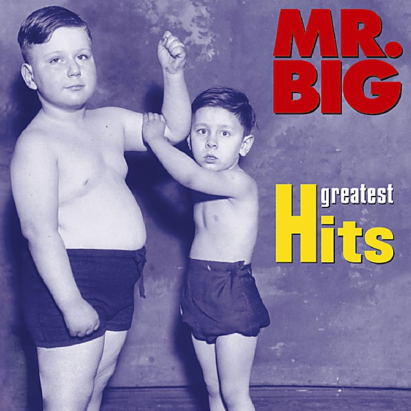

# Greatest Hits

By **Mr. Big**

## Album Data

- **Catalog:** Beets
- **Format:** Digital, Album
- **Album:** Greatest Hits
- **Artist:** Mr. Big
- **Albumartist:** Mr. Big
- **Genre:** Hard Rock
- **MusicBrainz Album Artist ID:** [bd1180c4-4252-461f-94dc-543906c02522](https://musicbrainz.org/artist/bd1180c4-4252-461f-94dc-543906c02522)
- **MusicBrainz Album ID:** [c032645c-3f0d-4bea-85a6-d66ac1d16ded](https://musicbrainz.org/release/c032645c-3f0d-4bea-85a6-d66ac1d16ded)
- **MusicBrainz Release Group ID:** [e1fde02b-b26b-3907-be78-7259006ae398](https://musicbrainz.org/release-group/e1fde02b-b26b-3907-be78-7259006ae398)
- **Year:** 2004
- **Catalog #:** R2 73987
- **Label:** Atlantic
- **Total Tracks:** 17

## Album Tracks

### Track 01 - Addicted to That Rush

- **Artist:** Mr. Big
- **Format:** MP3
- **Genre:** Hard Rock
- **Length:** 4:47
- **MusicBrainz Track ID:** [a98f6b9a-a457-4586-bb65-d9f19b53496a](https://musicbrainz.org/recording/a98f6b9a-a457-4586-bb65-d9f19b53496a)
- **Title:** Addicted to That Rush
- **Track:** 01
- **Year:** 2004

### Track 02 - Big Love

- **Artist:** Mr. Big
- **Format:** MP3
- **Genre:** Hard Rock
- **Length:** 4:50
- **MusicBrainz Track ID:** [29182644-78a3-4768-8f93-773fc56e706c](https://musicbrainz.org/recording/29182644-78a3-4768-8f93-773fc56e706c)
- **Title:** Big Love
- **Track:** 02
- **Year:** 2004

### Track 03 - Take a Walk

- **Artist:** Mr. Big
- **Format:** MP3
- **Genre:** Hard Rock
- **Length:** 3:58
- **MusicBrainz Track ID:** [7947b645-9ae6-469b-b7df-ee732a612221](https://musicbrainz.org/recording/7947b645-9ae6-469b-b7df-ee732a612221)
- **Title:** Take a Walk
- **Track:** 03
- **Year:** 2004

### Track 04 - Strike Like Lightning

- **Artist:** Mr. Big
- **Format:** MP3
- **Genre:** Glam Metal
- **Length:** 3:43
- **MusicBrainz Track ID:** [d9ef4412-6430-4f52-9ef4-5696675b821a](https://musicbrainz.org/recording/d9ef4412-6430-4f52-9ef4-5696675b821a)
- **Title:** Strike Like Lightning
- **Track:** 04
- **Year:** 2004

### Track 05 - Green-Tinted Sixties Mind

- **Artist:** Mr. Big
- **Format:** MP3
- **Genre:** Hard Rock
- **Length:** 3:31
- **MusicBrainz Track ID:** [550b58f8-30b3-4ea5-bf14-16671aa40776](https://musicbrainz.org/recording/550b58f8-30b3-4ea5-bf14-16671aa40776)
- **Title:** Green-Tinted Sixties Mind
- **Track:** 05
- **Year:** 2004

### Track 06 - Daddy, Brother, Lover, Little Boy (The Electric Drill Song)

- **Artist:** Mr. Big
- **Format:** MP3
- **Genre:** Hard Rock
- **Length:** 3:56
- **MusicBrainz Track ID:** [5e9246ed-bdf2-4ea2-af7e-76ca1c6396aa](https://musicbrainz.org/recording/5e9246ed-bdf2-4ea2-af7e-76ca1c6396aa)
- **Title:** Daddy, Brother, Lover, Little Boy (The Electric Drill Song)
- **Track:** 06
- **Year:** 2004

### Track 07 - Alive and Kickin'

- **Artist:** Mr. Big
- **Format:** MP3
- **Genre:** Hard Rock
- **Length:** 5:30
- **MusicBrainz Track ID:** [86439336-096c-4719-b999-556533b8c682](https://musicbrainz.org/recording/86439336-096c-4719-b999-556533b8c682)
- **Title:** Alive and Kickin'
- **Track:** 07
- **Year:** 2004

### Track 08 - Just Take My Heart

- **Artist:** Mr. Big
- **Format:** MP3
- **Genre:** Hard Rock
- **Length:** 4:24
- **MusicBrainz Track ID:** [a3d74622-9029-4b6c-adcc-996a44c0a97d](https://musicbrainz.org/recording/a3d74622-9029-4b6c-adcc-996a44c0a97d)
- **Title:** Just Take My Heart
- **Track:** 08
- **Year:** 2004

### Track 09 - To Be With You

- **Artist:** Mr. Big
- **Format:** MP3
- **Genre:** Hard Rock
- **Length:** 3:29
- **MusicBrainz Track ID:** [56b017fc-5b13-47c4-a9a5-c6b638f69d38](https://musicbrainz.org/recording/56b017fc-5b13-47c4-a9a5-c6b638f69d38)
- **Title:** To Be With You
- **Track:** 09
- **Year:** 2004

### Track 10 - Wild World

- **Artist:** Mr. Big
- **Format:** MP3
- **Genre:** Hard Rock
- **Length:** 3:29
- **MusicBrainz Track ID:** [8cc1ca86-144c-4953-aeec-1690256cef45](https://musicbrainz.org/recording/8cc1ca86-144c-4953-aeec-1690256cef45)
- **Title:** Wild World
- **Track:** 10
- **Year:** 2004

### Track 11 - Colorado Bulldog

- **Artist:** Mr. Big
- **Format:** MP3
- **Genre:** Hard Rock
- **Length:** 4:14
- **MusicBrainz Track ID:** [f9f6f9ee-e21a-4a86-86e5-b35d1311b2db](https://musicbrainz.org/recording/f9f6f9ee-e21a-4a86-86e5-b35d1311b2db)
- **Title:** Colorado Bulldog
- **Track:** 11
- **Year:** 2004

### Track 12 - Price You Gotta Pay

- **Artist:** Mr. Big
- **Format:** MP3
- **Genre:** Soft Rock
- **Length:** 3:57
- **MusicBrainz Track ID:** [c68be451-8a9e-4f23-ba06-ab0c935c78f4](https://musicbrainz.org/recording/c68be451-8a9e-4f23-ba06-ab0c935c78f4)
- **Title:** Price You Gotta Pay
- **Track:** 12
- **Year:** 2004

### Track 13 - Take Cover

- **Artist:** Mr. Big
- **Format:** MP3
- **Genre:** Hard Rock
- **Length:** 4:39
- **MusicBrainz Track ID:** [42a86e26-1eae-4c54-b862-1dc1570be0d1](https://musicbrainz.org/recording/42a86e26-1eae-4c54-b862-1dc1570be0d1)
- **Title:** Take Cover
- **Track:** 13
- **Year:** 2004

### Track 14 - Dancin' With My Devils

- **Artist:** Mr. Big
- **Format:** MP3
- **Genre:** Hard Rock
- **Length:** 3:43
- **MusicBrainz Track ID:** [f20dd3c9-ea49-42e7-a603-9a6b827c892f](https://musicbrainz.org/recording/f20dd3c9-ea49-42e7-a603-9a6b827c892f)
- **Title:** Dancin' With My Devils
- **Track:** 14
- **Year:** 2004

### Track 15 - Superfantastic

- **Artist:** Mr. Big
- **Format:** MP3
- **Genre:** Heavy Metal
- **Length:** 3:45
- **MusicBrainz Track ID:** [bdcefc66-8205-4b2a-b0d3-4c926e6085ac](https://musicbrainz.org/recording/bdcefc66-8205-4b2a-b0d3-4c926e6085ac)
- **Title:** Superfantastic
- **Track:** 15
- **Year:** 2004

### Track 16 - Shine

- **Artist:** Mr. Big
- **Format:** MP3
- **Genre:** Hard Rock
- **Length:** 3:43
- **MusicBrainz Track ID:** [3f11fd1c-8b70-47e8-9bc5-b85429a1ef3d](https://musicbrainz.org/recording/3f11fd1c-8b70-47e8-9bc5-b85429a1ef3d)
- **Title:** Shine
- **Track:** 16
- **Year:** 2004

### Track 17 - Suffocation

- **Artist:** Mr. Big
- **Format:** MP3
- **Genre:** Hard Rock
- **Length:** 4:41
- **MusicBrainz Track ID:** [566b2fdb-de87-44c5-b773-a91138fc0d5f](https://musicbrainz.org/recording/566b2fdb-de87-44c5-b773-a91138fc0d5f)
- **Title:** Suffocation
- **Track:** 17
- **Year:** 2004

