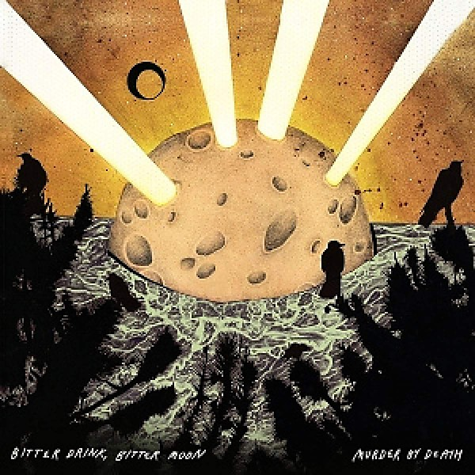

# Bitter Drink, Bitter Moon

By **Murder By Death**

## Album Data

- **Catalog:** Beets
- **Format:** Digital, Album
- **Album:** Bitter Drink, Bitter Moon
- **Artist:** Murder By Death
- **Albumartist:** Murder By Death
- **Genre:** Post-Rock
- **MusicBrainz Album Artist ID:** [https](https://musicbrainz.org/artist/https)
- **MusicBrainz Album ID:** [https](https://musicbrainz.org/release/https)
- **MusicBrainz Release Group ID:** 
- **Year:** 2012
- **Catalog #:** 
- **Label:** Bloodshot Records
- **Total Tracks:** 13

## Album Tracks

### Track 01 - My Hill

- **Artist:** Murder By Death
- **Format:** AAC
- **Genre:** Post-Rock
- **Length:** 2:36
- **MusicBrainz Track ID:** [https](https://musicbrainz.org/recording/https)
- **Title:** My Hill
- **Track:** 01
- **Year:** 2012

### Track 02 - Lost River

- **Artist:** Murder By Death
- **Format:** AAC
- **Genre:** Post-Rock
- **Length:** 4:24
- **MusicBrainz Track ID:** [https](https://musicbrainz.org/recording/https)
- **Title:** Lost River
- **Track:** 02
- **Year:** 2012

### Track 03 - Straight at the Sun

- **Artist:** Murder By Death
- **Format:** AAC
- **Genre:** Post-Rock
- **Length:** 4:04
- **MusicBrainz Track ID:** [https](https://musicbrainz.org/recording/https)
- **Title:** Straight at the Sun
- **Track:** 03
- **Year:** 2012

### Track 04 - No Oath, No Spell

- **Artist:** Murder By Death
- **Format:** AAC
- **Genre:** Rock
- **Length:** 3:32
- **MusicBrainz Track ID:** [https](https://musicbrainz.org/recording/https)
- **Title:** No Oath, No Spell
- **Track:** 04
- **Year:** 2012

### Track 05 - I Came Around

- **Artist:** Murder By Death
- **Format:** AAC
- **Genre:** Post-Rock
- **Length:** 4:35
- **MusicBrainz Track ID:** [https](https://musicbrainz.org/recording/https)
- **Title:** I Came Around
- **Track:** 05
- **Year:** 2012

### Track 06 - Hard World

- **Artist:** Murder By Death
- **Format:** AAC
- **Genre:** Indie Rock
- **Length:** 3:37
- **MusicBrainz Track ID:** [https](https://musicbrainz.org/recording/https)
- **Title:** Hard World
- **Track:** 06
- **Year:** 2012

### Track 07 - Ditch Lilly

- **Artist:** Murder By Death
- **Format:** AAC
- **Genre:** Post-Rock
- **Length:** 3:22
- **MusicBrainz Track ID:** [https](https://musicbrainz.org/recording/https)
- **Title:** Ditch Lilly
- **Track:** 07
- **Year:** 2012

### Track 08 - The Curse of Elkhart

- **Artist:** Murder By Death
- **Format:** AAC
- **Genre:** Post-Rock
- **Length:** 2:50
- **MusicBrainz Track ID:** [https](https://musicbrainz.org/recording/https)
- **Title:** The Curse of Elkhart
- **Track:** 08
- **Year:** 2012

### Track 09 - Ramblin'

- **Artist:** Murder By Death
- **Format:** AAC
- **Genre:** Post-Rock
- **Length:** 3:12
- **MusicBrainz Track ID:** [https](https://musicbrainz.org/recording/https)
- **Title:** Ramblin'
- **Track:** 09
- **Year:** 2012

### Track 10 - Queen Mab

- **Artist:** Murder By Death
- **Format:** AAC
- **Genre:** Post-Rock
- **Length:** 1:26
- **MusicBrainz Track ID:** [https](https://musicbrainz.org/recording/https)
- **Title:** Queen Mab
- **Track:** 10
- **Year:** 2012

### Track 11 - Go to the Light

- **Artist:** Murder By Death
- **Format:** AAC
- **Genre:** Post-Rock
- **Length:** 3:40
- **MusicBrainz Track ID:** [https](https://musicbrainz.org/recording/https)
- **Title:** Go to the Light
- **Track:** 11
- **Year:** 2012

### Track 12 - Oh, to be an Animal

- **Artist:** Murder By Death
- **Format:** AAC
- **Genre:** Post-Rock
- **Length:** 3:00
- **MusicBrainz Track ID:** [https](https://musicbrainz.org/recording/https)
- **Title:** Oh, to be an Animal
- **Track:** 12
- **Year:** 2012

### Track 13 - Ghost Fields

- **Artist:** Murder By Death
- **Format:** AAC
- **Genre:** Post-Rock
- **Length:** 4:01
- **MusicBrainz Track ID:** [https](https://musicbrainz.org/recording/https)
- **Title:** Ghost Fields
- **Track:** 13
- **Year:** 2012

