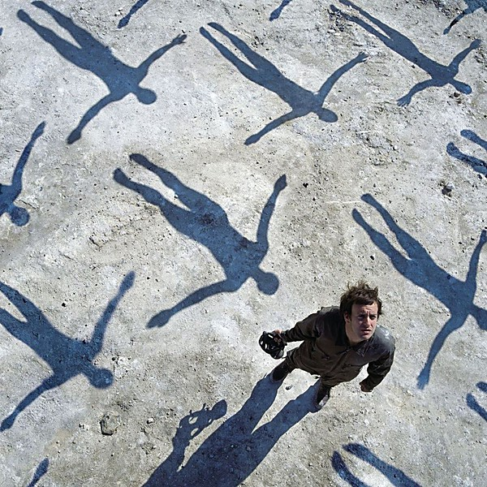

# Absolution

By **Muse**

## Album Data

- **Catalog:** Beets
- **Format:** Digital, Album
- **Album:** Absolution
- **Artist:** Muse
- **Albumartist:** Muse
- **Genre:** Indie Rock
- **MusicBrainz Album Artist ID:** [9c9f1380-2516-4fc9-a3e6-f9f61941d090](https://musicbrainz.org/artist/9c9f1380-2516-4fc9-a3e6-f9f61941d090)
- **MusicBrainz Album ID:** [a0a2b395-7989-4ec7-99f9-9bc9425c53b7](https://musicbrainz.org/release/a0a2b395-7989-4ec7-99f9-9bc9425c53b7)
- **MusicBrainz Release Group ID:** [6f151223-f3a3-3e57-810f-598f7897006c](https://musicbrainz.org/release-group/6f151223-f3a3-3e57-810f-598f7897006c)
- **Year:** 2003
- **Catalog #:** 44284-2
- **Label:** Warner Bros. Records
- **Total Tracks:** 11

## Album Tracks

### Track 01 - Take a Bow

- **Artist:** Muse
- **Format:** ALAC
- **Genre:** Indie Rock
- **Length:** 4:35
- **MusicBrainz Track ID:** [cccc851d-9214-4d24-9df6-e45f62664dbc](https://musicbrainz.org/recording/cccc851d-9214-4d24-9df6-e45f62664dbc)
- **Title:** Take a Bow
- **Track:** 01
- **Year:** 2006

### Track 02 - Starlight

- **Artist:** Muse
- **Format:** ALAC
- **Genre:** Indie Rock
- **Length:** 3:59
- **MusicBrainz Track ID:** [60e94685-0481-4d3d-bd84-11c389d9b2a5](https://musicbrainz.org/recording/60e94685-0481-4d3d-bd84-11c389d9b2a5)
- **Title:** Starlight
- **Track:** 02
- **Year:** 2006

### Track 03 - Supermassive Black Hole

- **Artist:** Muse
- **Format:** ALAC
- **Genre:** Indie Rock
- **Length:** 3:29
- **MusicBrainz Track ID:** [ff1e3e1a-f6e8-4692-b426-355880383bb6](https://musicbrainz.org/recording/ff1e3e1a-f6e8-4692-b426-355880383bb6)
- **Title:** Supermassive Black Hole
- **Track:** 03
- **Year:** 2006

### Track 04 - Map of the Problematique

- **Artist:** Muse
- **Format:** ALAC
- **Genre:** Space Rock
- **Length:** 4:18
- **MusicBrainz Track ID:** [d604a1b6-2cbd-4dc6-9682-a746405f247b](https://musicbrainz.org/recording/d604a1b6-2cbd-4dc6-9682-a746405f247b)
- **Title:** Map of the Problematique
- **Track:** 04
- **Year:** 2006

### Track 05 - Soldier's Poem

- **Artist:** Muse
- **Format:** ALAC
- **Genre:** Indie Rock
- **Length:** 2:03
- **MusicBrainz Track ID:** [c3823516-739c-4697-933b-f7f260e9aa60](https://musicbrainz.org/recording/c3823516-739c-4697-933b-f7f260e9aa60)
- **Title:** Soldier's Poem
- **Track:** 05
- **Year:** 2006

### Track 06 - Invincible

- **Artist:** Muse
- **Format:** ALAC
- **Genre:** Indie Rock
- **Length:** 5:00
- **MusicBrainz Track ID:** [55a7eb65-9b9e-4701-b6ae-de32b3a5652e](https://musicbrainz.org/recording/55a7eb65-9b9e-4701-b6ae-de32b3a5652e)
- **Title:** Invincible
- **Track:** 06
- **Year:** 2006

### Track 07 - Assassin

- **Artist:** Muse
- **Format:** ALAC
- **Genre:** Indie Rock
- **Length:** 3:31
- **MusicBrainz Track ID:** [aa0a3d7d-6f24-47ce-9809-ff58cea0a7bf](https://musicbrainz.org/recording/aa0a3d7d-6f24-47ce-9809-ff58cea0a7bf)
- **Title:** Assassin
- **Track:** 07
- **Year:** 2006

### Track 08 - Exo-Politics

- **Artist:** Muse
- **Format:** ALAC
- **Genre:** Indie Rock
- **Length:** 3:53
- **MusicBrainz Track ID:** [b3feb9d5-9ac5-493d-8f7c-10bf5013e964](https://musicbrainz.org/recording/b3feb9d5-9ac5-493d-8f7c-10bf5013e964)
- **Title:** Exo-Politics
- **Track:** 08
- **Year:** 2006

### Track 09 - City of Delusion

- **Artist:** Muse
- **Format:** ALAC
- **Genre:** Indie Rock
- **Length:** 4:48
- **MusicBrainz Track ID:** [a528ba1a-564f-42da-9953-01f7db07e881](https://musicbrainz.org/recording/a528ba1a-564f-42da-9953-01f7db07e881)
- **Title:** City of Delusion
- **Track:** 09
- **Year:** 2006

### Track 10 - Hoodoo

- **Artist:** Muse
- **Format:** ALAC
- **Genre:** Indie Rock
- **Length:** 3:43
- **MusicBrainz Track ID:** [14b6ae5a-3ae4-42a4-99b7-139f347b600b](https://musicbrainz.org/recording/14b6ae5a-3ae4-42a4-99b7-139f347b600b)
- **Title:** Hoodoo
- **Track:** 10
- **Year:** 2006

### Track 11 - Knights of Cydonia

- **Artist:** Muse
- **Format:** ALAC
- **Genre:** Indie Rock
- **Length:** 6:06
- **MusicBrainz Track ID:** [a28635ae-0520-401c-be53-20f4846f0113](https://musicbrainz.org/recording/a28635ae-0520-401c-be53-20f4846f0113)
- **Title:** Knights of Cydonia
- **Track:** 11
- **Year:** 2006

## See also

- [Black Holes and Revelations](Black_Holes_and_Revelations.md)
- [Drones](Drones.md)
- [HAARP](HAARP.md)
- [Hullabaloo (Eastwest Release)](Hullabaloo_Eastwest_Release.md)
- [Hullabaloo Soundtrack](Hullabaloo_Soundtrack.md)
- [Live at Rome Olympic Stadium](Live_at_Rome_Olympic_Stadium.md)
- [Showbiz](Showbiz.md)
- [Starlight](Starlight.md)
- [The 2nd Law](The_2nd_Law.md)
- [The Resistance](The_Resistance.md)
- [CD: Absolution](../../CD/Muse/Absolution.md)
- [CD: Drones](../../CD/Muse/Drones.md)
- [CD: ](../../CD/Muse/Muse.md)
- [CD: Showbiz](../../CD/Muse/Showbiz.md)
- [CD: The 2nd Law](../../CD/Muse/The_2nd_Law.md)
- [Roon: Absolution](../../Roon/Muse/Absolution.md)
- [Roon: Black Holes and Revelations](../../Roon/Muse/Black_Holes_and_Revelations.md)
- [Roon: Butterflies and Hurricanes (Updated 2009)](../../Roon/Muse/Butterflies_and_Hurricanes_Updated_2009.md)
- [Roon: Drones](../../Roon/Muse/Drones.md)
- [Roon: Hullabaloo Soundtrack](../../Roon/Muse/Hullabaloo_Soundtrack.md)
- [Roon: Live at Rome Olympic Stadium](../../Roon/Muse/Live_at_Rome_Olympic_Stadium.md)
- [Roon: Origin of Symmetry (XX Anniversary RemiXX)](../../Roon/Muse/Origin_of_Symmetry_XX_Anniversary_RemiXX.md)
- [Roon: Simulation Theory (Super Deluxe)](../../Roon/Muse/Simulation_Theory_Super_Deluxe.md)
- [Roon: Starlight (Updated 09)](../../Roon/Muse/Starlight_Updated_09.md)
- [Roon: The 2nd Law](../../Roon/Muse/The_2nd_Law.md)
- [Roon: The Resistance](../../Roon/Muse/The_Resistance.md)
- [Roon: Will Of The People](../../Roon/Muse/Will_Of_The_People.md)
- [Vinyl: Absolution](../../Vinyl/Muse/Absolution.md)
- [Vinyl: Black Holes And Revelations](../../Vinyl/Muse/Black_Holes_And_Revelations.md)
- [Vinyl: ](../../Vinyl/Muse/Muse.md)
- [Vinyl: The 2nd Law](../../Vinyl/Muse/The_2nd_Law.md)
- [Vinyl: The Resistance](../../Vinyl/Muse/The_Resistance.md)
