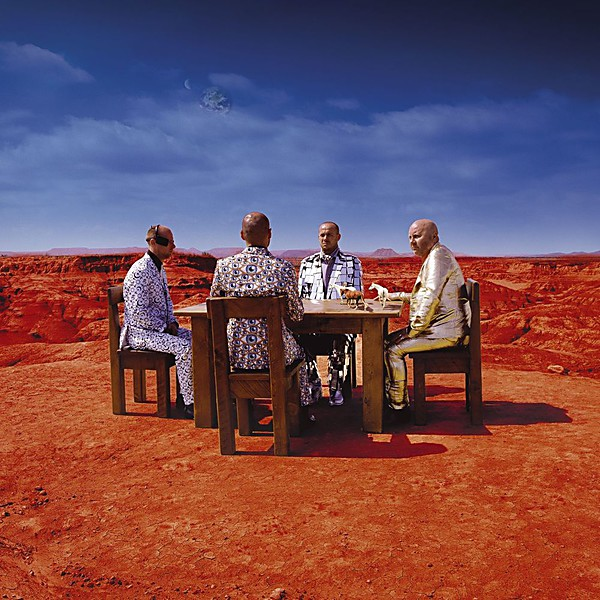

# Black Holes and Revelations

By **Muse**

## Album Data

- **Catalog:** Beets
- **Format:** Digital, Album
- **Album:** Black Holes and Revelations
- **Artist:** Muse
- **Albumartist:** Muse
- **Genre:** Progressive Rock
- **MusicBrainz Album Artist ID:** [9c9f1380-2516-4fc9-a3e6-f9f61941d090](https://musicbrainz.org/artist/9c9f1380-2516-4fc9-a3e6-f9f61941d090)
- **MusicBrainz Album ID:** [c3609171-00ec-3ccc-b34f-12901c3889c0](https://musicbrainz.org/release/c3609171-00ec-3ccc-b34f-12901c3889c0)
- **MusicBrainz Release Group ID:** [af2e8e23-e9c3-4e67-8ad8-66387c5898fd](https://musicbrainz.org/release-group/af2e8e23-e9c3-4e67-8ad8-66387c5898fd)
- **Year:** 2006
- **Catalog #:** 
- **Label:** Warner Bros. Records
- **Total Tracks:** 12

## Album Tracks

### Track 01 - Dead Inside

- **Artist:** Muse
- **Format:** ALAC
- **Genre:** Progressive Rock
- **Length:** 4:23
- **MusicBrainz Track ID:** [1d6564eb-42f9-43cf-aba8-5da4e72b0438](https://musicbrainz.org/recording/1d6564eb-42f9-43cf-aba8-5da4e72b0438)
- **Title:** Dead Inside
- **Track:** 01
- **Year:** 2015

### Track 02 - [Drill Sergeant]

- **Artist:** Muse
- **Format:** ALAC
- **Genre:** Progressive Rock
- **Length:** 0:21
- **MusicBrainz Track ID:** [274a399e-dab5-4403-8032-dbef97d71f5a](https://musicbrainz.org/recording/274a399e-dab5-4403-8032-dbef97d71f5a)
- **Title:** [Drill Sergeant]
- **Track:** 02
- **Year:** 2015

### Track 03 - Psycho

- **Artist:** Muse
- **Format:** ALAC
- **Genre:** Hard Rock
- **Length:** 5:16
- **MusicBrainz Track ID:** [ce41f1cd-778a-4484-a175-65ecebd01928](https://musicbrainz.org/recording/ce41f1cd-778a-4484-a175-65ecebd01928)
- **Title:** Psycho
- **Track:** 03
- **Year:** 2015

### Track 04 - Mercy

- **Artist:** Muse
- **Format:** ALAC
- **Genre:** Progressive Rock
- **Length:** 3:51
- **MusicBrainz Track ID:** [54612367-e523-4a65-ab73-0b5890035bb5](https://musicbrainz.org/recording/54612367-e523-4a65-ab73-0b5890035bb5)
- **Title:** Mercy
- **Track:** 04
- **Year:** 2015

### Track 05 - Reapers

- **Artist:** Muse
- **Format:** ALAC
- **Genre:** Progressive Rock
- **Length:** 5:59
- **MusicBrainz Track ID:** [ae342b46-2f8e-438b-ba9a-c266255f2296](https://musicbrainz.org/recording/ae342b46-2f8e-438b-ba9a-c266255f2296)
- **Title:** Reapers
- **Track:** 05
- **Year:** 2015

### Track 06 - The Handler

- **Artist:** Muse
- **Format:** ALAC
- **Genre:** Progressive Metal
- **Length:** 4:33
- **MusicBrainz Track ID:** [ff72d388-2c38-48b8-b03a-d452564c39ed](https://musicbrainz.org/recording/ff72d388-2c38-48b8-b03a-d452564c39ed)
- **Title:** The Handler
- **Track:** 06
- **Year:** 2015

### Track 07 - [JFK]

- **Artist:** Muse
- **Format:** ALAC
- **Genre:** Alternative Rock
- **Length:** 0:54
- **MusicBrainz Track ID:** [10156726-3287-4c45-8b42-1b410aaffe89](https://musicbrainz.org/recording/10156726-3287-4c45-8b42-1b410aaffe89)
- **Title:** [JFK]
- **Track:** 07
- **Year:** 2015

### Track 08 - Defector

- **Artist:** Muse
- **Format:** ALAC
- **Genre:** Progressive Rock
- **Length:** 4:32
- **MusicBrainz Track ID:** [0c1c1751-b376-47ee-a843-fffa7e0659b5](https://musicbrainz.org/recording/0c1c1751-b376-47ee-a843-fffa7e0659b5)
- **Title:** Defector
- **Track:** 08
- **Year:** 2015

### Track 09 - Revolt

- **Artist:** Muse
- **Format:** ALAC
- **Genre:** Indie Rock
- **Length:** 4:05
- **MusicBrainz Track ID:** [bdbbdc3f-c61e-40c6-8788-55298862c753](https://musicbrainz.org/recording/bdbbdc3f-c61e-40c6-8788-55298862c753)
- **Title:** Revolt
- **Track:** 09
- **Year:** 2015

### Track 10 - Aftermath

- **Artist:** Muse
- **Format:** ALAC
- **Genre:** Symphonic
- **Length:** 5:48
- **MusicBrainz Track ID:** [7c3d60d6-68b6-4ae3-a231-133c040c4df6](https://musicbrainz.org/recording/7c3d60d6-68b6-4ae3-a231-133c040c4df6)
- **Title:** Aftermath
- **Track:** 10
- **Year:** 2015

### Track 11 - The Globalist

- **Artist:** Muse
- **Format:** ALAC
- **Genre:** Symphonic
- **Length:** 10:07
- **MusicBrainz Track ID:** [6e44031c-781e-4ccb-ba0e-bf74941c06c1](https://musicbrainz.org/recording/6e44031c-781e-4ccb-ba0e-bf74941c06c1)
- **Title:** The Globalist
- **Track:** 11
- **Year:** 2015

### Track 12 - Drones

- **Artist:** Muse
- **Format:** ALAC
- **Genre:** Opera
- **Length:** 2:51
- **MusicBrainz Track ID:** [7b42df2c-279c-43b7-be34-b0037fc6cd61](https://musicbrainz.org/recording/7b42df2c-279c-43b7-be34-b0037fc6cd61)
- **Title:** Drones
- **Track:** 12
- **Year:** 2015

## See also

- [Absolution](Absolution.md)
- [Drones](Drones.md)
- [HAARP](HAARP.md)
- [Hullabaloo (Eastwest Release)](Hullabaloo_Eastwest_Release.md)
- [Hullabaloo Soundtrack](Hullabaloo_Soundtrack.md)
- [Live at Rome Olympic Stadium](Live_at_Rome_Olympic_Stadium.md)
- [Showbiz](Showbiz.md)
- [Starlight](Starlight.md)
- [The 2nd Law](The_2nd_Law.md)
- [The Resistance](The_Resistance.md)
- [CD: Absolution](../../CD/Muse/Absolution.md)
- [CD: Drones](../../CD/Muse/Drones.md)
- [CD: ](../../CD/Muse/Muse.md)
- [CD: Showbiz](../../CD/Muse/Showbiz.md)
- [CD: The 2nd Law](../../CD/Muse/The_2nd_Law.md)
- [Roon: Absolution](../../Roon/Muse/Absolution.md)
- [Roon: Black Holes and Revelations](../../Roon/Muse/Black_Holes_and_Revelations.md)
- [Roon: Butterflies and Hurricanes (Updated 2009)](../../Roon/Muse/Butterflies_and_Hurricanes_Updated_2009.md)
- [Roon: Drones](../../Roon/Muse/Drones.md)
- [Roon: Hullabaloo Soundtrack](../../Roon/Muse/Hullabaloo_Soundtrack.md)
- [Roon: Live at Rome Olympic Stadium](../../Roon/Muse/Live_at_Rome_Olympic_Stadium.md)
- [Roon: Origin of Symmetry (XX Anniversary RemiXX)](../../Roon/Muse/Origin_of_Symmetry_XX_Anniversary_RemiXX.md)
- [Roon: Simulation Theory (Super Deluxe)](../../Roon/Muse/Simulation_Theory_Super_Deluxe.md)
- [Roon: Starlight (Updated 09)](../../Roon/Muse/Starlight_Updated_09.md)
- [Roon: The 2nd Law](../../Roon/Muse/The_2nd_Law.md)
- [Roon: The Resistance](../../Roon/Muse/The_Resistance.md)
- [Roon: Will Of The People](../../Roon/Muse/Will_Of_The_People.md)
- [Vinyl: Absolution](../../Vinyl/Muse/Absolution.md)
- [Vinyl: Black Holes And Revelations](../../Vinyl/Muse/Black_Holes_And_Revelations.md)
- [Vinyl: ](../../Vinyl/Muse/Muse.md)
- [Vinyl: The 2nd Law](../../Vinyl/Muse/The_2nd_Law.md)
- [Vinyl: The Resistance](../../Vinyl/Muse/The_Resistance.md)
