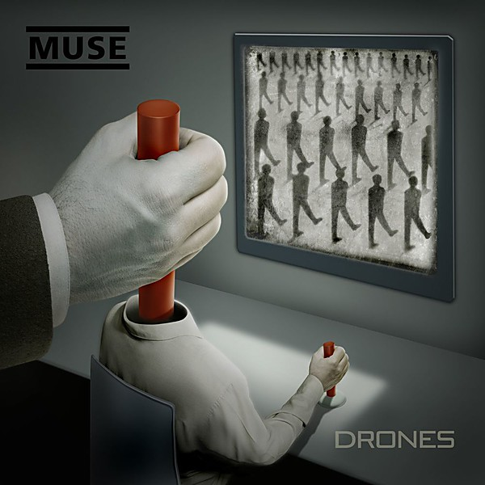

# Drones

By **Muse**

## Album Data

- **Catalog:** Beets
- **Format:** Digital, Album
- **Album:** Drones
- **Artist:** Muse
- **Albumartist:** Muse
- **Genre:** Progressive Rock
- **MusicBrainz Album Artist ID:** [9c9f1380-2516-4fc9-a3e6-f9f61941d090](https://musicbrainz.org/artist/9c9f1380-2516-4fc9-a3e6-f9f61941d090)
- **MusicBrainz Album ID:** [2aab6332-8042-4513-ac2e-e68698336cdb](https://musicbrainz.org/release/2aab6332-8042-4513-ac2e-e68698336cdb)
- **MusicBrainz Release Group ID:** [3133d4d5-5cfb-4f53-87f5-f3a97c8f310d](https://musicbrainz.org/release-group/3133d4d5-5cfb-4f53-87f5-f3a97c8f310d)
- **Year:** 2015
- **Catalog #:** WPZR-30267
- **Label:** Warner Bros. Records
- **Total Tracks:** 14

## Album Tracks

### Track 01 - Intro

- **Artist:** Muse
- **Format:** ALAC
- **Genre:** Indie Rock
- **Length:** 1:44
- **MusicBrainz Track ID:** [640a6964-3562-4d58-8684-f3fb7b699e59](https://musicbrainz.org/recording/640a6964-3562-4d58-8684-f3fb7b699e59)
- **Title:** Intro
- **Track:** 01
- **Year:** 2008

### Track 02 - Knights of Cydonia

- **Artist:** Muse
- **Format:** ALAC
- **Genre:** Indie Rock
- **Length:** 6:37
- **MusicBrainz Track ID:** [fdf4fa44-3db8-4b1d-aaee-a139715f0160](https://musicbrainz.org/recording/fdf4fa44-3db8-4b1d-aaee-a139715f0160)
- **Title:** Knights of Cydonia
- **Track:** 02
- **Year:** 2008

### Track 03 - Hysteria

- **Artist:** Muse
- **Format:** ALAC
- **Genre:** Indie Rock
- **Length:** 4:19
- **MusicBrainz Track ID:** [c318ea32-fa88-4999-a0d6-e49965cbf07b](https://musicbrainz.org/recording/c318ea32-fa88-4999-a0d6-e49965cbf07b)
- **Title:** Hysteria
- **Track:** 03
- **Year:** 2008

### Track 04 - Supermassive Black Hole

- **Artist:** Muse
- **Format:** ALAC
- **Genre:** Indie Rock
- **Length:** 4:01
- **MusicBrainz Track ID:** [606bc027-eb8e-40c0-a027-af9535ecd22c](https://musicbrainz.org/recording/606bc027-eb8e-40c0-a027-af9535ecd22c)
- **Title:** Supermassive Black Hole
- **Track:** 04
- **Year:** 2008

### Track 05 - Map of the Problematique

- **Artist:** Muse
- **Format:** ALAC
- **Genre:** Space Rock
- **Length:** 5:22
- **MusicBrainz Track ID:** [d7e29cf9-4918-4aa0-846d-b65238f6c6ef](https://musicbrainz.org/recording/d7e29cf9-4918-4aa0-846d-b65238f6c6ef)
- **Title:** Map of the Problematique
- **Track:** 05
- **Year:** 2008

### Track 06 - Butterflies & Hurricanes

- **Artist:** Muse
- **Format:** ALAC
- **Genre:** Indie Rock
- **Length:** 5:56
- **MusicBrainz Track ID:** [fdcbfecf-deb5-4ded-ad20-097988377238](https://musicbrainz.org/recording/fdcbfecf-deb5-4ded-ad20-097988377238)
- **Title:** Butterflies & Hurricanes
- **Track:** 06
- **Year:** 2008

### Track 07 - Invincible

- **Artist:** Muse
- **Format:** ALAC
- **Genre:** Indie Rock
- **Length:** 6:15
- **MusicBrainz Track ID:** [21626896-e413-455e-8a90-212d86a63a6a](https://musicbrainz.org/recording/21626896-e413-455e-8a90-212d86a63a6a)
- **Title:** Invincible
- **Track:** 07
- **Year:** 2008

### Track 08 - Starlight

- **Artist:** Muse
- **Format:** ALAC
- **Genre:** Indie Rock
- **Length:** 4:13
- **MusicBrainz Track ID:** [f1a66a7d-eaff-485d-a01d-d2d8d59e8206](https://musicbrainz.org/recording/f1a66a7d-eaff-485d-a01d-d2d8d59e8206)
- **Title:** Starlight
- **Track:** 08
- **Year:** 2008

### Track 09 - Time Is Running Out

- **Artist:** Muse
- **Format:** ALAC
- **Genre:** Indie Rock
- **Length:** 4:23
- **MusicBrainz Track ID:** [4981dacb-497a-4b0c-9c32-ef7dc27503ce](https://musicbrainz.org/recording/4981dacb-497a-4b0c-9c32-ef7dc27503ce)
- **Title:** Time Is Running Out
- **Track:** 09
- **Year:** 2008

### Track 10 - New Born

- **Artist:** Muse
- **Format:** ALAC
- **Genre:** Indie Rock
- **Length:** 8:16
- **MusicBrainz Track ID:** [0ade48a3-26c3-4a15-9105-8d644bcb6bbf](https://musicbrainz.org/recording/0ade48a3-26c3-4a15-9105-8d644bcb6bbf)
- **Title:** New Born
- **Track:** 10
- **Year:** 2008

### Track 11 - Unintended

- **Artist:** Muse
- **Format:** ALAC
- **Genre:** Britpop
- **Length:** 4:36
- **MusicBrainz Track ID:** [11e9c695-ee54-4c06-bafc-f129b03078ed](https://musicbrainz.org/recording/11e9c695-ee54-4c06-bafc-f129b03078ed)
- **Title:** Unintended
- **Track:** 11
- **Year:** 2008

### Track 12 - Micro Cuts

- **Artist:** Muse
- **Format:** ALAC
- **Genre:** Indie Rock
- **Length:** 3:47
- **MusicBrainz Track ID:** [46293974-b560-46ac-b92d-c15e36100dbb](https://musicbrainz.org/recording/46293974-b560-46ac-b92d-c15e36100dbb)
- **Title:** Micro Cuts
- **Track:** 12
- **Year:** 2008

### Track 13 - Stockholm Syndrome

- **Artist:** Muse
- **Format:** ALAC
- **Genre:** Indie Rock
- **Length:** 7:37
- **MusicBrainz Track ID:** [a7a50703-8dfb-487f-91c7-b692cb7c24df](https://musicbrainz.org/recording/a7a50703-8dfb-487f-91c7-b692cb7c24df)
- **Title:** Stockholm Syndrome
- **Track:** 13
- **Year:** 2008

### Track 14 - Take a Bow

- **Artist:** Muse
- **Format:** ALAC
- **Genre:** Indie Rock
- **Length:** 4:42
- **MusicBrainz Track ID:** [d842db8e-cea4-445d-bee4-d85ab359d5bb](https://musicbrainz.org/recording/d842db8e-cea4-445d-bee4-d85ab359d5bb)
- **Title:** Take a Bow
- **Track:** 14
- **Year:** 2008

## See also

- [Absolution](Absolution.md)
- [Black Holes and Revelations](Black_Holes_and_Revelations.md)
- [HAARP](HAARP.md)
- [Hullabaloo (Eastwest Release)](Hullabaloo_Eastwest_Release.md)
- [Hullabaloo Soundtrack](Hullabaloo_Soundtrack.md)
- [Live at Rome Olympic Stadium](Live_at_Rome_Olympic_Stadium.md)
- [Showbiz](Showbiz.md)
- [Starlight](Starlight.md)
- [The 2nd Law](The_2nd_Law.md)
- [The Resistance](The_Resistance.md)
- [CD: Absolution](../../CD/Muse/Absolution.md)
- [CD: Drones](../../CD/Muse/Drones.md)
- [CD: ](../../CD/Muse/Muse.md)
- [CD: Showbiz](../../CD/Muse/Showbiz.md)
- [CD: The 2nd Law](../../CD/Muse/The_2nd_Law.md)
- [Roon: Absolution](../../Roon/Muse/Absolution.md)
- [Roon: Black Holes and Revelations](../../Roon/Muse/Black_Holes_and_Revelations.md)
- [Roon: Butterflies and Hurricanes (Updated 2009)](../../Roon/Muse/Butterflies_and_Hurricanes_Updated_2009.md)
- [Roon: Drones](../../Roon/Muse/Drones.md)
- [Roon: Hullabaloo Soundtrack](../../Roon/Muse/Hullabaloo_Soundtrack.md)
- [Roon: Live at Rome Olympic Stadium](../../Roon/Muse/Live_at_Rome_Olympic_Stadium.md)
- [Roon: Origin of Symmetry (XX Anniversary RemiXX)](../../Roon/Muse/Origin_of_Symmetry_XX_Anniversary_RemiXX.md)
- [Roon: Simulation Theory (Super Deluxe)](../../Roon/Muse/Simulation_Theory_Super_Deluxe.md)
- [Roon: Starlight (Updated 09)](../../Roon/Muse/Starlight_Updated_09.md)
- [Roon: The 2nd Law](../../Roon/Muse/The_2nd_Law.md)
- [Roon: The Resistance](../../Roon/Muse/The_Resistance.md)
- [Roon: Will Of The People](../../Roon/Muse/Will_Of_The_People.md)
- [Vinyl: Absolution](../../Vinyl/Muse/Absolution.md)
- [Vinyl: Black Holes And Revelations](../../Vinyl/Muse/Black_Holes_And_Revelations.md)
- [Vinyl: ](../../Vinyl/Muse/Muse.md)
- [Vinyl: The 2nd Law](../../Vinyl/Muse/The_2nd_Law.md)
- [Vinyl: The Resistance](../../Vinyl/Muse/The_Resistance.md)
