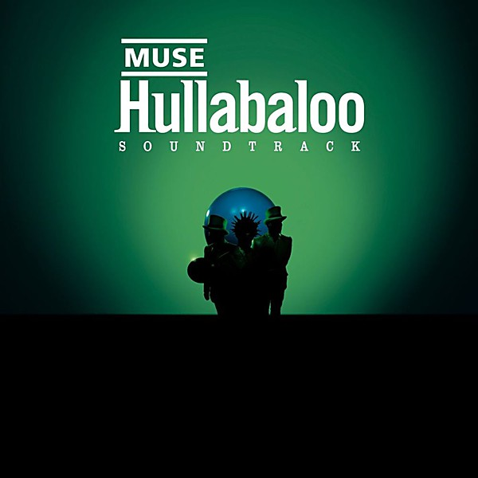

# Hullabaloo (Eastwest Release)

By **Muse**

## Album Data

- **Catalog:** Beets
- **Format:** Digital, Album
- **Album:** Hullabaloo (Eastwest Release)
- **Artist:** Muse
- **Albumartist:** Muse
- **Genre:** Indie Rock
- **MusicBrainz Album Artist ID:** 
- **MusicBrainz Album ID:** 
- **MusicBrainz Release Group ID:** 
- **Year:** 2006
- **Catalog #:** 335342
- **Label:** Taste Media
- **Total Tracks:** 21

## Album Tracks

### Track 01 - Forced In

- **Artist:** Muse
- **Format:** AAC
- **Genre:** Space Rock
- **Length:** 4:18
- **MusicBrainz Track ID:** [0e84d50e-aa9a-4365-bae9-7e8f870f0f02](https://musicbrainz.org/recording/0e84d50e-aa9a-4365-bae9-7e8f870f0f02)
- **Title:** Forced In
- **Track:** 01
- **Year:** 2002

### Track 02 - Shrinking Universe

- **Artist:** Muse
- **Format:** AAC
- **Genre:** Space Rock
- **Length:** 3:06
- **MusicBrainz Track ID:** [253240e6-7d91-4da9-98b5-4a6dc194a19d](https://musicbrainz.org/recording/253240e6-7d91-4da9-98b5-4a6dc194a19d)
- **Title:** Shrinking Universe
- **Track:** 02
- **Year:** 2002

### Track 03 - Recess

- **Artist:** Muse
- **Format:** AAC
- **Genre:** Britpop
- **Length:** 3:35
- **MusicBrainz Track ID:** [f5210a19-fc4f-4c03-95e0-a673b8757da8](https://musicbrainz.org/recording/f5210a19-fc4f-4c03-95e0-a673b8757da8)
- **Title:** Recess
- **Track:** 03
- **Year:** 2002

### Track 04 - Yes Please

- **Artist:** Muse
- **Format:** AAC
- **Genre:** Indie Rock
- **Length:** 3:05
- **MusicBrainz Track ID:** [0b900da7-d90e-4d0b-a053-e08398cc91ec](https://musicbrainz.org/recording/0b900da7-d90e-4d0b-a053-e08398cc91ec)
- **Title:** Yes Please
- **Track:** 04
- **Year:** 2002

### Track 05 - Map of Your Head

- **Artist:** Muse
- **Format:** AAC
- **Genre:** Indie Rock
- **Length:** 4:23
- **MusicBrainz Track ID:** [ad621f2d-3b8f-4e99-b6a1-5d8c72e5a66b](https://musicbrainz.org/recording/ad621f2d-3b8f-4e99-b6a1-5d8c72e5a66b)
- **Title:** Map of Your Head
- **Track:** 05
- **Year:** 2002

### Track 06 - Nature_1

- **Artist:** Muse
- **Format:** AAC
- **Genre:** Indie Rock
- **Length:** 3:39
- **MusicBrainz Track ID:** [ab49c326-f3cb-4b0d-82b5-62a80ebb309c](https://musicbrainz.org/recording/ab49c326-f3cb-4b0d-82b5-62a80ebb309c)
- **Title:** Nature_1
- **Track:** 06
- **Year:** 2002

### Track 07 - Shine Acoustic

- **Artist:** Muse
- **Format:** AAC
- **Genre:** Britpop
- **Length:** 5:12
- **MusicBrainz Track ID:** [6e4f7083-cd37-454e-a6dc-3e0face9b1eb](https://musicbrainz.org/recording/6e4f7083-cd37-454e-a6dc-3e0face9b1eb)
- **Title:** Shine Acoustic
- **Track:** 07
- **Year:** 2002

### Track 08 - Ashamed

- **Artist:** Muse
- **Format:** AAC
- **Genre:** Britpop
- **Length:** 3:47
- **MusicBrainz Track ID:** [6c8abbcc-3d65-4866-8719-92ab9544488e](https://musicbrainz.org/recording/6c8abbcc-3d65-4866-8719-92ab9544488e)
- **Title:** Ashamed
- **Track:** 08
- **Year:** 2002

### Track 09 - The Gallery

- **Artist:** Muse
- **Format:** AAC
- **Genre:** Space Rock
- **Length:** 3:30
- **MusicBrainz Track ID:** [1b47d48f-ad07-443c-8ad4-acf42aa12cc5](https://musicbrainz.org/recording/1b47d48f-ad07-443c-8ad4-acf42aa12cc5)
- **Title:** The Gallery
- **Track:** 09
- **Year:** 2002

### Track 10 - Hyper Chondriac Music

- **Artist:** Muse
- **Format:** AAC
- **Genre:** Indie Rock
- **Length:** 5:29
- **MusicBrainz Track ID:** [e7f5cfb4-47eb-42cb-97ce-3b506274ec73](https://musicbrainz.org/recording/e7f5cfb4-47eb-42cb-97ce-3b506274ec73)
- **Title:** Hyper Chondriac Music
- **Track:** 10
- **Year:** 2002

### Track 11 - Dead Star

- **Artist:** Muse
- **Format:** AAC
- **Genre:** Indie Rock
- **Length:** 4:10
- **MusicBrainz Track ID:** [64eb6085-12e6-428e-b1cf-71669b453388](https://musicbrainz.org/recording/64eb6085-12e6-428e-b1cf-71669b453388)
- **Title:** Dead Star
- **Track:** 11
- **Year:** 2002

### Track 12 - Micro Cuts

- **Artist:** Muse
- **Format:** AAC
- **Genre:** Indie Rock
- **Length:** 3:30
- **MusicBrainz Track ID:** [ebdbcd8d-823e-4bea-ad70-a8cb7643487a](https://musicbrainz.org/recording/ebdbcd8d-823e-4bea-ad70-a8cb7643487a)
- **Title:** Micro Cuts
- **Track:** 12
- **Year:** 2002

### Track 13 - Citizen Erased

- **Artist:** Muse
- **Format:** AAC
- **Genre:** Indie Rock
- **Length:** 7:21
- **MusicBrainz Track ID:** [28145665-cb89-41b5-90d3-19f74f765b46](https://musicbrainz.org/recording/28145665-cb89-41b5-90d3-19f74f765b46)
- **Title:** Citizen Erased
- **Track:** 13
- **Year:** 2002

### Track 14 - Showbiz

- **Artist:** Muse
- **Format:** AAC
- **Genre:** Indie Rock
- **Length:** 5:04
- **MusicBrainz Track ID:** [aa233736-abb6-4a3a-b7fd-1135b2d0001c](https://musicbrainz.org/recording/aa233736-abb6-4a3a-b7fd-1135b2d0001c)
- **Title:** Showbiz
- **Track:** 14
- **Year:** 2002

### Track 15 - Megalomania

- **Artist:** Muse
- **Format:** AAC
- **Genre:** Indie Rock
- **Length:** 4:36
- **MusicBrainz Track ID:** [3fc6fedb-7ec5-4308-aff6-239da2412897](https://musicbrainz.org/recording/3fc6fedb-7ec5-4308-aff6-239da2412897)
- **Title:** Megalomania
- **Track:** 15
- **Year:** 2002

### Track 16 - Dark Shines

- **Artist:** Muse
- **Format:** AAC
- **Genre:** Emo
- **Length:** 4:37
- **MusicBrainz Track ID:** [9cd369d7-b323-43db-bbdb-f2410a82bceb](https://musicbrainz.org/recording/9cd369d7-b323-43db-bbdb-f2410a82bceb)
- **Title:** Dark Shines
- **Track:** 16
- **Year:** 2002

### Track 17 - Screenager

- **Artist:** Muse
- **Format:** AAC
- **Genre:** Indie Rock
- **Length:** 4:22
- **MusicBrainz Track ID:** [471cd372-937a-4031-bb94-702c52d0504c](https://musicbrainz.org/recording/471cd372-937a-4031-bb94-702c52d0504c)
- **Title:** Screenager
- **Track:** 17
- **Year:** 2002

### Track 18 - Space Dementia

- **Artist:** Muse
- **Format:** AAC
- **Genre:** Space Rock
- **Length:** 5:32
- **MusicBrainz Track ID:** [5026f6d4-89be-4d29-b731-a91bb3f4779c](https://musicbrainz.org/recording/5026f6d4-89be-4d29-b731-a91bb3f4779c)
- **Title:** Space Dementia
- **Track:** 18
- **Year:** 2002

### Track 19 - In Your World

- **Artist:** Muse
- **Format:** AAC
- **Genre:** Progressive Rock
- **Length:** 3:11
- **MusicBrainz Track ID:** [ef5dd117-9e97-4d58-9bcc-fce15a8339f7](https://musicbrainz.org/recording/ef5dd117-9e97-4d58-9bcc-fce15a8339f7)
- **Title:** In Your World
- **Track:** 19
- **Year:** 2002

### Track 20 - Muscle Museum

- **Artist:** Muse
- **Format:** AAC
- **Genre:** Indie Rock
- **Length:** 4:29
- **MusicBrainz Track ID:** [6adb97bf-548f-479e-bb61-728dbdc7c7b7](https://musicbrainz.org/recording/6adb97bf-548f-479e-bb61-728dbdc7c7b7)
- **Title:** Muscle Museum
- **Track:** 20
- **Year:** 2002

### Track 21 - Agitated

- **Artist:** Muse
- **Format:** AAC
- **Genre:** Alternative Metal
- **Length:** 4:11
- **MusicBrainz Track ID:** [fac363f8-7da2-4d2d-9b19-d90be9bcefae](https://musicbrainz.org/recording/fac363f8-7da2-4d2d-9b19-d90be9bcefae)
- **Title:** Agitated
- **Track:** 21
- **Year:** 2002

## See also

- [Absolution](Absolution.md)
- [Black Holes and Revelations](Black_Holes_and_Revelations.md)
- [Drones](Drones.md)
- [HAARP](HAARP.md)
- [Hullabaloo Soundtrack](Hullabaloo_Soundtrack.md)
- [Live at Rome Olympic Stadium](Live_at_Rome_Olympic_Stadium.md)
- [Showbiz](Showbiz.md)
- [Starlight](Starlight.md)
- [The 2nd Law](The_2nd_Law.md)
- [The Resistance](The_Resistance.md)
- [CD: Absolution](../../CD/Muse/Absolution.md)
- [CD: Drones](../../CD/Muse/Drones.md)
- [CD: ](../../CD/Muse/Muse.md)
- [CD: Showbiz](../../CD/Muse/Showbiz.md)
- [CD: The 2nd Law](../../CD/Muse/The_2nd_Law.md)
- [Roon: Absolution](../../Roon/Muse/Absolution.md)
- [Roon: Black Holes and Revelations](../../Roon/Muse/Black_Holes_and_Revelations.md)
- [Roon: Butterflies and Hurricanes (Updated 2009)](../../Roon/Muse/Butterflies_and_Hurricanes_Updated_2009.md)
- [Roon: Drones](../../Roon/Muse/Drones.md)
- [Roon: Hullabaloo Soundtrack](../../Roon/Muse/Hullabaloo_Soundtrack.md)
- [Roon: Live at Rome Olympic Stadium](../../Roon/Muse/Live_at_Rome_Olympic_Stadium.md)
- [Roon: Origin of Symmetry (XX Anniversary RemiXX)](../../Roon/Muse/Origin_of_Symmetry_XX_Anniversary_RemiXX.md)
- [Roon: Simulation Theory (Super Deluxe)](../../Roon/Muse/Simulation_Theory_Super_Deluxe.md)
- [Roon: Starlight (Updated 09)](../../Roon/Muse/Starlight_Updated_09.md)
- [Roon: The 2nd Law](../../Roon/Muse/The_2nd_Law.md)
- [Roon: The Resistance](../../Roon/Muse/The_Resistance.md)
- [Roon: Will Of The People](../../Roon/Muse/Will_Of_The_People.md)
- [Vinyl: Absolution](../../Vinyl/Muse/Absolution.md)
- [Vinyl: Black Holes And Revelations](../../Vinyl/Muse/Black_Holes_And_Revelations.md)
- [Vinyl: ](../../Vinyl/Muse/Muse.md)
- [Vinyl: The 2nd Law](../../Vinyl/Muse/The_2nd_Law.md)
- [Vinyl: The Resistance](../../Vinyl/Muse/The_Resistance.md)
