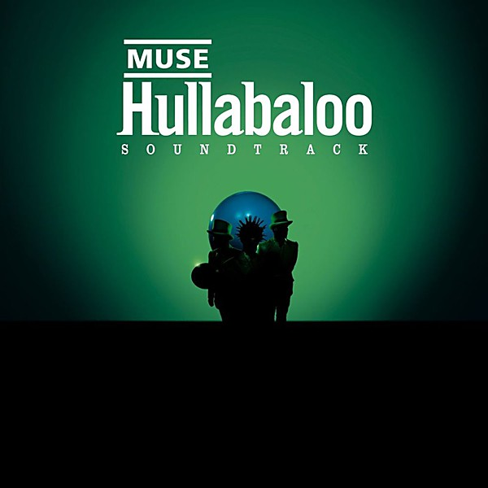

# Hullabaloo Soundtrack

By **Muse**

## Album Data

- **Catalog:** Beets
- **Format:** Digital, Album
- **Album:** Hullabaloo Soundtrack
- **Artist:** Muse
- **Albumartist:** Muse
- **Genre:** Indie Rock
- **MusicBrainz Album Artist ID:** [9c9f1380-2516-4fc9-a3e6-f9f61941d090](https://musicbrainz.org/artist/9c9f1380-2516-4fc9-a3e6-f9f61941d090)
- **MusicBrainz Album ID:** [4e8f6b3e-656f-3fe5-8042-16e3ff94e0ed](https://musicbrainz.org/release/4e8f6b3e-656f-3fe5-8042-16e3ff94e0ed)
- **MusicBrainz Release Group ID:** [9334b1d6-1604-35f1-bd99-484deb70af1b](https://musicbrainz.org/release-group/9334b1d6-1604-35f1-bd99-484deb70af1b)
- **Year:** 2002
- **Catalog #:** 
- **Label:** Warner Bros. Records
- **Total Tracks:** 13

## Album Tracks

### Track 01 - Supremacy

- **Artist:** Muse
- **Format:** ALAC
- **Genre:** Progressive Rock
- **Length:** 5:14
- **MusicBrainz Track ID:** [ab86bdf5-ac83-4f67-9a8b-a1b30cd58413](https://musicbrainz.org/recording/ab86bdf5-ac83-4f67-9a8b-a1b30cd58413)
- **Title:** Supremacy
- **Track:** 01
- **Year:** 2013

### Track 02 - Panic Station

- **Artist:** Muse
- **Format:** ALAC
- **Genre:** Progressive Rock
- **Length:** 3:12
- **MusicBrainz Track ID:** [a7ec9417-5b63-4995-9c3e-d80c593d0d53](https://musicbrainz.org/recording/a7ec9417-5b63-4995-9c3e-d80c593d0d53)
- **Title:** Panic Station
- **Track:** 02
- **Year:** 2013

### Track 03 - Resistance

- **Artist:** Muse
- **Format:** ALAC
- **Genre:** Progressive Rock
- **Length:** 5:32
- **MusicBrainz Track ID:** [bd1fee3e-4c47-4e96-a766-7d460d30c049](https://musicbrainz.org/recording/bd1fee3e-4c47-4e96-a766-7d460d30c049)
- **Title:** Resistance
- **Track:** 03
- **Year:** 2013

### Track 04 - Hysteria

- **Artist:** Muse
- **Format:** ALAC
- **Genre:** Indie Rock
- **Length:** 5:06
- **MusicBrainz Track ID:** [474641a4-93e4-4f6a-b801-7d1b97bf88d9](https://musicbrainz.org/recording/474641a4-93e4-4f6a-b801-7d1b97bf88d9)
- **Title:** Hysteria
- **Track:** 04
- **Year:** 2013

### Track 05 - Animals

- **Artist:** Muse
- **Format:** ALAC
- **Genre:** Progressive Rock
- **Length:** 4:21
- **MusicBrainz Track ID:** [8b2b5c3c-66c5-47d6-996a-4566858a061c](https://musicbrainz.org/recording/8b2b5c3c-66c5-47d6-996a-4566858a061c)
- **Title:** Animals
- **Track:** 05
- **Year:** 2013

### Track 06 - Knights of Cydonia

- **Artist:** Muse
- **Format:** ALAC
- **Genre:** Indie Rock
- **Length:** 8:19
- **MusicBrainz Track ID:** [aacc37bb-273b-47e4-bc20-1df82159f06c](https://musicbrainz.org/recording/aacc37bb-273b-47e4-bc20-1df82159f06c)
- **Title:** Knights of Cydonia
- **Track:** 06
- **Year:** 2013

### Track 07 - Explorers

- **Artist:** Muse
- **Format:** ALAC
- **Genre:** Britpop
- **Length:** 5:54
- **MusicBrainz Track ID:** [3977dcef-2caa-4044-b3e3-3128553dfde2](https://musicbrainz.org/recording/3977dcef-2caa-4044-b3e3-3128553dfde2)
- **Title:** Explorers
- **Track:** 07
- **Year:** 2013

### Track 08 - Follow Me

- **Artist:** Muse
- **Format:** ALAC
- **Genre:** Dubstep
- **Length:** 3:52
- **MusicBrainz Track ID:** [1148dbb4-64d9-4047-b3f8-35113d6818c7](https://musicbrainz.org/recording/1148dbb4-64d9-4047-b3f8-35113d6818c7)
- **Title:** Follow Me
- **Track:** 08
- **Year:** 2013

### Track 09 - Madness

- **Artist:** Muse
- **Format:** ALAC
- **Genre:** Dubstep
- **Length:** 4:37
- **MusicBrainz Track ID:** [f4f1b599-34eb-4410-9ed3-f83f0c63abd7](https://musicbrainz.org/recording/f4f1b599-34eb-4410-9ed3-f83f0c63abd7)
- **Title:** Madness
- **Track:** 09
- **Year:** 2013

### Track 10 - Guiding Light

- **Artist:** Muse
- **Format:** ALAC
- **Genre:** Space Rock
- **Length:** 4:18
- **MusicBrainz Track ID:** [42d9beec-c44c-4623-967a-9fdccbd39c65](https://musicbrainz.org/recording/42d9beec-c44c-4623-967a-9fdccbd39c65)
- **Title:** Guiding Light
- **Track:** 10
- **Year:** 2013

### Track 11 - Supermassive Black Hole

- **Artist:** Muse
- **Format:** ALAC
- **Genre:** Indie Rock
- **Length:** 4:05
- **MusicBrainz Track ID:** [b8082c94-b20a-4199-ac4a-93968282b88c](https://musicbrainz.org/recording/b8082c94-b20a-4199-ac4a-93968282b88c)
- **Title:** Supermassive Black Hole
- **Track:** 11
- **Year:** 2013

### Track 12 - Uprising

- **Artist:** Muse
- **Format:** ALAC
- **Genre:** Progressive Rock
- **Length:** 5:35
- **MusicBrainz Track ID:** [4942e2d1-dffc-4efe-832d-3a7818e383f3](https://musicbrainz.org/recording/4942e2d1-dffc-4efe-832d-3a7818e383f3)
- **Title:** Uprising
- **Track:** 12
- **Year:** 2013

### Track 13 - Starlight

- **Artist:** Muse
- **Format:** ALAC
- **Genre:** Indie Rock
- **Length:** 4:27
- **MusicBrainz Track ID:** [473bdbf3-e847-4aba-b738-cdaf2e4ea18c](https://musicbrainz.org/recording/473bdbf3-e847-4aba-b738-cdaf2e4ea18c)
- **Title:** Starlight
- **Track:** 13
- **Year:** 2013

## See also

- [Absolution](Absolution.md)
- [Black Holes and Revelations](Black_Holes_and_Revelations.md)
- [Drones](Drones.md)
- [HAARP](HAARP.md)
- [Hullabaloo (Eastwest Release)](Hullabaloo_Eastwest_Release.md)
- [Live at Rome Olympic Stadium](Live_at_Rome_Olympic_Stadium.md)
- [Showbiz](Showbiz.md)
- [Starlight](Starlight.md)
- [The 2nd Law](The_2nd_Law.md)
- [The Resistance](The_Resistance.md)
- [CD: Absolution](../../CD/Muse/Absolution.md)
- [CD: Drones](../../CD/Muse/Drones.md)
- [CD: ](../../CD/Muse/Muse.md)
- [CD: Showbiz](../../CD/Muse/Showbiz.md)
- [CD: The 2nd Law](../../CD/Muse/The_2nd_Law.md)
- [Roon: Absolution](../../Roon/Muse/Absolution.md)
- [Roon: Black Holes and Revelations](../../Roon/Muse/Black_Holes_and_Revelations.md)
- [Roon: Butterflies and Hurricanes (Updated 2009)](../../Roon/Muse/Butterflies_and_Hurricanes_Updated_2009.md)
- [Roon: Drones](../../Roon/Muse/Drones.md)
- [Roon: Hullabaloo Soundtrack](../../Roon/Muse/Hullabaloo_Soundtrack.md)
- [Roon: Live at Rome Olympic Stadium](../../Roon/Muse/Live_at_Rome_Olympic_Stadium.md)
- [Roon: Origin of Symmetry (XX Anniversary RemiXX)](../../Roon/Muse/Origin_of_Symmetry_XX_Anniversary_RemiXX.md)
- [Roon: Simulation Theory (Super Deluxe)](../../Roon/Muse/Simulation_Theory_Super_Deluxe.md)
- [Roon: Starlight (Updated 09)](../../Roon/Muse/Starlight_Updated_09.md)
- [Roon: The 2nd Law](../../Roon/Muse/The_2nd_Law.md)
- [Roon: The Resistance](../../Roon/Muse/The_Resistance.md)
- [Roon: Will Of The People](../../Roon/Muse/Will_Of_The_People.md)
- [Vinyl: Absolution](../../Vinyl/Muse/Absolution.md)
- [Vinyl: Black Holes And Revelations](../../Vinyl/Muse/Black_Holes_And_Revelations.md)
- [Vinyl: ](../../Vinyl/Muse/Muse.md)
- [Vinyl: The 2nd Law](../../Vinyl/Muse/The_2nd_Law.md)
- [Vinyl: The Resistance](../../Vinyl/Muse/The_Resistance.md)
