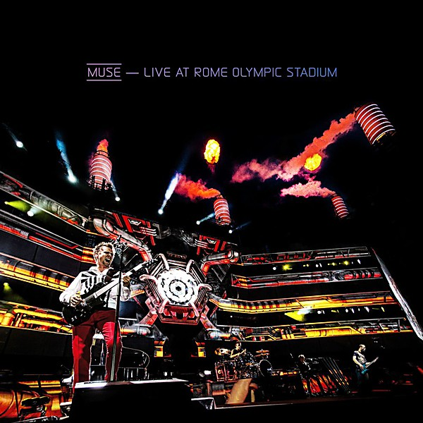

# Live at Rome Olympic Stadium

By **Muse**

## Album Data

- **Catalog:** Beets
- **Format:** Digital, Album
- **Album:** Live at Rome Olympic Stadium
- **Artist:** Muse
- **Albumartist:** Muse
- **Genre:** Space Rock
- **MusicBrainz Album Artist ID:** [9c9f1380-2516-4fc9-a3e6-f9f61941d090](https://musicbrainz.org/artist/9c9f1380-2516-4fc9-a3e6-f9f61941d090)
- **MusicBrainz Album ID:** [089ca863-f9e8-40bc-93e3-4d91e5054edb](https://musicbrainz.org/release/089ca863-f9e8-40bc-93e3-4d91e5054edb)
- **MusicBrainz Release Group ID:** [1064cc31-5ad0-4f94-a136-8294ffb756e3](https://musicbrainz.org/release-group/1064cc31-5ad0-4f94-a136-8294ffb756e3)
- **Year:** 2013
- **Catalog #:** 0 9362-47382-2 0
- **Label:** Taste Media
- **Total Tracks:** 12

## Album Tracks

### Track 01 - Sunburn

- **Artist:** Muse
- **Format:** ALAC
- **Genre:** Indie Rock
- **Length:** 3:53
- **MusicBrainz Track ID:** [921a4e83-93b3-4051-a59c-367128f4a452](https://musicbrainz.org/recording/921a4e83-93b3-4051-a59c-367128f4a452)
- **Title:** Sunburn
- **Track:** 01
- **Year:** 1999

### Track 02 - Muscle Museum

- **Artist:** Muse
- **Format:** ALAC
- **Genre:** Indie Rock
- **Length:** 4:22
- **MusicBrainz Track ID:** [04df790c-c036-460c-b94e-4ff07edc9fa8](https://musicbrainz.org/recording/04df790c-c036-460c-b94e-4ff07edc9fa8)
- **Title:** Muscle Museum
- **Track:** 02
- **Year:** 1999

### Track 03 - Fillip

- **Artist:** Muse
- **Format:** ALAC
- **Genre:** Indie Rock
- **Length:** 4:01
- **MusicBrainz Track ID:** [8d5b40df-d9a8-4352-a93b-2d666c867222](https://musicbrainz.org/recording/8d5b40df-d9a8-4352-a93b-2d666c867222)
- **Title:** Fillip
- **Track:** 03
- **Year:** 1999

### Track 04 - Falling Down

- **Artist:** Muse
- **Format:** ALAC
- **Genre:** Progressive Rock
- **Length:** 4:33
- **MusicBrainz Track ID:** [b85ceef2-4564-4778-8591-b57a7a39e00c](https://musicbrainz.org/recording/b85ceef2-4564-4778-8591-b57a7a39e00c)
- **Title:** Falling Down
- **Track:** 04
- **Year:** 1999

### Track 05 - Cave

- **Artist:** Muse
- **Format:** ALAC
- **Genre:** Progressive Rock
- **Length:** 4:45
- **MusicBrainz Track ID:** [08368217-2a2c-4912-bf15-1936f77a9d2f](https://musicbrainz.org/recording/08368217-2a2c-4912-bf15-1936f77a9d2f)
- **Title:** Cave
- **Track:** 05
- **Year:** 1999

### Track 06 - Showbiz

- **Artist:** Muse
- **Format:** ALAC
- **Genre:** Indie Rock
- **Length:** 5:17
- **MusicBrainz Track ID:** [f4bd55b1-2b50-4cab-8776-a37c447e9973](https://musicbrainz.org/recording/f4bd55b1-2b50-4cab-8776-a37c447e9973)
- **Title:** Showbiz
- **Track:** 06
- **Year:** 1999

### Track 07 - Unintended

- **Artist:** Muse
- **Format:** ALAC
- **Genre:** Britpop
- **Length:** 3:57
- **MusicBrainz Track ID:** [c1014fda-63d0-4496-8695-18d325cf3387](https://musicbrainz.org/recording/c1014fda-63d0-4496-8695-18d325cf3387)
- **Title:** Unintended
- **Track:** 07
- **Year:** 1999

### Track 08 - Uno

- **Artist:** Muse
- **Format:** ALAC
- **Genre:** Progressive Rock
- **Length:** 3:38
- **MusicBrainz Track ID:** [85a7a0ac-20f1-4ab6-9e23-5cdcb077ecff](https://musicbrainz.org/recording/85a7a0ac-20f1-4ab6-9e23-5cdcb077ecff)
- **Title:** Uno
- **Track:** 08
- **Year:** 1999

### Track 09 - Sober

- **Artist:** Muse
- **Format:** ALAC
- **Genre:** Indie Rock
- **Length:** 4:04
- **MusicBrainz Track ID:** [4d69ec2e-643d-444e-b54d-081a26b3e057](https://musicbrainz.org/recording/4d69ec2e-643d-444e-b54d-081a26b3e057)
- **Title:** Sober
- **Track:** 09
- **Year:** 1999

### Track 10 - Escape

- **Artist:** Muse
- **Format:** ALAC
- **Genre:** Indie Rock
- **Length:** 3:31
- **MusicBrainz Track ID:** [b3bd754c-94f8-4279-bef9-7ce80ef8d283](https://musicbrainz.org/recording/b3bd754c-94f8-4279-bef9-7ce80ef8d283)
- **Title:** Escape
- **Track:** 10
- **Year:** 1999

### Track 11 - Overdue

- **Artist:** Muse
- **Format:** ALAC
- **Genre:** Indie Rock
- **Length:** 2:26
- **MusicBrainz Track ID:** [aacec886-84e4-49af-a076-0e0f82f4b637](https://musicbrainz.org/recording/aacec886-84e4-49af-a076-0e0f82f4b637)
- **Title:** Overdue
- **Track:** 11
- **Year:** 1999

### Track 12 - Hate This & I’ll Love You

- **Artist:** Muse
- **Format:** ALAC
- **Genre:** Alternative Rock
- **Length:** 5:09
- **MusicBrainz Track ID:** [3a598cd8-e3e9-48cd-a18e-0132be1e8765](https://musicbrainz.org/recording/3a598cd8-e3e9-48cd-a18e-0132be1e8765)
- **Title:** Hate This & I’ll Love You
- **Track:** 12
- **Year:** 1999

## See also

- [Absolution](Absolution.md)
- [Black Holes and Revelations](Black_Holes_and_Revelations.md)
- [Drones](Drones.md)
- [HAARP](HAARP.md)
- [Hullabaloo (Eastwest Release)](Hullabaloo_Eastwest_Release.md)
- [Hullabaloo Soundtrack](Hullabaloo_Soundtrack.md)
- [Showbiz](Showbiz.md)
- [Starlight](Starlight.md)
- [The 2nd Law](The_2nd_Law.md)
- [The Resistance](The_Resistance.md)
- [CD: Absolution](../../CD/Muse/Absolution.md)
- [CD: Drones](../../CD/Muse/Drones.md)
- [CD: ](../../CD/Muse/Muse.md)
- [CD: Showbiz](../../CD/Muse/Showbiz.md)
- [CD: The 2nd Law](../../CD/Muse/The_2nd_Law.md)
- [Roon: Absolution](../../Roon/Muse/Absolution.md)
- [Roon: Black Holes and Revelations](../../Roon/Muse/Black_Holes_and_Revelations.md)
- [Roon: Butterflies and Hurricanes (Updated 2009)](../../Roon/Muse/Butterflies_and_Hurricanes_Updated_2009.md)
- [Roon: Drones](../../Roon/Muse/Drones.md)
- [Roon: Hullabaloo Soundtrack](../../Roon/Muse/Hullabaloo_Soundtrack.md)
- [Roon: Live at Rome Olympic Stadium](../../Roon/Muse/Live_at_Rome_Olympic_Stadium.md)
- [Roon: Origin of Symmetry (XX Anniversary RemiXX)](../../Roon/Muse/Origin_of_Symmetry_XX_Anniversary_RemiXX.md)
- [Roon: Simulation Theory (Super Deluxe)](../../Roon/Muse/Simulation_Theory_Super_Deluxe.md)
- [Roon: Starlight (Updated 09)](../../Roon/Muse/Starlight_Updated_09.md)
- [Roon: The 2nd Law](../../Roon/Muse/The_2nd_Law.md)
- [Roon: The Resistance](../../Roon/Muse/The_Resistance.md)
- [Roon: Will Of The People](../../Roon/Muse/Will_Of_The_People.md)
- [Vinyl: Absolution](../../Vinyl/Muse/Absolution.md)
- [Vinyl: Black Holes And Revelations](../../Vinyl/Muse/Black_Holes_And_Revelations.md)
- [Vinyl: ](../../Vinyl/Muse/Muse.md)
- [Vinyl: The 2nd Law](../../Vinyl/Muse/The_2nd_Law.md)
- [Vinyl: The Resistance](../../Vinyl/Muse/The_Resistance.md)
