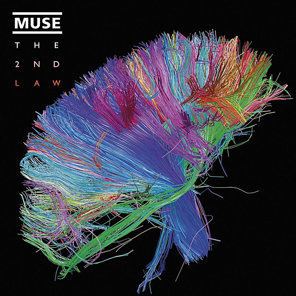

# The 2nd Law

By **Muse**

## Album Data

- **Catalog:** Beets
- **Format:** Digital, Album
- **Album:** The 2nd Law
- **Artist:** Muse
- **Albumartist:** Muse
- **Genre:** Dubstep
- **MusicBrainz Album Artist ID:** [9c9f1380-2516-4fc9-a3e6-f9f61941d090](https://musicbrainz.org/artist/9c9f1380-2516-4fc9-a3e6-f9f61941d090)
- **MusicBrainz Album ID:** [1f27b00b-b078-4286-9f0b-2fb0bd516cff](https://musicbrainz.org/release/1f27b00b-b078-4286-9f0b-2fb0bd516cff)
- **MusicBrainz Release Group ID:** [422cd8ac-8599-4356-b874-4da79a06abac](https://musicbrainz.org/release-group/422cd8ac-8599-4356-b874-4da79a06abac)
- **Year:** 2012
- **Catalog #:** 521294-2
- **Label:** Warner Bros. Records
- **Total Tracks:** 11

## Album Tracks

### Track 01 - Uprising

- **Artist:** Muse
- **Format:** ALAC
- **Genre:** Progressive Rock
- **Length:** 5:02
- **MusicBrainz Track ID:** [0ca789c6-3618-48f1-8ee0-977f70a621d6](https://musicbrainz.org/recording/0ca789c6-3618-48f1-8ee0-977f70a621d6)
- **Title:** Uprising
- **Track:** 01
- **Year:** 2009

### Track 02 - Resistance

- **Artist:** Muse
- **Format:** ALAC
- **Genre:** Progressive Rock
- **Length:** 5:46
- **MusicBrainz Track ID:** [09595161-717b-4ec5-94d1-9040aab8aae4](https://musicbrainz.org/recording/09595161-717b-4ec5-94d1-9040aab8aae4)
- **Title:** Resistance
- **Track:** 02
- **Year:** 2009

### Track 03 - Undisclosed Desires

- **Artist:** Muse
- **Format:** ALAC
- **Genre:** Progressive Rock
- **Length:** 3:56
- **MusicBrainz Track ID:** [cf6af080-1bc0-4a82-90c9-0ecb7e9e4ec4](https://musicbrainz.org/recording/cf6af080-1bc0-4a82-90c9-0ecb7e9e4ec4)
- **Title:** Undisclosed Desires
- **Track:** 03
- **Year:** 2009

### Track 04 - United States of Eurasia / Collateral Damage

- **Artist:** Muse
- **Format:** ALAC
- **Genre:** Symphonic
- **Length:** 5:47
- **MusicBrainz Track ID:** [10ea46dd-2cf9-4837-8642-e838ff406fa9](https://musicbrainz.org/recording/10ea46dd-2cf9-4837-8642-e838ff406fa9)
- **Title:** United States of Eurasia / Collateral Damage
- **Track:** 04
- **Year:** 2009

### Track 05 - Guiding Light

- **Artist:** Muse
- **Format:** ALAC
- **Genre:** Space Rock
- **Length:** 4:13
- **MusicBrainz Track ID:** [8b72efea-0a9e-463e-9981-f938ead2d09b](https://musicbrainz.org/recording/8b72efea-0a9e-463e-9981-f938ead2d09b)
- **Title:** Guiding Light
- **Track:** 05
- **Year:** 2009

### Track 06 - Unnatural Selection

- **Artist:** Muse
- **Format:** ALAC
- **Genre:** Progressive Rock
- **Length:** 6:54
- **MusicBrainz Track ID:** [bd5a8e36-b012-4eec-ba89-e435a8f6c58c](https://musicbrainz.org/recording/bd5a8e36-b012-4eec-ba89-e435a8f6c58c)
- **Title:** Unnatural Selection
- **Track:** 06
- **Year:** 2009

### Track 07 - MK Ultra

- **Artist:** Muse
- **Format:** ALAC
- **Genre:** Space Rock
- **Length:** 4:06
- **MusicBrainz Track ID:** [e3fada81-0718-4807-b249-cf47dbf29a03](https://musicbrainz.org/recording/e3fada81-0718-4807-b249-cf47dbf29a03)
- **Title:** MK Ultra
- **Track:** 07
- **Year:** 2009

### Track 08 - I Belong to You / Mon cœur s’ouvre à ta voix

- **Artist:** Muse
- **Format:** ALAC
- **Genre:** Space Rock
- **Length:** 5:38
- **MusicBrainz Track ID:** [bfbc588f-c4f7-464a-a890-7ac749326a13](https://musicbrainz.org/recording/bfbc588f-c4f7-464a-a890-7ac749326a13)
- **Title:** I Belong to You / Mon cœur s’ouvre à ta voix
- **Track:** 08
- **Year:** 2009

### Track 09 - Exogenesis

- **Artist:** Muse
- **Format:** ALAC
- **Genre:** Progressive Rock
- **Length:** 4:18
- **MusicBrainz Track ID:** [f2a4c13b-9bfc-4bfd-a197-3e4f7af55d52](https://musicbrainz.org/recording/f2a4c13b-9bfc-4bfd-a197-3e4f7af55d52)
- **Title:** Exogenesis
- **Track:** 09
- **Year:** 2009

### Track 10 - Exogenesis

- **Artist:** Muse
- **Format:** ALAC
- **Genre:** Alternative Rock
- **Length:** 3:56
- **MusicBrainz Track ID:** [7f198a38-b1f7-4a4f-be6a-5e5631dca16f](https://musicbrainz.org/recording/7f198a38-b1f7-4a4f-be6a-5e5631dca16f)
- **Title:** Exogenesis
- **Track:** 10
- **Year:** 2009

### Track 11 - Exogenesis

- **Artist:** Muse
- **Format:** ALAC
- **Genre:** Hard Rock
- **Length:** 4:37
- **MusicBrainz Track ID:** [42b205b0-7f27-4d3d-a33f-9a7cbf9a33f7](https://musicbrainz.org/recording/42b205b0-7f27-4d3d-a33f-9a7cbf9a33f7)
- **Title:** Exogenesis
- **Track:** 11
- **Year:** 2009

## See also

- [Absolution](Absolution.md)
- [Black Holes and Revelations](Black_Holes_and_Revelations.md)
- [Drones](Drones.md)
- [HAARP](HAARP.md)
- [Hullabaloo (Eastwest Release)](Hullabaloo_Eastwest_Release.md)
- [Hullabaloo Soundtrack](Hullabaloo_Soundtrack.md)
- [Live at Rome Olympic Stadium](Live_at_Rome_Olympic_Stadium.md)
- [Showbiz](Showbiz.md)
- [Starlight](Starlight.md)
- [The Resistance](The_Resistance.md)
- [CD: Absolution](../../CD/Muse/Absolution.md)
- [CD: Drones](../../CD/Muse/Drones.md)
- [CD: ](../../CD/Muse/Muse.md)
- [CD: Showbiz](../../CD/Muse/Showbiz.md)
- [CD: The 2nd Law](../../CD/Muse/The_2nd_Law.md)
- [Roon: Absolution](../../Roon/Muse/Absolution.md)
- [Roon: Black Holes and Revelations](../../Roon/Muse/Black_Holes_and_Revelations.md)
- [Roon: Butterflies and Hurricanes (Updated 2009)](../../Roon/Muse/Butterflies_and_Hurricanes_Updated_2009.md)
- [Roon: Drones](../../Roon/Muse/Drones.md)
- [Roon: Hullabaloo Soundtrack](../../Roon/Muse/Hullabaloo_Soundtrack.md)
- [Roon: Live at Rome Olympic Stadium](../../Roon/Muse/Live_at_Rome_Olympic_Stadium.md)
- [Roon: Origin of Symmetry (XX Anniversary RemiXX)](../../Roon/Muse/Origin_of_Symmetry_XX_Anniversary_RemiXX.md)
- [Roon: Simulation Theory (Super Deluxe)](../../Roon/Muse/Simulation_Theory_Super_Deluxe.md)
- [Roon: Starlight (Updated 09)](../../Roon/Muse/Starlight_Updated_09.md)
- [Roon: The 2nd Law](../../Roon/Muse/The_2nd_Law.md)
- [Roon: The Resistance](../../Roon/Muse/The_Resistance.md)
- [Roon: Will Of The People](../../Roon/Muse/Will_Of_The_People.md)
- [Vinyl: Absolution](../../Vinyl/Muse/Absolution.md)
- [Vinyl: Black Holes And Revelations](../../Vinyl/Muse/Black_Holes_And_Revelations.md)
- [Vinyl: ](../../Vinyl/Muse/Muse.md)
- [Vinyl: The 2nd Law](../../Vinyl/Muse/The_2nd_Law.md)
- [Vinyl: The Resistance](../../Vinyl/Muse/The_Resistance.md)
