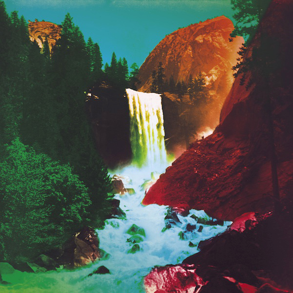

# The Waterfall

By **My Morning Jacket**

## Album Data

- **Catalog:** Beets
- **Format:** Digital, Album
- **Album:** The Waterfall
- **Artist:** My Morning Jacket
- **Albumartist:** My Morning Jacket
- **Genre:** Indie Rock
- **MusicBrainz Album Artist ID:** [ea5883b7-68ce-48b3-b115-61746ea53b8c](https://musicbrainz.org/artist/ea5883b7-68ce-48b3-b115-61746ea53b8c)
- **MusicBrainz Album ID:** [5b9237ec-5f3a-494b-a6cc-7fb4fe4f45ac](https://musicbrainz.org/release/5b9237ec-5f3a-494b-a6cc-7fb4fe4f45ac)
- **MusicBrainz Release Group ID:** [c1adab00-5213-44e5-808e-3a649ee73e9b](https://musicbrainz.org/release-group/c1adab00-5213-44e5-808e-3a649ee73e9b)
- **Year:** 2015
- **Catalog #:** B002282802
- **Label:** Capitol Records
- **Total Tracks:** 15

## Album Tracks

### Track 01 - Believe (Nobody Knows)

- **Artist:** My Morning Jacket
- **Format:** ALAC
- **Genre:** Alternative Rock
- **Length:** 4:55
- **MusicBrainz Track ID:** [9aa06b66-de2a-46a0-b11a-5034d32185f7](https://musicbrainz.org/recording/9aa06b66-de2a-46a0-b11a-5034d32185f7)
- **Title:** Believe (Nobody Knows)
- **Track:** 01
- **Year:** 2015

### Track 02 - Compound Fracture

- **Artist:** My Morning Jacket
- **Format:** ALAC
- **Genre:** Indie Rock
- **Length:** 3:43
- **MusicBrainz Track ID:** [d1dd86e0-8d63-4368-86f4-d7e7faa9bc7a](https://musicbrainz.org/recording/d1dd86e0-8d63-4368-86f4-d7e7faa9bc7a)
- **Title:** Compound Fracture
- **Track:** 02
- **Year:** 2015

### Track 03 - Like a River

- **Artist:** My Morning Jacket
- **Format:** ALAC
- **Genre:** Indie Rock
- **Length:** 4:50
- **MusicBrainz Track ID:** [95be6ace-04be-4262-8dce-fd707b794213](https://musicbrainz.org/recording/95be6ace-04be-4262-8dce-fd707b794213)
- **Title:** Like a River
- **Track:** 03
- **Year:** 2015

### Track 04 - In Its Infancy (The Waterfall)

- **Artist:** My Morning Jacket
- **Format:** ALAC
- **Genre:** Indie Rock
- **Length:** 5:12
- **MusicBrainz Track ID:** [d9a472b0-d1fb-4749-b1a8-4bf5f22e26db](https://musicbrainz.org/recording/d9a472b0-d1fb-4749-b1a8-4bf5f22e26db)
- **Title:** In Its Infancy (The Waterfall)
- **Track:** 04
- **Year:** 2015

### Track 05 - Get the Point

- **Artist:** My Morning Jacket
- **Format:** ALAC
- **Genre:** Indie Rock
- **Length:** 3:01
- **MusicBrainz Track ID:** [0d237dc5-6bc4-463a-b25d-5e486c32add2](https://musicbrainz.org/recording/0d237dc5-6bc4-463a-b25d-5e486c32add2)
- **Title:** Get the Point
- **Track:** 05
- **Year:** 2015

### Track 06 - Spring (Among the Living)

- **Artist:** My Morning Jacket
- **Format:** ALAC
- **Genre:** Rock And Roll
- **Length:** 6:00
- **MusicBrainz Track ID:** [4c36f374-de8f-4c66-bd45-a31865de4e58](https://musicbrainz.org/recording/4c36f374-de8f-4c66-bd45-a31865de4e58)
- **Title:** Spring (Among the Living)
- **Track:** 06
- **Year:** 2015

### Track 07 - Thin Line

- **Artist:** My Morning Jacket
- **Format:** ALAC
- **Genre:** Indie Rock
- **Length:** 4:02
- **MusicBrainz Track ID:** [3b963186-9ccd-4ab8-aea1-773550a7ae71](https://musicbrainz.org/recording/3b963186-9ccd-4ab8-aea1-773550a7ae71)
- **Title:** Thin Line
- **Track:** 07
- **Year:** 2015

### Track 08 - Big Decisions

- **Artist:** My Morning Jacket
- **Format:** ALAC
- **Genre:** Indie Rock
- **Length:** 3:52
- **MusicBrainz Track ID:** [a50ccd04-34a5-4229-85fc-2df89d0a1e91](https://musicbrainz.org/recording/a50ccd04-34a5-4229-85fc-2df89d0a1e91)
- **Title:** Big Decisions
- **Track:** 08
- **Year:** 2015

### Track 09 - Tropics (Erase Traces)

- **Artist:** My Morning Jacket
- **Format:** ALAC
- **Genre:** Indie Rock
- **Length:** 5:09
- **MusicBrainz Track ID:** [75e8ffde-9d28-4f5f-821c-02988af37acd](https://musicbrainz.org/recording/75e8ffde-9d28-4f5f-821c-02988af37acd)
- **Title:** Tropics (Erase Traces)
- **Track:** 09
- **Year:** 2015

### Track 10 - Only Memories Remain

- **Artist:** My Morning Jacket
- **Format:** ALAC
- **Genre:** Indie Rock
- **Length:** 7:10
- **MusicBrainz Track ID:** [e514b68c-648a-40c2-839e-a53c0254e2f4](https://musicbrainz.org/recording/e514b68c-648a-40c2-839e-a53c0254e2f4)
- **Title:** Only Memories Remain
- **Track:** 10
- **Year:** 2015

### Track 11 - [silence]

- **Artist:** My Morning Jacket
- **Format:** ALAC
- **Genre:** Indie Rock
- **Length:** 0:59
- **MusicBrainz Track ID:** [b1ae8464-fc31-40ac-9646-9d1f63165f40](https://musicbrainz.org/recording/b1ae8464-fc31-40ac-9646-9d1f63165f40)
- **Title:** [silence]
- **Track:** 11
- **Year:** 2015

### Track 12 - Hillside Song

- **Artist:** My Morning Jacket
- **Format:** ALAC
- **Genre:** Indie Rock
- **Length:** 2:46
- **MusicBrainz Track ID:** [bac4fd76-3d72-4652-8b21-9043846523d5](https://musicbrainz.org/recording/bac4fd76-3d72-4652-8b21-9043846523d5)
- **Title:** Hillside Song
- **Track:** 12
- **Year:** 2015

### Track 13 - Compound Fracture (Miami Jungle Version)

- **Artist:** My Morning Jacket
- **Format:** ALAC
- **Genre:** Indie Rock
- **Length:** 4:18
- **MusicBrainz Track ID:** [95b74b45-c3ed-4f11-8f5a-d76feee17631](https://musicbrainz.org/recording/95b74b45-c3ed-4f11-8f5a-d76feee17631)
- **Title:** Compound Fracture (Miami Jungle Version)
- **Track:** 13
- **Year:** 2015

### Track 14 - I Can't Wait

- **Artist:** My Morning Jacket
- **Format:** ALAC
- **Genre:** Indie Rock
- **Length:** 3:31
- **MusicBrainz Track ID:** [4b759d0f-5d7f-4d2f-b115-14f1089036ce](https://musicbrainz.org/recording/4b759d0f-5d7f-4d2f-b115-14f1089036ce)
- **Title:** I Can't Wait
- **Track:** 14
- **Year:** 2015

### Track 15 - Only Memories Remain (Jim Demo)

- **Artist:** My Morning Jacket
- **Format:** ALAC
- **Genre:** Indie Rock
- **Length:** 4:41
- **MusicBrainz Track ID:** [6537066a-5a5d-4914-8077-15ef9d0a64aa](https://musicbrainz.org/recording/6537066a-5a5d-4914-8077-15ef9d0a64aa)
- **Title:** Only Memories Remain (Jim Demo)
- **Track:** 15
- **Year:** 2015

## See also

- [Circuital](Circuital.md)
- [Roon: My Morning Jacket](../../Roon/My_Morning_Jacket/My_Morning_Jacket.md)
- [Roon: The Waterfall II](../../Roon/My_Morning_Jacket/The_Waterfall_II.md)
