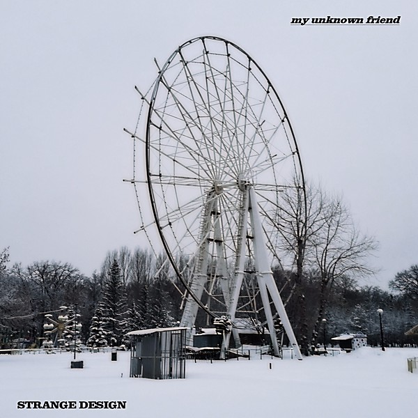

# My Strange Friend

By **My Strange Friend**

## Album Data

- **Catalog:** Beets
- **Format:** Digital, Album
- **Album:** My Strange Friend
- **Artist:** My Strange Friend
- **Albumartist:** My Strange Friend
- **Genre:** Unknown
- **MusicBrainz Album Artist ID:** [4061a2fa-05a9-4aff-a980-a075992fa29f](https://musicbrainz.org/artist/4061a2fa-05a9-4aff-a980-a075992fa29f)
- **MusicBrainz Album ID:** [8000b52a-44fa-41dc-80bf-d594f9fe8a11](https://musicbrainz.org/release/8000b52a-44fa-41dc-80bf-d594f9fe8a11)
- **MusicBrainz Release Group ID:** [4ddb818f-7baa-3c40-b1bd-2dfba180542e](https://musicbrainz.org/release-group/4ddb818f-7baa-3c40-b1bd-2dfba180542e)
- **Year:** 0000
- **Catalog #:** 
- **Label:** 
- **Total Tracks:** 13

## Album Tracks

### Track 01 - El Hombre

- **Artist:** My Strange Friend
- **Format:** MP3
- **Genre:** Unknown
- **Length:** 3:18
- **MusicBrainz Track ID:** [7b16f3e5-6104-4ea1-be48-5ff9394abb28](https://musicbrainz.org/recording/7b16f3e5-6104-4ea1-be48-5ff9394abb28)
- **Title:** El Hombre
- **Track:** 01
- **Year:** 0000

### Track 02 - Movin' Out

- **Artist:** My Strange Friend
- **Format:** MP3
- **Genre:** Unknown
- **Length:** 3:23
- **MusicBrainz Track ID:** [b13a66df-e859-478c-a226-5453bb3d32a6](https://musicbrainz.org/recording/b13a66df-e859-478c-a226-5453bb3d32a6)
- **Title:** Movin' Out
- **Track:** 02
- **Year:** 0000

### Track 03 - Magazine

- **Artist:** My Strange Friend
- **Format:** MP3
- **Genre:** Unknown
- **Length:** 2:46
- **MusicBrainz Track ID:** [666c1466-eace-474c-a9e0-b4dc06d6e944](https://musicbrainz.org/recording/666c1466-eace-474c-a9e0-b4dc06d6e944)
- **Title:** Magazine
- **Track:** 03
- **Year:** 0000

### Track 04 - Free

- **Artist:** My Strange Friend
- **Format:** MP3
- **Genre:** Unknown
- **Length:** 3:23
- **MusicBrainz Track ID:** [627528bc-fabb-4830-b902-37c35eb3f410](https://musicbrainz.org/recording/627528bc-fabb-4830-b902-37c35eb3f410)
- **Title:** Free
- **Track:** 04
- **Year:** 0000

### Track 05 - Multiple Choice

- **Artist:** My Strange Friend
- **Format:** MP3
- **Genre:** Unknown
- **Length:** 6:21
- **MusicBrainz Track ID:** [1e13cbe9-6277-491d-882f-938cfe1f945a](https://musicbrainz.org/recording/1e13cbe9-6277-491d-882f-938cfe1f945a)
- **Title:** Multiple Choice
- **Track:** 05
- **Year:** 0000

### Track 06 - Pearl Necklace

- **Artist:** My Strange Friend
- **Format:** MP3
- **Genre:** Unknown
- **Length:** 4:44
- **MusicBrainz Track ID:** [8f637fc0-a3de-47af-b037-d41b59bcd3a5](https://musicbrainz.org/recording/8f637fc0-a3de-47af-b037-d41b59bcd3a5)
- **Title:** Pearl Necklace
- **Track:** 06
- **Year:** 0000

### Track 07 - High Is Gone

- **Artist:** My Strange Friend
- **Format:** MP3
- **Genre:** Unknown
- **Length:** 3:44
- **MusicBrainz Track ID:** [8bf19aca-66a0-47c7-8490-19e6fa1abb4a](https://musicbrainz.org/recording/8bf19aca-66a0-47c7-8490-19e6fa1abb4a)
- **Title:** High Is Gone
- **Track:** 07
- **Year:** 0000

### Track 08 - Ensign Resign

- **Artist:** My Strange Friend
- **Format:** MP3
- **Genre:** Unknown
- **Length:** 7:43
- **MusicBrainz Track ID:** [e5fde6e3-5d21-4c85-90a6-df6d4e22759e](https://musicbrainz.org/recording/e5fde6e3-5d21-4c85-90a6-df6d4e22759e)
- **Title:** Ensign Resign
- **Track:** 08
- **Year:** 0000

### Track 09 - Violet Blue

- **Artist:** My Strange Friend
- **Format:** MP3
- **Genre:** Unknown
- **Length:** 4:08
- **MusicBrainz Track ID:** [27f2e3ea-791e-47cc-9360-4ea85ab0589f](https://musicbrainz.org/recording/27f2e3ea-791e-47cc-9360-4ea85ab0589f)
- **Title:** Violet Blue
- **Track:** 09
- **Year:** 0000

### Track 10 - Fat City

- **Artist:** My Strange Friend
- **Format:** MP3
- **Genre:** Unknown
- **Length:** 5:39
- **MusicBrainz Track ID:** [795c9c67-c601-41c7-bf3d-448024be7c21](https://musicbrainz.org/recording/795c9c67-c601-41c7-bf3d-448024be7c21)
- **Title:** Fat City
- **Track:** 10
- **Year:** 0000

### Track 11 - Alphabet Soup

- **Artist:** My Strange Friend
- **Format:** MP3
- **Genre:** Unknown
- **Length:** 5:19
- **MusicBrainz Track ID:** [78e9c342-0610-4cbd-bc74-c643e5431a1d](https://musicbrainz.org/recording/78e9c342-0610-4cbd-bc74-c643e5431a1d)
- **Title:** Alphabet Soup
- **Track:** 11
- **Year:** 0000

### Track 12 - Lovely Morning

- **Artist:** My Strange Friend
- **Format:** MP3
- **Genre:** Unknown
- **Length:** 4:48
- **MusicBrainz Track ID:** [c818a0e1-a3cd-4c90-8fad-17c8eab4a4f4](https://musicbrainz.org/recording/c818a0e1-a3cd-4c90-8fad-17c8eab4a4f4)
- **Title:** Lovely Morning
- **Track:** 12
- **Year:** 0000

### Track 13 - Drown in the Sun

- **Artist:** My Strange Friend
- **Format:** MP3
- **Genre:** Unknown
- **Length:** 3:11
- **MusicBrainz Track ID:** [cd8d469d-d0ca-4392-8ffc-e84e580c93c5](https://musicbrainz.org/recording/cd8d469d-d0ca-4392-8ffc-e84e580c93c5)
- **Title:** Drown in the Sun
- **Track:** 13
- **Year:** 0000

