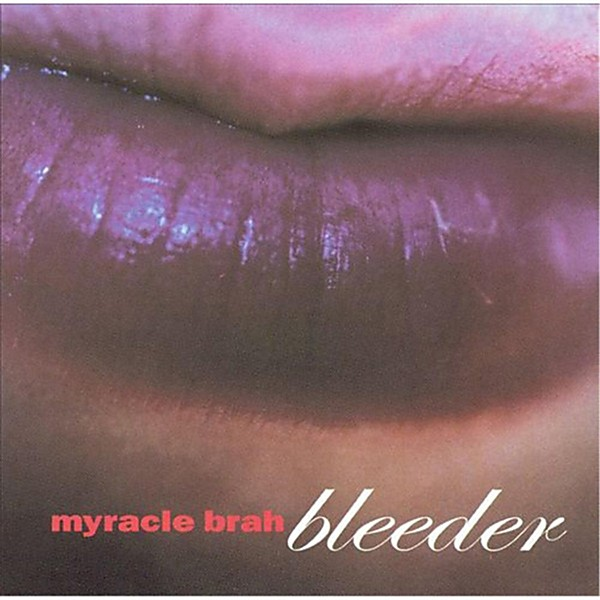

# Bleeder

By **Myracle Brah**

## Album Data

- **Catalog:** Beets
- **Format:** Digital, Album
- **Album:** Bleeder
- **Artist:** Myracle Brah
- **Albumartist:** Myracle Brah
- **Genre:** Indie Rock
- **MusicBrainz Album Artist ID:** 
- **MusicBrainz Album ID:** 
- **MusicBrainz Release Group ID:** 
- **Year:** 2002
- **Catalog #:** NL-044
- **Label:** Not Lame Recordings
- **Total Tracks:** 20

## Album Tracks

### Track 01 - Whisper Softly

- **Artist:** Myracle Brah
- **Format:** MP3
- **Genre:** Power Pop
- **Length:** 2:04
- **MusicBrainz Track ID:** [aa69805b-3593-4f99-81f0-5683a5d2abc5](https://musicbrainz.org/recording/aa69805b-3593-4f99-81f0-5683a5d2abc5)
- **Title:** Whisper Softly
- **Track:** 01
- **Year:** 1998

### Track 02 - Action Reaction

- **Artist:** Myracle Brah
- **Format:** MP3
- **Genre:** Rock
- **Length:** 2:13
- **MusicBrainz Track ID:** [5816c97e-96b9-4da5-9b38-e3b9da90dd4a](https://musicbrainz.org/recording/5816c97e-96b9-4da5-9b38-e3b9da90dd4a)
- **Title:** Action Reaction
- **Track:** 02
- **Year:** 1998

### Track 03 - Someday Soon

- **Artist:** Myracle Brah
- **Format:** MP3
- **Genre:** Indie Rock
- **Length:** 2:53
- **MusicBrainz Track ID:** [4021b9ae-fb9a-485a-bea4-a71357d222c2](https://musicbrainz.org/recording/4021b9ae-fb9a-485a-bea4-a71357d222c2)
- **Title:** Someday Soon
- **Track:** 03
- **Year:** 1998

### Track 04 - Getting Over Delusion

- **Artist:** Myracle Brah
- **Format:** MP3
- **Genre:** Indie Rock
- **Length:** 1:30
- **MusicBrainz Track ID:** [f3f78bec-4de7-4764-b414-e2923a487e61](https://musicbrainz.org/recording/f3f78bec-4de7-4764-b414-e2923a487e61)
- **Title:** Getting Over Delusion
- **Track:** 04
- **Year:** 1998

### Track 05 - I'm in Love

- **Artist:** Myracle Brah
- **Format:** MP3
- **Genre:** Indie Rock
- **Length:** 1:48
- **MusicBrainz Track ID:** [b455a5c1-5bd8-4083-84d5-ffa618dd39de](https://musicbrainz.org/recording/b455a5c1-5bd8-4083-84d5-ffa618dd39de)
- **Title:** I'm in Love
- **Track:** 05
- **Year:** 1998

### Track 06 - Good Day to the Night

- **Artist:** Myracle Brah
- **Format:** MP3
- **Genre:** Indie Rock
- **Length:** 3:02
- **MusicBrainz Track ID:** [f211d740-b2b9-492c-99f8-e196ab277dd4](https://musicbrainz.org/recording/f211d740-b2b9-492c-99f8-e196ab277dd4)
- **Title:** Good Day to the Night
- **Track:** 06
- **Year:** 1998

### Track 07 - Usual Request

- **Artist:** Myracle Brah
- **Format:** MP3
- **Genre:** Indie Rock
- **Length:** 3:01
- **MusicBrainz Track ID:** [fbe37d6d-2410-4863-a0c4-fc0c32bfa3e6](https://musicbrainz.org/recording/fbe37d6d-2410-4863-a0c4-fc0c32bfa3e6)
- **Title:** Usual Request
- **Track:** 07
- **Year:** 1998

### Track 08 - Medicine Man

- **Artist:** Myracle Brah
- **Format:** MP3
- **Genre:** Indie Rock
- **Length:** 2:18
- **MusicBrainz Track ID:** [3fda93af-b461-4593-952a-8bb575f1bb91](https://musicbrainz.org/recording/3fda93af-b461-4593-952a-8bb575f1bb91)
- **Title:** Medicine Man
- **Track:** 08
- **Year:** 1998

### Track 09 - Photograph

- **Artist:** Myracle Brah
- **Format:** MP3
- **Genre:** Indie Rock
- **Length:** 2:16
- **MusicBrainz Track ID:** [5041da89-65f9-409d-8101-dc86be3b225e](https://musicbrainz.org/recording/5041da89-65f9-409d-8101-dc86be3b225e)
- **Title:** Photograph
- **Track:** 09
- **Year:** 1998

### Track 10 - She's Everything

- **Artist:** Myracle Brah
- **Format:** MP3
- **Genre:** Indie Rock
- **Length:** 1:52
- **MusicBrainz Track ID:** [8ca52f83-43ce-4804-b5fe-ae9a65e2f726](https://musicbrainz.org/recording/8ca52f83-43ce-4804-b5fe-ae9a65e2f726)
- **Title:** She's Everything
- **Track:** 10
- **Year:** 1998

### Track 11 - Anything But This World

- **Artist:** Myracle Brah
- **Format:** MP3
- **Genre:** Indie Rock
- **Length:** 4:13
- **MusicBrainz Track ID:** [965a6549-f580-4026-988a-76fe613d2cfa](https://musicbrainz.org/recording/965a6549-f580-4026-988a-76fe613d2cfa)
- **Title:** Anything But This World
- **Track:** 11
- **Year:** 1998

### Track 12 - Loli La Letta

- **Artist:** Myracle Brah
- **Format:** MP3
- **Genre:** Indie Rock
- **Length:** 2:31
- **MusicBrainz Track ID:** [e42f2c09-5086-4bf2-905e-78eb68a5cf62](https://musicbrainz.org/recording/e42f2c09-5086-4bf2-905e-78eb68a5cf62)
- **Title:** Loli La Letta
- **Track:** 12
- **Year:** 1998

### Track 13 - She's So Young

- **Artist:** Myracle Brah
- **Format:** MP3
- **Genre:** Indie Rock
- **Length:** 3:12
- **MusicBrainz Track ID:** [f99c1e2e-b1a2-4221-ba8b-114ab3b84bc6](https://musicbrainz.org/recording/f99c1e2e-b1a2-4221-ba8b-114ab3b84bc6)
- **Title:** She's So Young
- **Track:** 13
- **Year:** 1998

### Track 14 - Talk to Me

- **Artist:** Myracle Brah
- **Format:** MP3
- **Genre:** Indie Rock
- **Length:** 3:53
- **MusicBrainz Track ID:** [7550e8c4-e328-49ec-97e7-38cce6f5943a](https://musicbrainz.org/recording/7550e8c4-e328-49ec-97e7-38cce6f5943a)
- **Title:** Talk to Me
- **Track:** 14
- **Year:** 1998

### Track 15 - Just Because

- **Artist:** Myracle Brah
- **Format:** MP3
- **Genre:** Indie Rock
- **Length:** 2:49
- **MusicBrainz Track ID:** [74b07d03-6a08-4a51-a2cc-a69a5a6f019d](https://musicbrainz.org/recording/74b07d03-6a08-4a51-a2cc-a69a5a6f019d)
- **Title:** Just Because
- **Track:** 15
- **Year:** 1998

### Track 16 - Bitter Thing

- **Artist:** Myracle Brah
- **Format:** MP3
- **Genre:** Indie Rock
- **Length:** 3:01
- **MusicBrainz Track ID:** [cfc80e44-4184-4e94-aaec-41778a1b8f70](https://musicbrainz.org/recording/cfc80e44-4184-4e94-aaec-41778a1b8f70)
- **Title:** Bitter Thing
- **Track:** 16
- **Year:** 1998

### Track 17 - Carry On the Lie

- **Artist:** Myracle Brah
- **Format:** MP3
- **Genre:** Indie Rock
- **Length:** 3:45
- **MusicBrainz Track ID:** [a465be3d-83ec-4647-afab-d1924ef62e80](https://musicbrainz.org/recording/a465be3d-83ec-4647-afab-d1924ef62e80)
- **Title:** Carry On the Lie
- **Track:** 17
- **Year:** 1998

### Track 18 - Inside of You

- **Artist:** Myracle Brah
- **Format:** MP3
- **Genre:** Indie Rock
- **Length:** 2:41
- **MusicBrainz Track ID:** [9f47a25c-56e5-414f-8106-5469fb8173dc](https://musicbrainz.org/recording/9f47a25c-56e5-414f-8106-5469fb8173dc)
- **Title:** Inside of You
- **Track:** 18
- **Year:** 1998

### Track 19 - Machina

- **Artist:** Myracle Brah
- **Format:** MP3
- **Genre:** Indie Rock
- **Length:** 2:11
- **MusicBrainz Track ID:** [df48276c-a656-49a3-8e5f-d3c180656193](https://musicbrainz.org/recording/df48276c-a656-49a3-8e5f-d3c180656193)
- **Title:** Machina
- **Track:** 19
- **Year:** 1998

### Track 20 - Love Is

- **Artist:** Myracle Brah
- **Format:** MP3
- **Genre:** Indie Rock
- **Length:** 1:38
- **MusicBrainz Track ID:** [44a8c85d-27ee-4790-8100-bc76dd4444a5](https://musicbrainz.org/recording/44a8c85d-27ee-4790-8100-bc76dd4444a5)
- **Title:** Love Is
- **Track:** 20
- **Year:** 1998

## See also

- [Life on Planet Eartsnop](Life_on_Planet_Eartsnop.md)
- [Plate Spinner](Plate_Spinner.md)
- [The Myracle Brah](The_Myracle_Brah.md)
