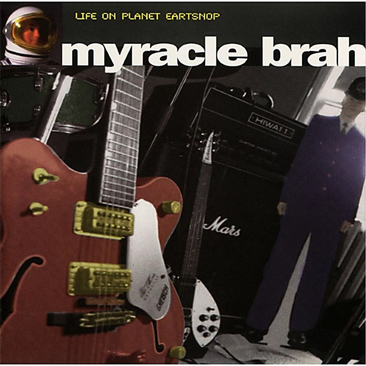

# Life on Planet Eartsnop

By **Myracle Brah**

## Album Data

- **Catalog:** Beets
- **Format:** Digital, Album
- **Album:** Life on Planet Eartsnop
- **Artist:** Myracle Brah
- **Albumartist:** Myracle Brah
- **Genre:** Indie Rock
- **MusicBrainz Album Artist ID:** [2fc4b378-6a18-4135-84c4-7e2e60225f31](https://musicbrainz.org/artist/2fc4b378-6a18-4135-84c4-7e2e60225f31)
- **MusicBrainz Album ID:** [1bbda127-4e5d-42fc-a4ff-a58097354972](https://musicbrainz.org/release/1bbda127-4e5d-42fc-a4ff-a58097354972)
- **MusicBrainz Release Group ID:** [c94def1e-3716-3de0-9415-ebb8ec99b2db](https://musicbrainz.org/release-group/c94def1e-3716-3de0-9415-ebb8ec99b2db)
- **Year:** 1998
- **Catalog #:** NL-050
- **Label:** Not Lame Recordings
- **Total Tracks:** 12

## Album Tracks

### Track 01 - Isn't It a Crime

- **Artist:** Myracle Brah
- **Format:** MP3
- **Genre:** Indie Rock
- **Length:** 3:58
- **MusicBrainz Track ID:** [914eb0c7-db07-4c39-9749-1d9e276fc928](https://musicbrainz.org/recording/914eb0c7-db07-4c39-9749-1d9e276fc928)
- **Title:** Isn't It a Crime
- **Track:** 01
- **Year:** 1999

### Track 02 - Does It Even Matter

- **Artist:** Myracle Brah
- **Format:** MP3
- **Genre:** Indie Rock
- **Length:** 1:57
- **MusicBrainz Track ID:** [694aff16-772a-4451-bc91-583464ba0fe8](https://musicbrainz.org/recording/694aff16-772a-4451-bc91-583464ba0fe8)
- **Title:** Does It Even Matter
- **Track:** 02
- **Year:** 1999

### Track 03 - Drowning

- **Artist:** Myracle Brah
- **Format:** MP3
- **Genre:** Indie Rock
- **Length:** 2:58
- **MusicBrainz Track ID:** [25f2da3f-435a-4c7a-9707-f33ffdd2bc63](https://musicbrainz.org/recording/25f2da3f-435a-4c7a-9707-f33ffdd2bc63)
- **Title:** Drowning
- **Track:** 03
- **Year:** 1999

### Track 04 - The Seeds Keep Growing Faster

- **Artist:** Myracle Brah
- **Format:** MP3
- **Genre:** Indie Rock
- **Length:** 2:24
- **MusicBrainz Track ID:** [bb87f819-74bc-4dcf-9b74-26a749e1ad21](https://musicbrainz.org/recording/bb87f819-74bc-4dcf-9b74-26a749e1ad21)
- **Title:** The Seeds Keep Growing Faster
- **Track:** 04
- **Year:** 1999

### Track 05 - Mr. Tuesday Man

- **Artist:** Myracle Brah
- **Format:** MP3
- **Genre:** Indie Rock
- **Length:** 2:11
- **MusicBrainz Track ID:** [2ce801e0-f31b-4361-af49-8ee0411d295d](https://musicbrainz.org/recording/2ce801e0-f31b-4361-af49-8ee0411d295d)
- **Title:** Mr. Tuesday Man
- **Track:** 05
- **Year:** 1999

### Track 06 - Hearts on Fire

- **Artist:** Myracle Brah
- **Format:** MP3
- **Genre:** Indie Rock
- **Length:** 4:41
- **MusicBrainz Track ID:** [3f7ce8df-9991-48f6-b310-588833f1ad08](https://musicbrainz.org/recording/3f7ce8df-9991-48f6-b310-588833f1ad08)
- **Title:** Hearts on Fire
- **Track:** 06
- **Year:** 1999

### Track 07 - Faux Americans

- **Artist:** Myracle Brah
- **Format:** MP3
- **Genre:** Indie Rock
- **Length:** 1:49
- **MusicBrainz Track ID:** [6f1e8868-88fe-4562-837b-1da37597ae1a](https://musicbrainz.org/recording/6f1e8868-88fe-4562-837b-1da37597ae1a)
- **Title:** Faux Americans
- **Track:** 07
- **Year:** 1999

### Track 08 - Dead Overnight

- **Artist:** Myracle Brah
- **Format:** MP3
- **Genre:** Indie Rock
- **Length:** 2:00
- **MusicBrainz Track ID:** [7275a57c-fa8a-4745-bc2a-685cc90c9081](https://musicbrainz.org/recording/7275a57c-fa8a-4745-bc2a-685cc90c9081)
- **Title:** Dead Overnight
- **Track:** 08
- **Year:** 1999

### Track 09 - Eleven

- **Artist:** Myracle Brah
- **Format:** MP3
- **Genre:** Indie Rock
- **Length:** 2:34
- **MusicBrainz Track ID:** [5b4ed1e1-cf64-4331-b99a-b01895e81912](https://musicbrainz.org/recording/5b4ed1e1-cf64-4331-b99a-b01895e81912)
- **Title:** Eleven
- **Track:** 09
- **Year:** 1999

### Track 10 - Treat Her Right

- **Artist:** Myracle Brah
- **Format:** MP3
- **Genre:** Indie Rock
- **Length:** 1:55
- **MusicBrainz Track ID:** [87cf37f2-94cd-4677-b8a8-5fbe663557cd](https://musicbrainz.org/recording/87cf37f2-94cd-4677-b8a8-5fbe663557cd)
- **Title:** Treat Her Right
- **Track:** 10
- **Year:** 1999

### Track 11 - Albert S. Hand

- **Artist:** Myracle Brah
- **Format:** MP3
- **Genre:** Indie Rock
- **Length:** 3:13
- **MusicBrainz Track ID:** [dc44d9eb-a774-4d1c-a8ea-bd29ed944106](https://musicbrainz.org/recording/dc44d9eb-a774-4d1c-a8ea-bd29ed944106)
- **Title:** Albert S. Hand
- **Track:** 11
- **Year:** 1999

### Track 12 - Slip Away

- **Artist:** Myracle Brah
- **Format:** MP3
- **Genre:** Indie Rock
- **Length:** 3:13
- **MusicBrainz Track ID:** [383bcd48-8625-4aab-b997-4d90f9927333](https://musicbrainz.org/recording/383bcd48-8625-4aab-b997-4d90f9927333)
- **Title:** Slip Away
- **Track:** 12
- **Year:** 1999

## See also

- [Bleeder](Bleeder.md)
- [Plate Spinner](Plate_Spinner.md)
- [The Myracle Brah](The_Myracle_Brah.md)
