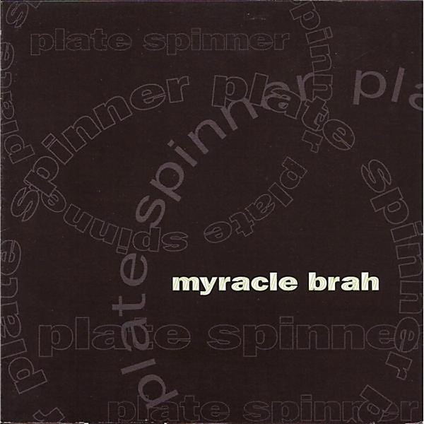

# Plate Spinner

By **Myracle Brah**

## Album Data

- **Catalog:** Beets
- **Format:** Digital, Album
- **Album:** Plate Spinner
- **Artist:** Myracle Brah
- **Albumartist:** Myracle Brah
- **Genre:** Indie Rock
- **MusicBrainz Album Artist ID:** [2fc4b378-6a18-4135-84c4-7e2e60225f31](https://musicbrainz.org/artist/2fc4b378-6a18-4135-84c4-7e2e60225f31)
- **MusicBrainz Album ID:** [38badb9a-adb8-4d0a-a835-bb19a170c5c6](https://musicbrainz.org/release/38badb9a-adb8-4d0a-a835-bb19a170c5c6)
- **MusicBrainz Release Group ID:** [abf077d6-84c0-3296-93f4-8f0376a4b810](https://musicbrainz.org/release-group/abf077d6-84c0-3296-93f4-8f0376a4b810)
- **Year:** 1999
- **Catalog #:** NL-060
- **Label:** Not Lame Recordings
- **Total Tracks:** 12

## Album Tracks

### Track 01 - I'd Rather Be

- **Artist:** Myracle Brah
- **Format:** MP3
- **Genre:** Indie Rock
- **Length:** 2:56
- **MusicBrainz Track ID:** [cedaa6cc-b084-4f5c-82f2-7c041a282b05](https://musicbrainz.org/recording/cedaa6cc-b084-4f5c-82f2-7c041a282b05)
- **Title:** I'd Rather Be
- **Track:** 01
- **Year:** 2000

### Track 02 - Message '78

- **Artist:** Myracle Brah
- **Format:** MP3
- **Genre:** Indie Rock
- **Length:** 3:06
- **MusicBrainz Track ID:** [10866d6e-3613-4f0f-aa40-74d366cb1251](https://musicbrainz.org/recording/10866d6e-3613-4f0f-aa40-74d366cb1251)
- **Title:** Message '78
- **Track:** 02
- **Year:** 2000

### Track 03 - When She Cries

- **Artist:** Myracle Brah
- **Format:** MP3
- **Genre:** Indie Rock
- **Length:** 3:21
- **MusicBrainz Track ID:** [ab20cdc9-6203-462e-a8bf-f6bbfd4695ba](https://musicbrainz.org/recording/ab20cdc9-6203-462e-a8bf-f6bbfd4695ba)
- **Title:** When She Cries
- **Track:** 03
- **Year:** 2000

### Track 04 - Madeliene

- **Artist:** Myracle Brah
- **Format:** MP3
- **Genre:** Indie Rock
- **Length:** 3:31
- **MusicBrainz Track ID:** [ff52f4e5-6260-4f85-a34b-517da53f75d6](https://musicbrainz.org/recording/ff52f4e5-6260-4f85-a34b-517da53f75d6)
- **Title:** Madeliene
- **Track:** 04
- **Year:** 2000

### Track 05 - Going Crazy

- **Artist:** Myracle Brah
- **Format:** MP3
- **Genre:** Indie Rock
- **Length:** 3:56
- **MusicBrainz Track ID:** [396c5273-440a-4395-b633-57a4adb608f1](https://musicbrainz.org/recording/396c5273-440a-4395-b633-57a4adb608f1)
- **Title:** Going Crazy
- **Track:** 05
- **Year:** 2000

### Track 06 - Out of Tune

- **Artist:** Myracle Brah
- **Format:** MP3
- **Genre:** Indie Rock
- **Length:** 3:51
- **MusicBrainz Track ID:** [1450afc8-a653-4848-a2b3-edcd17327c78](https://musicbrainz.org/recording/1450afc8-a653-4848-a2b3-edcd17327c78)
- **Title:** Out of Tune
- **Track:** 06
- **Year:** 2000

### Track 07 - Crane

- **Artist:** Myracle Brah
- **Format:** MP3
- **Genre:** Indie Rock
- **Length:** 3:38
- **MusicBrainz Track ID:** [b0577577-e8a9-4353-ae06-c739e1cdcf20](https://musicbrainz.org/recording/b0577577-e8a9-4353-ae06-c739e1cdcf20)
- **Title:** Crane
- **Track:** 07
- **Year:** 2000

### Track 08 - She's Gonna Fly

- **Artist:** Myracle Brah
- **Format:** MP3
- **Genre:** Indie Rock
- **Length:** 3:34
- **MusicBrainz Track ID:** [e09f32ff-53e3-4b90-bf01-b9441d44dce5](https://musicbrainz.org/recording/e09f32ff-53e3-4b90-bf01-b9441d44dce5)
- **Title:** She's Gonna Fly
- **Track:** 08
- **Year:** 2000

### Track 09 - Smile

- **Artist:** Myracle Brah
- **Format:** MP3
- **Genre:** Indie Rock
- **Length:** 2:28
- **MusicBrainz Track ID:** [7050c6f7-55dd-463e-8bbf-75df9de56e7f](https://musicbrainz.org/recording/7050c6f7-55dd-463e-8bbf-75df9de56e7f)
- **Title:** Smile
- **Track:** 09
- **Year:** 2000

### Track 10 - Dying 310

- **Artist:** Myracle Brah
- **Format:** MP3
- **Genre:** Indie Rock
- **Length:** 3:46
- **MusicBrainz Track ID:** [971dd546-8041-4428-a8a4-ecbe6ef51aeb](https://musicbrainz.org/recording/971dd546-8041-4428-a8a4-ecbe6ef51aeb)
- **Title:** Dying 310
- **Track:** 10
- **Year:** 2000

### Track 11 - Hey Now

- **Artist:** Myracle Brah
- **Format:** MP3
- **Genre:** Indie Rock
- **Length:** 4:00
- **MusicBrainz Track ID:** [1328bb5a-8599-400f-b57d-94062780ec58](https://musicbrainz.org/recording/1328bb5a-8599-400f-b57d-94062780ec58)
- **Title:** Hey Now
- **Track:** 11
- **Year:** 2000

### Track 12 - Inside Those Eyes

- **Artist:** Myracle Brah
- **Format:** MP3
- **Genre:** Indie Rock
- **Length:** 2:56
- **MusicBrainz Track ID:** [732d8018-08e7-46b4-9bc3-d29be6d72b07](https://musicbrainz.org/recording/732d8018-08e7-46b4-9bc3-d29be6d72b07)
- **Title:** Inside Those Eyes
- **Track:** 12
- **Year:** 2000

## See also

- [Bleeder](Bleeder.md)
- [Life on Planet Eartsnop](Life_on_Planet_Eartsnop.md)
- [The Myracle Brah](The_Myracle_Brah.md)
