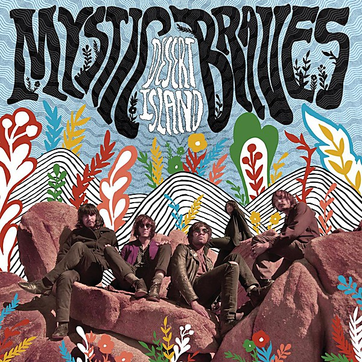

# Desert Island

By **Mystic Braves**

## Album Data

- **Catalog:** Beets
- **Format:** Digital, Album
- **Album:** Desert Island
- **Artist:** Mystic Braves
- **Albumartist:** Mystic Braves
- **Genre:** Surf Rock
- **MusicBrainz Album Artist ID:** [https](https://musicbrainz.org/artist/https)
- **MusicBrainz Album ID:** [https](https://musicbrainz.org/release/https)
- **MusicBrainz Release Group ID:** 
- **Year:** 2014
- **Catalog #:** 
- **Label:** Lolipop Records
- **Total Tracks:** 09

## Album Tracks

### Track 01 - Mystic Rabbit

- **Artist:** Mystic Braves
- **Format:** MP3
- **Genre:** Surf Rock
- **Length:** 4:04
- **MusicBrainz Track ID:** [917e9d01-2fda-4837-9196-f68929f70f09](https://musicbrainz.org/recording/917e9d01-2fda-4837-9196-f68929f70f09)
- **Title:** Mystic Rabbit
- **Track:** 01
- **Year:** 2013

### Track 02 - Trippin' Like I Do

- **Artist:** Mystic Braves
- **Format:** MP3
- **Genre:** Garage Rock
- **Length:** 3:08
- **MusicBrainz Track ID:** [a40e78ba-c996-4944-b325-7d7fa3ef1fc9](https://musicbrainz.org/recording/a40e78ba-c996-4944-b325-7d7fa3ef1fc9)
- **Title:** Trippin' Like I Do
- **Track:** 02
- **Year:** 2013

### Track 03 - Open Up Your Heart

- **Artist:** Mystic Braves
- **Format:** MP3
- **Genre:** Rock
- **Length:** 3:10
- **MusicBrainz Track ID:** [82e55428-e8ff-4968-bfc1-5e4e79b74148](https://musicbrainz.org/recording/82e55428-e8ff-4968-bfc1-5e4e79b74148)
- **Title:** Open Up Your Heart
- **Track:** 03
- **Year:** 2013

### Track 04 - Misery Loves Company

- **Artist:** Mystic Braves
- **Format:** MP3
- **Genre:** Surf Rock
- **Length:** 4:33
- **MusicBrainz Track ID:** [c7f26feb-1588-4d57-9645-d1bcbffdcc73](https://musicbrainz.org/recording/c7f26feb-1588-4d57-9645-d1bcbffdcc73)
- **Title:** Misery Loves Company
- **Track:** 04
- **Year:** 2013

### Track 05 - Oh So Fine

- **Artist:** Mystic Braves
- **Format:** MP3
- **Genre:** Surf Rock
- **Length:** 5:03
- **MusicBrainz Track ID:** [f0a8c076-cdb4-4eae-90bb-8227d30c50df](https://musicbrainz.org/recording/f0a8c076-cdb4-4eae-90bb-8227d30c50df)
- **Title:** Oh So Fine
- **Track:** 05
- **Year:** 2013

### Track 06 - Cloud 9

- **Artist:** Mystic Braves
- **Format:** MP3
- **Genre:** Surf Rock
- **Length:** 5:23
- **MusicBrainz Track ID:** [4616ce46-a59a-48e0-8e30-f8264fd1c2cd](https://musicbrainz.org/recording/4616ce46-a59a-48e0-8e30-f8264fd1c2cd)
- **Title:** Cloud 9
- **Track:** 06
- **Year:** 2013

### Track 07 - Strange Lovers

- **Artist:** Mystic Braves
- **Format:** MP3
- **Genre:** Surf Rock
- **Length:** 4:30
- **MusicBrainz Track ID:** [f0650c52-2b1e-451f-9085-d3b40223f7e9](https://musicbrainz.org/recording/f0650c52-2b1e-451f-9085-d3b40223f7e9)
- **Title:** Strange Lovers
- **Track:** 07
- **Year:** 2013

### Track 08 - Vicious Cycle

- **Artist:** Mystic Braves
- **Format:** MP3
- **Genre:** Surf Rock
- **Length:** 4:50
- **MusicBrainz Track ID:** [426a0575-08ee-426a-b005-71d008a7b3f0](https://musicbrainz.org/recording/426a0575-08ee-426a-b005-71d008a7b3f0)
- **Title:** Vicious Cycle
- **Track:** 08
- **Year:** 2013

### Track 09 - High n' Dry

- **Artist:** Mystic Braves
- **Format:** MP3
- **Genre:** Surf Rock
- **Length:** 2:57
- **MusicBrainz Track ID:** [412a43af-02bc-4cd0-b0d1-396612f2311e](https://musicbrainz.org/recording/412a43af-02bc-4cd0-b0d1-396612f2311e)
- **Title:** High n' Dry
- **Track:** 09
- **Year:** 2013

## See also

- [Mystic Braves](Mystic_Braves.md)
- [Please Let Me Know - Dockweiler 45](Please_Let_Me_Know_-_Dockweiler_45.md)
- [Vinyl: Desert Island](../../Vinyl/Mystic_Braves/Desert_Island.md)
- [Vinyl: ](../../Vinyl/Mystic_Braves/Mystic_Braves_index.md)
- [Vinyl: Mystic Braves](../../Vinyl/Mystic_Braves/Mystic_Braves.md)
- [Vinyl: Please Let Me Know](../../Vinyl/Mystic_Braves/Please_Let_Me_Know.md)
