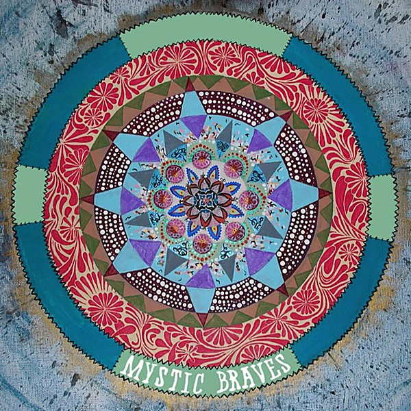

# Mystic Braves

By **Mystic Braves**

## Album Data

- **Catalog:** Beets
- **Format:** Digital, Album
- **Album:** Mystic Braves
- **Artist:** Mystic Braves
- **Albumartist:** Mystic Braves
- **Genre:** Surf Rock
- **MusicBrainz Album Artist ID:** [fc2510cb-2813-4f9c-9cf1-278fd801b0a4](https://musicbrainz.org/artist/fc2510cb-2813-4f9c-9cf1-278fd801b0a4)
- **MusicBrainz Album ID:** [3c03b0f4-f77f-47cb-8d5c-1be43ad79c57](https://musicbrainz.org/release/3c03b0f4-f77f-47cb-8d5c-1be43ad79c57)
- **MusicBrainz Release Group ID:** [f1277faa-6976-4e16-aa3a-9c53eaea451a](https://musicbrainz.org/release-group/f1277faa-6976-4e16-aa3a-9c53eaea451a)
- **Year:** 2013
- **Catalog #:** 
- **Label:** 
- **Total Tracks:** 00

## Album Tracks

### Track 01 - Please Let Me Know

- **Artist:** Mystic Braves
- **Format:** MP3
- **Genre:** Garage Rock
- **Length:** 3:30
- **MusicBrainz Track ID:** 
- **Title:** Please Let Me Know
- **Track:** 01
- **Year:** 2013

### Track 02 - Dockweiler

- **Artist:** Mystic Braves
- **Format:** MP3
- **Genre:** Surf Rock
- **Length:** 3:12
- **MusicBrainz Track ID:** 
- **Title:** Dockweiler
- **Track:** 02
- **Year:** 2013

## See also

- [Desert Island](Desert_Island.md)
- [Please Let Me Know - Dockweiler 45](Please_Let_Me_Know_-_Dockweiler_45.md)
- [Vinyl: Desert Island](../../Vinyl/Mystic_Braves/Desert_Island.md)
- [Vinyl: ](../../Vinyl/Mystic_Braves/Mystic_Braves_index.md)
- [Vinyl: Mystic Braves](../../Vinyl/Mystic_Braves/Mystic_Braves.md)
- [Vinyl: Please Let Me Know](../../Vinyl/Mystic_Braves/Please_Let_Me_Know.md)
