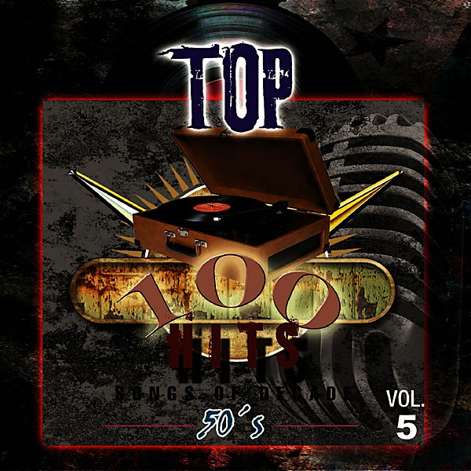

# 1950

By **Nat King Cole**

## Album Data

- **Catalog:** Beets
- **Format:** Digital, Album
- **Album:** 1950
- **Artist:** Nat King Cole
- **Albumartist:** Nat King Cole
- **Genre:** Vocal Jazz
- **MusicBrainz Album Artist ID:** 
- **MusicBrainz Album ID:** 
- **MusicBrainz Release Group ID:** 
- **Year:** 1950
- **Catalog #:** 
- **Label:** 
- **Total Tracks:** 00

## Album Tracks

### Track 13 - Pretend

- **Artist:** Nat King Cole
- **Format:** AAC
- **Genre:** Vocal Jazz
- **Length:** 2:44
- **MusicBrainz Track ID:** 
- **Title:** Pretend
- **Track:** 13
- **Year:** 1944

## See also

- [The Greatest Hits [Capitol]](The_Greatest_Hits_[Capitol].md)
- [Unknown Album](Unknown_Album.md)
- [Vinyl: Make Her Mine](../../Vinyl/Nat_King_Cole/Make_Her_Mine.md)
- [Vinyl: Marnie / More And More Of Your Amor](../../Vinyl/Nat_King_Cole/Marnie_-_More_And_More_Of_Your_Amor.md)
- [Vinyl: ](../../Vinyl/Nat_King_Cole/Nat_King_Cole.md)
- [Vinyl: The Best Of Nat King Cole](../../Vinyl/Nat_King_Cole/The_Best_Of_Nat_King_Cole.md)
- [Vinyl: The Christmas Song (Merry Christmas To You) / The Little Boy That Santa Claus Forgot](../../Vinyl/Nat_King_Cole/The_Christmas_Song_Merry_Christmas_To_You_-_The_Little_Boy_That_Santa_Claus_Forgot.md)
