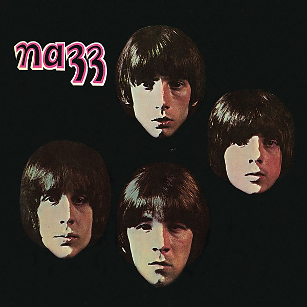

# Nazz

By **Nazz**

## Album Data

- **Catalog:** Beets
- **Format:** Digital, Album
- **Album:** Nazz
- **Artist:** Nazz
- **Albumartist:** Nazz
- **Genre:** Psychedelic Rock
- **MusicBrainz Album Artist ID:** [8295499e-808a-4e10-9e91-2df00d9c1a72](https://musicbrainz.org/artist/8295499e-808a-4e10-9e91-2df00d9c1a72)
- **MusicBrainz Album ID:** [6eee7625-3bd4-48b8-92f4-9867e6dcad59](https://musicbrainz.org/release/6eee7625-3bd4-48b8-92f4-9867e6dcad59)
- **MusicBrainz Release Group ID:** [0b35e47d-8970-3fd8-b241-6d24e6ee5aea](https://musicbrainz.org/release-group/0b35e47d-8970-3fd8-b241-6d24e6ee5aea)
- **Year:** 1990
- **Catalog #:** R2 70109
- **Label:** Rhino
- **Total Tracks:** 10

## Album Tracks

### Track 01 - Open My Eyes

- **Artist:** Nazz
- **Format:** ALAC
- **Genre:** Acid Rock
- **Length:** 2:44
- **MusicBrainz Track ID:** [01f6a838-1bba-4e33-9f44-e95f108f03b3](https://musicbrainz.org/recording/01f6a838-1bba-4e33-9f44-e95f108f03b3)
- **Title:** Open My Eyes
- **Track:** 01
- **Year:** 1990

### Track 02 - Back of Your Mind

- **Artist:** Nazz
- **Format:** ALAC
- **Genre:** Psychedelic Rock
- **Length:** 3:56
- **MusicBrainz Track ID:** [285fdcac-3717-411f-b6d9-65cd1c564a32](https://musicbrainz.org/recording/285fdcac-3717-411f-b6d9-65cd1c564a32)
- **Title:** Back of Your Mind
- **Track:** 02
- **Year:** 1990

### Track 03 - See What You Can Be

- **Artist:** Nazz
- **Format:** ALAC
- **Genre:** Psychedelic Rock
- **Length:** 3:02
- **MusicBrainz Track ID:** [6249b498-1999-4490-83b5-0a71998eab73](https://musicbrainz.org/recording/6249b498-1999-4490-83b5-0a71998eab73)
- **Title:** See What You Can Be
- **Track:** 03
- **Year:** 1990

### Track 04 - Hello It's Me

- **Artist:** Nazz
- **Format:** ALAC
- **Genre:** Psychedelic Rock
- **Length:** 4:08
- **MusicBrainz Track ID:** [c073ae33-f9dc-46df-9ee6-ab51373b0dfa](https://musicbrainz.org/recording/c073ae33-f9dc-46df-9ee6-ab51373b0dfa)
- **Title:** Hello It's Me
- **Track:** 04
- **Year:** 1990

### Track 05 - Wildwood Blues

- **Artist:** Nazz
- **Format:** ALAC
- **Genre:** Blues
- **Length:** 4:41
- **MusicBrainz Track ID:** [1b8c0d18-1d5a-4db9-8055-85c5f0814c3c](https://musicbrainz.org/recording/1b8c0d18-1d5a-4db9-8055-85c5f0814c3c)
- **Title:** Wildwood Blues
- **Track:** 05
- **Year:** 1990

### Track 06 - If That's the Way You Feel

- **Artist:** Nazz
- **Format:** ALAC
- **Genre:** Psychedelic Rock
- **Length:** 4:52
- **MusicBrainz Track ID:** [65621209-f427-4f23-9456-4c68fb4e7896](https://musicbrainz.org/recording/65621209-f427-4f23-9456-4c68fb4e7896)
- **Title:** If That's the Way You Feel
- **Track:** 06
- **Year:** 1990

### Track 07 - When I Get My Plane

- **Artist:** Nazz
- **Format:** ALAC
- **Genre:** Progressive Rock
- **Length:** 3:11
- **MusicBrainz Track ID:** [12f53049-bf5c-4ac4-b9c3-f1491b611766](https://musicbrainz.org/recording/12f53049-bf5c-4ac4-b9c3-f1491b611766)
- **Title:** When I Get My Plane
- **Track:** 07
- **Year:** 1990

### Track 08 - Lemming Song

- **Artist:** Nazz
- **Format:** ALAC
- **Genre:** Psychedelic Rock
- **Length:** 4:31
- **MusicBrainz Track ID:** [b7c5896c-0787-494a-8585-3a7eb5b456e3](https://musicbrainz.org/recording/b7c5896c-0787-494a-8585-3a7eb5b456e3)
- **Title:** Lemming Song
- **Track:** 08
- **Year:** 1990

### Track 09 - Crowded

- **Artist:** Nazz
- **Format:** ALAC
- **Genre:** Psychedelic Rock
- **Length:** 2:21
- **MusicBrainz Track ID:** [82f09a04-7f20-4031-90aa-f0b37ca70aa0](https://musicbrainz.org/recording/82f09a04-7f20-4031-90aa-f0b37ca70aa0)
- **Title:** Crowded
- **Track:** 09
- **Year:** 1990

### Track 10 - She's Goin' Down

- **Artist:** Nazz
- **Format:** ALAC
- **Genre:** Psychedelic Rock
- **Length:** 5:12
- **MusicBrainz Track ID:** [5852dd72-3321-4adb-8767-fc7febeaeecb](https://musicbrainz.org/recording/5852dd72-3321-4adb-8767-fc7febeaeecb)
- **Title:** She's Goin' Down
- **Track:** 10
- **Year:** 1990

