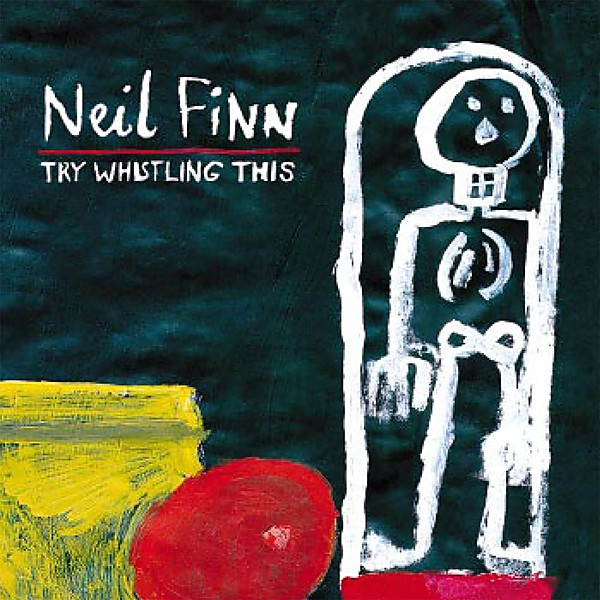

# Try Whistling This

By **Neil Finn**

## Album Data

- **Catalog:** Beets
- **Format:** Digital, Album
- **Album:** Try Whistling This
- **Artist:** Neil Finn
- **Albumartist:** Neil Finn
- **Genre:** Pop Rock
- **MusicBrainz Album Artist ID:** [3b7c93ab-40a5-4745-ab6b-eaafed2308bb](https://musicbrainz.org/artist/3b7c93ab-40a5-4745-ab6b-eaafed2308bb)
- **MusicBrainz Album ID:** [5b569700-0195-3c0a-a522-104eadc603a6](https://musicbrainz.org/release/5b569700-0195-3c0a-a522-104eadc603a6)
- **MusicBrainz Release Group ID:** [debf99ab-3645-33d8-a96e-0e3c0f29c9b4](https://musicbrainz.org/release-group/debf99ab-3645-33d8-a96e-0e3c0f29c9b4)
- **Year:** 1998
- **Catalog #:** 
- **Label:** 
- **Total Tracks:** 14

## Album Tracks

### Track 01 - Track 1

- **Artist:** Neil Finn
- **Format:** MP3
- **Genre:** Rock
- **Length:** 3:29
- **MusicBrainz Track ID:** 
- **Title:** Track 1
- **Track:** 01
- **Year:** 0000

### Track 02 - Weather With You

- **Artist:** Neil Finn
- **Format:** MP3
- **Genre:** Rock
- **Length:** 5:12
- **MusicBrainz Track ID:** 
- **Title:** Weather With You
- **Track:** 02
- **Year:** 0000

### Track 03 - She Will Have Her Way

- **Artist:** Neil Finn
- **Format:** MP3
- **Genre:** Rock
- **Length:** 5:11
- **MusicBrainz Track ID:** 
- **Title:** She Will Have Her Way
- **Track:** 03
- **Year:** 0000

### Track 04 - Track 4

- **Artist:** Neil Finn
- **Format:** MP3
- **Genre:** Rock
- **Length:** 3:46
- **MusicBrainz Track ID:** 
- **Title:** Track 4
- **Track:** 04
- **Year:** 0000

### Track 05 - Track 5

- **Artist:** Neil Finn
- **Format:** MP3
- **Genre:** Rock
- **Length:** 3:05
- **MusicBrainz Track ID:** 
- **Title:** Track 5
- **Track:** 05
- **Year:** 0000

### Track 06 - Track 6

- **Artist:** Neil Finn
- **Format:** MP3
- **Genre:** Rock
- **Length:** 3:14
- **MusicBrainz Track ID:** 
- **Title:** Track 6
- **Track:** 06
- **Year:** 0000

### Track 07 - Track 7

- **Artist:** Neil Finn
- **Format:** MP3
- **Genre:** Rock
- **Length:** 3:42
- **MusicBrainz Track ID:** 
- **Title:** Track 7
- **Track:** 07
- **Year:** 0000

### Track 08 - Track 8

- **Artist:** Neil Finn
- **Format:** MP3
- **Genre:** Rock
- **Length:** 2:59
- **MusicBrainz Track ID:** 
- **Title:** Track 8
- **Track:** 08
- **Year:** 0000

### Track 09 - Track 9

- **Artist:** Neil Finn
- **Format:** MP3
- **Genre:** Rock
- **Length:** 4:24
- **MusicBrainz Track ID:** 
- **Title:** Track 9
- **Track:** 09
- **Year:** 0000

### Track 10 - Track 10

- **Artist:** Neil Finn
- **Format:** MP3
- **Genre:** Rock
- **Length:** 3:11
- **MusicBrainz Track ID:** 
- **Title:** Track 10
- **Track:** 10
- **Year:** 0000

### Track 11 - Moon River

- **Artist:** Neil Finn
- **Format:** MP3
- **Genre:** Rock
- **Length:** 1:16
- **MusicBrainz Track ID:** 
- **Title:** Moon River
- **Track:** 11
- **Year:** 0000

### Track 12 - Track 12

- **Artist:** Neil Finn
- **Format:** MP3
- **Genre:** Rock
- **Length:** 3:00
- **MusicBrainz Track ID:** 
- **Title:** Track 12
- **Track:** 12
- **Year:** 0000

### Track 13 - Track 13

- **Artist:** Neil Finn
- **Format:** MP3
- **Genre:** Rock
- **Length:** 3:23
- **MusicBrainz Track ID:** 
- **Title:** Track 13
- **Track:** 13
- **Year:** 0000

### Track 14 - Track 14

- **Artist:** Neil Finn
- **Format:** MP3
- **Genre:** Rock
- **Length:** 3:50
- **MusicBrainz Track ID:** 
- **Title:** Track 14
- **Track:** 14
- **Year:** 0000

## See also

- [Live At The Roxy](Live_At_The_Roxy.md)
- [CD: ](../../CD/Neil_Finn/Neil_Finn.md)
- [CD: Try Whistling This](../../CD/Neil_Finn/Try_Whistling_This.md)
