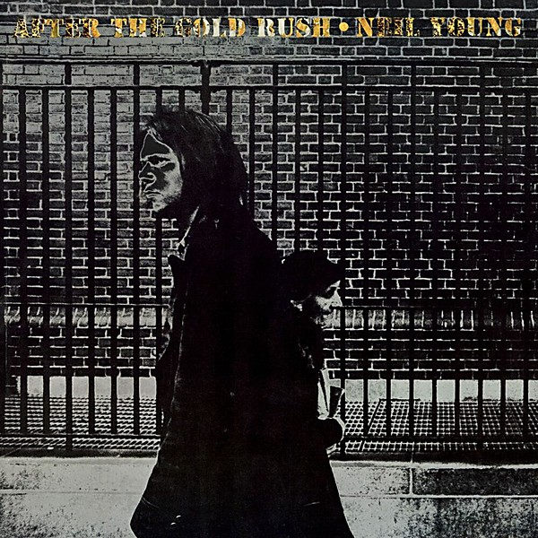

# After the Gold Rush

By **Neil Young**

## Album Data

- **Catalog:** Beets
- **Format:** Digital, Album
- **Album:** After the Gold Rush
- **Artist:** Neil Young
- **Albumartist:** Neil Young
- **Genre:** Folk Rock
- **MusicBrainz Album Artist ID:** [75167b8b-44e4-407b-9d35-effe87b223cf](https://musicbrainz.org/artist/75167b8b-44e4-407b-9d35-effe87b223cf)
- **MusicBrainz Album ID:** [95723f6f-f2e3-4a94-9ede-5d2f69932a8a](https://musicbrainz.org/release/95723f6f-f2e3-4a94-9ede-5d2f69932a8a)
- **MusicBrainz Release Group ID:** [b6a3952b-9977-351c-a80a-73e023143858](https://musicbrainz.org/release-group/b6a3952b-9977-351c-a80a-73e023143858)
- **Year:** 1970
- **Catalog #:** 9 48100-9
- **Label:** Reprise Records
- **Total Tracks:** 20

## Album Tracks

### Track 01 - Out on the Weekend

- **Artist:** Neil Young
- **Format:** MP3
- **Genre:** Folk Rock
- **Length:** 4:32
- **MusicBrainz Track ID:** [35a10dd3-9b81-4367-99d6-a9c43b9fb495](https://musicbrainz.org/recording/35a10dd3-9b81-4367-99d6-a9c43b9fb495)
- **Title:** Out on the Weekend
- **Track:** 01
- **Year:** 2002

### Track 02 - Harvest

- **Artist:** Neil Young
- **Format:** MP3
- **Genre:** Folk Rock
- **Length:** 3:09
- **MusicBrainz Track ID:** [7b4776b6-c6fb-4937-aa55-fb26f0480de4](https://musicbrainz.org/recording/7b4776b6-c6fb-4937-aa55-fb26f0480de4)
- **Title:** Harvest
- **Track:** 02
- **Year:** 2002

### Track 03 - A Man Needs a Maid

- **Artist:** Neil Young
- **Format:** MP3
- **Genre:** Orchestral
- **Length:** 4:02
- **MusicBrainz Track ID:** [45086c8b-01f2-4088-9ac0-fdb0638cbb82](https://musicbrainz.org/recording/45086c8b-01f2-4088-9ac0-fdb0638cbb82)
- **Title:** A Man Needs a Maid
- **Track:** 03
- **Year:** 2002

### Track 04 - Heart of Gold

- **Artist:** Neil Young
- **Format:** MP3
- **Genre:** Folk Rock
- **Length:** 3:07
- **MusicBrainz Track ID:** [e832b734-62e9-4eb7-84f8-0951f39e719e](https://musicbrainz.org/recording/e832b734-62e9-4eb7-84f8-0951f39e719e)
- **Title:** Heart of Gold
- **Track:** 04
- **Year:** 2002

### Track 05 - Are You Ready for the Country?

- **Artist:** Neil Young
- **Format:** MP3
- **Genre:** Folk Rock
- **Length:** 3:23
- **MusicBrainz Track ID:** [bb4d7377-9088-4206-af20-2937a843501f](https://musicbrainz.org/recording/bb4d7377-9088-4206-af20-2937a843501f)
- **Title:** Are You Ready for the Country?
- **Track:** 05
- **Year:** 2002

### Track 06 - Old Man

- **Artist:** Neil Young
- **Format:** MP3
- **Genre:** Folk Rock
- **Length:** 3:22
- **MusicBrainz Track ID:** [39442bc5-989f-4a79-bc68-e3f339f3108d](https://musicbrainz.org/recording/39442bc5-989f-4a79-bc68-e3f339f3108d)
- **Title:** Old Man
- **Track:** 06
- **Year:** 2002

### Track 07 - There’s a World

- **Artist:** Neil Young
- **Format:** MP3
- **Genre:** Folk Rock
- **Length:** 2:59
- **MusicBrainz Track ID:** [81274fb8-0f84-424a-b17a-2b6c08ee1053](https://musicbrainz.org/recording/81274fb8-0f84-424a-b17a-2b6c08ee1053)
- **Title:** There’s a World
- **Track:** 07
- **Year:** 2002

### Track 08 - Alabama

- **Artist:** Neil Young
- **Format:** MP3
- **Genre:** Folk Rock
- **Length:** 4:02
- **MusicBrainz Track ID:** [d7314f92-0346-4953-a187-01c13cb14262](https://musicbrainz.org/recording/d7314f92-0346-4953-a187-01c13cb14262)
- **Title:** Alabama
- **Track:** 08
- **Year:** 2002

### Track 09 - The Needle and the Damage Done

- **Artist:** Neil Young
- **Format:** MP3
- **Genre:** Folk Rock
- **Length:** 2:03
- **MusicBrainz Track ID:** [bd045f9d-573c-4ff4-8091-9a26b387c25e](https://musicbrainz.org/recording/bd045f9d-573c-4ff4-8091-9a26b387c25e)
- **Title:** The Needle and the Damage Done
- **Track:** 09
- **Year:** 2002

### Track 10 - Words (Between the Lines of Age)

- **Artist:** Neil Young
- **Format:** MP3
- **Genre:** Folk Rock
- **Length:** 6:47
- **MusicBrainz Track ID:** [fb8d4d8b-0448-4a45-8c2d-5938437953f1](https://musicbrainz.org/recording/fb8d4d8b-0448-4a45-8c2d-5938437953f1)
- **Title:** Words (Between the Lines of Age)
- **Track:** 10
- **Year:** 2002

### Track 11 - Out on the Weekend (5.1 mix)

- **Artist:** Neil Young
- **Format:** MP3
- **Genre:** Folk Rock
- **Length:** 4:31
- **MusicBrainz Track ID:** [a215b509-aed6-4ce8-ad99-4d4f6b71ac23](https://musicbrainz.org/recording/a215b509-aed6-4ce8-ad99-4d4f6b71ac23)
- **Title:** Out on the Weekend (5.1 mix)
- **Track:** 11
- **Year:** 2002

### Track 12 - Harvest (5.1 mix)

- **Artist:** Neil Young
- **Format:** MP3
- **Genre:** Folk Rock
- **Length:** 3:10
- **MusicBrainz Track ID:** [2569d2f7-c26a-48e6-a01f-6b151d3d1276](https://musicbrainz.org/recording/2569d2f7-c26a-48e6-a01f-6b151d3d1276)
- **Title:** Harvest (5.1 mix)
- **Track:** 12
- **Year:** 2002

### Track 13 - A Man Needs a Maid (5.1 mix)

- **Artist:** Neil Young
- **Format:** MP3
- **Genre:** Folk Rock
- **Length:** 4:01
- **MusicBrainz Track ID:** [a8fc6115-bc3d-4eb8-86d0-bfa43aa00407](https://musicbrainz.org/recording/a8fc6115-bc3d-4eb8-86d0-bfa43aa00407)
- **Title:** A Man Needs a Maid (5.1 mix)
- **Track:** 13
- **Year:** 2002

### Track 14 - Heart of Gold (5.1 mix)

- **Artist:** Neil Young
- **Format:** MP3
- **Genre:** Folk Rock
- **Length:** 3:07
- **MusicBrainz Track ID:** [5f10e7c6-2812-4d26-833c-525b2ebf00a4](https://musicbrainz.org/recording/5f10e7c6-2812-4d26-833c-525b2ebf00a4)
- **Title:** Heart of Gold (5.1 mix)
- **Track:** 14
- **Year:** 2002

### Track 15 - Are You Ready for the Country? (5.1 mix)

- **Artist:** Neil Young
- **Format:** MP3
- **Genre:** Folk Rock
- **Length:** 3:23
- **MusicBrainz Track ID:** [ca9541b3-5637-459c-b840-84b5e7d386fb](https://musicbrainz.org/recording/ca9541b3-5637-459c-b840-84b5e7d386fb)
- **Title:** Are You Ready for the Country? (5.1 mix)
- **Track:** 15
- **Year:** 2002

### Track 16 - Old Man (5.1 mix)

- **Artist:** Neil Young
- **Format:** MP3
- **Genre:** Folk Rock
- **Length:** 3:22
- **MusicBrainz Track ID:** [31a6ecb5-216e-4189-9b4f-9d72286b412e](https://musicbrainz.org/recording/31a6ecb5-216e-4189-9b4f-9d72286b412e)
- **Title:** Old Man (5.1 mix)
- **Track:** 16
- **Year:** 2002

### Track 17 - There’s a World (5.1 mix)

- **Artist:** Neil Young
- **Format:** MP3
- **Genre:** Folk Rock
- **Length:** 2:58
- **MusicBrainz Track ID:** [a3f01dc5-4d9f-4cb9-869b-179faddda0bd](https://musicbrainz.org/recording/a3f01dc5-4d9f-4cb9-869b-179faddda0bd)
- **Title:** There’s a World (5.1 mix)
- **Track:** 17
- **Year:** 2002

### Track 18 - Alabama (5.1 mix)

- **Artist:** Neil Young
- **Format:** MP3
- **Genre:** Folk Rock
- **Length:** 4:03
- **MusicBrainz Track ID:** [960c7e5f-543e-4dc5-8d44-d14179217a7e](https://musicbrainz.org/recording/960c7e5f-543e-4dc5-8d44-d14179217a7e)
- **Title:** Alabama (5.1 mix)
- **Track:** 18
- **Year:** 2002

### Track 19 - The Needle and the Damage Done (5.1 mix)

- **Artist:** Neil Young
- **Format:** MP3
- **Genre:** Folk Rock
- **Length:** 2:03
- **MusicBrainz Track ID:** [6f5298b1-f328-4126-a0a8-64d422ed4eb7](https://musicbrainz.org/recording/6f5298b1-f328-4126-a0a8-64d422ed4eb7)
- **Title:** The Needle and the Damage Done (5.1 mix)
- **Track:** 19
- **Year:** 2002

### Track 20 - Words (Between the Lines of Age) (5.1 mix)

- **Artist:** Neil Young
- **Format:** MP3
- **Genre:** Folk Rock
- **Length:** 6:43
- **MusicBrainz Track ID:** [6bfbd6d3-1fae-4093-a39d-bcde83476974](https://musicbrainz.org/recording/6bfbd6d3-1fae-4093-a39d-bcde83476974)
- **Title:** Words (Between the Lines of Age) (5.1 mix)
- **Track:** 20
- **Year:** 2002

## See also

- [Everybody Knows This Is Nowhere](Everybody_Knows_This_Is_Nowhere.md)
- [Harvest](Harvest.md)
- [Neil Young](Neil_Young.md)
- [On the Beach](On_the_Beach.md)
- [Tonight’s the Night](Tonight’s_the_Night.md)
- [Roon: After The Gold Rush (50th Anniversary)](../../Roon/Neil_Young/After_The_Gold_Rush_50th_Anniversary.md)
- [Roon: Barn](../../Roon/Neil_Young/Barn.md)
- [Roon: Decade](../../Roon/Neil_Young/Decade.md)
- [Roon: Everybody Knows This Is Nowhere](../../Roon/Neil_Young/Everybody_Knows_This_Is_Nowhere.md)
- [Roon: Harvest](../../Roon/Neil_Young/Harvest.md)
- [Roon: Neil Young Archives Vol. II (1972 - 1976)](../../Roon/Neil_Young/Neil_Young_Archives_Vol_II_1972_-_1976.md)
- [Roon: Neil Young Archives Volume I [1963 - 1972] (DMD Album)](../../Roon/Neil_Young/Neil_Young_Archives_Volume_I_[1963_-_1972]_DMD_Album.md)
- [Roon: Psychedelic Pill](../../Roon/Neil_Young/Psychedelic_Pill.md)
- [Roon: Rust Never Sleeps (2016 Remaster)](../../Roon/Neil_Young/Rust_Never_Sleeps_2016_Remaster.md)
- [Roon: Sleeps with Angels](../../Roon/Neil_Young/Sleeps_with_Angels.md)
- [Roon: The Visitor](../../Roon/Neil_Young/The_Visitor.md)
- [Roon: Tonight's The Night](../../Roon/Neil_Young/Tonights_The_Night.md)
- [Roon: Way Down In The Rust Bucket (Live)](../../Roon/Neil_Young/Way_Down_In_The_Rust_Bucket_Live.md)
- [Roon: Zuma (2016 Remaster)](../../Roon/Neil_Young/Zuma_2016_Remaster.md)
- [Vinyl: Harvest](../../Vinyl/Neil_Young/Harvest.md)
- [Vinyl: ](../../Vinyl/Neil_Young/Neil_Young.md)
