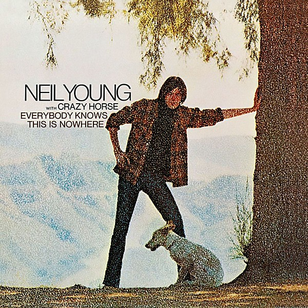

# Everybody Knows This Is Nowhere

By **Neil Young**

## Album Data

- **Catalog:** Beets
- **Format:** Digital, Album
- **Album:** Everybody Knows This Is Nowhere
- **Artist:** Neil Young
- **Albumartist:** Neil Young
- **Genre:** Hard Rock
- **MusicBrainz Album Artist ID:** 
- **MusicBrainz Album ID:** 
- **MusicBrainz Release Group ID:** 
- **Year:** 1969
- **Catalog #:** RS 6383
- **Label:** Reprise Records
- **Total Tracks:** 11

## Album Tracks

### Track 01 - Tell Me Why

- **Artist:** Neil Young
- **Format:** MP3
- **Genre:** Folk Rock
- **Length:** 2:57
- **MusicBrainz Track ID:** [9554c841-cae9-4bea-b6a4-ad75e8cacefb](https://musicbrainz.org/recording/9554c841-cae9-4bea-b6a4-ad75e8cacefb)
- **Title:** Tell Me Why
- **Track:** 01
- **Year:** 1970

### Track 02 - After the Gold Rush

- **Artist:** Neil Young
- **Format:** MP3
- **Genre:** Folk Rock
- **Length:** 3:45
- **MusicBrainz Track ID:** [a1d14a11-b6ec-4dd9-a8f8-c58deb43a41f](https://musicbrainz.org/recording/a1d14a11-b6ec-4dd9-a8f8-c58deb43a41f)
- **Title:** After the Gold Rush
- **Track:** 02
- **Year:** 1970

### Track 03 - Only Love Can Break Your Heart

- **Artist:** Neil Young
- **Format:** MP3
- **Genre:** Folk Rock
- **Length:** 3:08
- **MusicBrainz Track ID:** [92e1e562-eefb-4891-9ad0-083d28e796b7](https://musicbrainz.org/recording/92e1e562-eefb-4891-9ad0-083d28e796b7)
- **Title:** Only Love Can Break Your Heart
- **Track:** 03
- **Year:** 1970

### Track 04 - Southern Man

- **Artist:** Neil Young
- **Format:** MP3
- **Genre:** Folk Rock
- **Length:** 5:31
- **MusicBrainz Track ID:** [843c6839-ed55-4085-bc5a-7116cbd9f21d](https://musicbrainz.org/recording/843c6839-ed55-4085-bc5a-7116cbd9f21d)
- **Title:** Southern Man
- **Track:** 04
- **Year:** 1970

### Track 05 - Till the Morning Comes

- **Artist:** Neil Young
- **Format:** MP3
- **Genre:** Soft Rock
- **Length:** 1:15
- **MusicBrainz Track ID:** [47603577-a5f5-41c9-8b9a-d32e1edfb55b](https://musicbrainz.org/recording/47603577-a5f5-41c9-8b9a-d32e1edfb55b)
- **Title:** Till the Morning Comes
- **Track:** 05
- **Year:** 1970

### Track 06 - Oh, Lonesome Me

- **Artist:** Neil Young
- **Format:** MP3
- **Genre:** Folk Rock
- **Length:** 3:49
- **MusicBrainz Track ID:** [2f1737b5-e900-4990-9d24-a432b0c69cd3](https://musicbrainz.org/recording/2f1737b5-e900-4990-9d24-a432b0c69cd3)
- **Title:** Oh, Lonesome Me
- **Track:** 06
- **Year:** 1970

### Track 07 - Don't Let It Bring You Down

- **Artist:** Neil Young
- **Format:** MP3
- **Genre:** Folk Rock
- **Length:** 2:56
- **MusicBrainz Track ID:** [10bef80a-d669-4fc1-9080-7bd290552686](https://musicbrainz.org/recording/10bef80a-d669-4fc1-9080-7bd290552686)
- **Title:** Don't Let It Bring You Down
- **Track:** 07
- **Year:** 1970

### Track 08 - Birds

- **Artist:** Neil Young
- **Format:** MP3
- **Genre:** Folk Rock
- **Length:** 2:33
- **MusicBrainz Track ID:** [4ab2f711-ee1f-43e7-a122-5b4be3053955](https://musicbrainz.org/recording/4ab2f711-ee1f-43e7-a122-5b4be3053955)
- **Title:** Birds
- **Track:** 08
- **Year:** 1970

### Track 09 - When You Dance I Can Really Love

- **Artist:** Neil Young
- **Format:** MP3
- **Genre:** Hard Rock
- **Length:** 3:43
- **MusicBrainz Track ID:** [2d7bd7d5-facd-4649-82b2-89e59a469f01](https://musicbrainz.org/recording/2d7bd7d5-facd-4649-82b2-89e59a469f01)
- **Title:** When You Dance I Can Really Love
- **Track:** 09
- **Year:** 1970

### Track 10 - I Believe in You

- **Artist:** Neil Young
- **Format:** MP3
- **Genre:** Folk Rock
- **Length:** 3:27
- **MusicBrainz Track ID:** [72a62c00-2505-49ce-b332-3d52c20f70db](https://musicbrainz.org/recording/72a62c00-2505-49ce-b332-3d52c20f70db)
- **Title:** I Believe in You
- **Track:** 10
- **Year:** 1970

### Track 11 - Cripple Creek Ferry

- **Artist:** Neil Young
- **Format:** MP3
- **Genre:** Folk Rock
- **Length:** 1:33
- **MusicBrainz Track ID:** [732a1131-9e79-4c36-aae1-060dd951a6c5](https://musicbrainz.org/recording/732a1131-9e79-4c36-aae1-060dd951a6c5)
- **Title:** Cripple Creek Ferry
- **Track:** 11
- **Year:** 1970

## See also

- [After the Gold Rush](After_the_Gold_Rush.md)
- [Harvest](Harvest.md)
- [Neil Young](Neil_Young.md)
- [On the Beach](On_the_Beach.md)
- [Tonight’s the Night](Tonight’s_the_Night.md)
- [Roon: After The Gold Rush (50th Anniversary)](../../Roon/Neil_Young/After_The_Gold_Rush_50th_Anniversary.md)
- [Roon: Barn](../../Roon/Neil_Young/Barn.md)
- [Roon: Decade](../../Roon/Neil_Young/Decade.md)
- [Roon: Everybody Knows This Is Nowhere](../../Roon/Neil_Young/Everybody_Knows_This_Is_Nowhere.md)
- [Roon: Harvest](../../Roon/Neil_Young/Harvest.md)
- [Roon: Neil Young Archives Vol. II (1972 - 1976)](../../Roon/Neil_Young/Neil_Young_Archives_Vol_II_1972_-_1976.md)
- [Roon: Neil Young Archives Volume I [1963 - 1972] (DMD Album)](../../Roon/Neil_Young/Neil_Young_Archives_Volume_I_[1963_-_1972]_DMD_Album.md)
- [Roon: Psychedelic Pill](../../Roon/Neil_Young/Psychedelic_Pill.md)
- [Roon: Rust Never Sleeps (2016 Remaster)](../../Roon/Neil_Young/Rust_Never_Sleeps_2016_Remaster.md)
- [Roon: Sleeps with Angels](../../Roon/Neil_Young/Sleeps_with_Angels.md)
- [Roon: The Visitor](../../Roon/Neil_Young/The_Visitor.md)
- [Roon: Tonight's The Night](../../Roon/Neil_Young/Tonights_The_Night.md)
- [Roon: Way Down In The Rust Bucket (Live)](../../Roon/Neil_Young/Way_Down_In_The_Rust_Bucket_Live.md)
- [Roon: Zuma (2016 Remaster)](../../Roon/Neil_Young/Zuma_2016_Remaster.md)
- [Vinyl: Harvest](../../Vinyl/Neil_Young/Harvest.md)
- [Vinyl: ](../../Vinyl/Neil_Young/Neil_Young.md)
