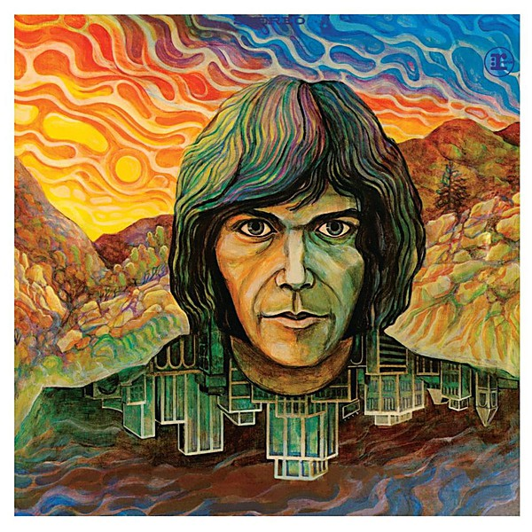

# Neil Young

By **Neil Young**

## Album Data

- **Catalog:** Beets
- **Format:** Digital, Album
- **Album:** Neil Young
- **Artist:** Neil Young
- **Albumartist:** Neil Young
- **Genre:** Folk Rock
- **MusicBrainz Album Artist ID:** [75167b8b-44e4-407b-9d35-effe87b223cf](https://musicbrainz.org/artist/75167b8b-44e4-407b-9d35-effe87b223cf)
- **MusicBrainz Album ID:** [ecef5375-c4c1-367c-8aa9-9b02f6659db5](https://musicbrainz.org/release/ecef5375-c4c1-367c-8aa9-9b02f6659db5)
- **MusicBrainz Release Group ID:** [52418ea0-7f00-3265-92ae-485de63fcb13](https://musicbrainz.org/release-group/52418ea0-7f00-3265-92ae-485de63fcb13)
- **Year:** 1986
- **Catalog #:** 
- **Label:** Reprise Records
- **Total Tracks:** 08

## Album Tracks

### Track 01 - Walk On

- **Artist:** Neil Young
- **Format:** AAC
- **Genre:** Folk Rock
- **Length:** 2:40
- **MusicBrainz Track ID:** [0a5b9fa5-9d25-45a1-9c73-a55b7813ff03](https://musicbrainz.org/recording/0a5b9fa5-9d25-45a1-9c73-a55b7813ff03)
- **Title:** Walk On
- **Track:** 01
- **Year:** 2015

### Track 02 - See the Sky About to Rain

- **Artist:** Neil Young
- **Format:** AAC
- **Genre:** Folk Rock
- **Length:** 5:01
- **MusicBrainz Track ID:** [ba03e857-e8ef-42e5-a073-bb7222fb2701](https://musicbrainz.org/recording/ba03e857-e8ef-42e5-a073-bb7222fb2701)
- **Title:** See the Sky About to Rain
- **Track:** 02
- **Year:** 2015

### Track 03 - Revolution Blues

- **Artist:** Neil Young
- **Format:** AAC
- **Genre:** Folk Rock
- **Length:** 4:04
- **MusicBrainz Track ID:** [4e00a8f1-551f-4a15-9528-c59ba26ca347](https://musicbrainz.org/recording/4e00a8f1-551f-4a15-9528-c59ba26ca347)
- **Title:** Revolution Blues
- **Track:** 03
- **Year:** 2015

### Track 04 - For the Turnstiles

- **Artist:** Neil Young
- **Format:** AAC
- **Genre:** Folk Rock
- **Length:** 3:13
- **MusicBrainz Track ID:** [7ba8203c-df50-42d2-bc42-9f7727f26bea](https://musicbrainz.org/recording/7ba8203c-df50-42d2-bc42-9f7727f26bea)
- **Title:** For the Turnstiles
- **Track:** 04
- **Year:** 2015

### Track 05 - Vampire Blues

- **Artist:** Neil Young
- **Format:** AAC
- **Genre:** Folk Rock
- **Length:** 4:10
- **MusicBrainz Track ID:** [eb15a0b9-2403-4c6a-9c02-d4d459d8f989](https://musicbrainz.org/recording/eb15a0b9-2403-4c6a-9c02-d4d459d8f989)
- **Title:** Vampire Blues
- **Track:** 05
- **Year:** 2015

### Track 06 - On the Beach

- **Artist:** Neil Young
- **Format:** AAC
- **Genre:** Progressive Folk
- **Length:** 12:39
- **MusicBrainz Track ID:** [1d3e2594-6d1d-48a8-b8e8-225d274d57c3](https://musicbrainz.org/recording/1d3e2594-6d1d-48a8-b8e8-225d274d57c3)
- **Title:** On the Beach
- **Track:** 06
- **Year:** 2015

### Track 07 - Motion Pictures

- **Artist:** Neil Young
- **Format:** AAC
- **Genre:** Folk Rock
- **Length:** 4:24
- **MusicBrainz Track ID:** [5fc7c570-a4fc-4ad5-8980-1fb4d4a4f19c](https://musicbrainz.org/recording/5fc7c570-a4fc-4ad5-8980-1fb4d4a4f19c)
- **Title:** Motion Pictures
- **Track:** 07
- **Year:** 2015

### Track 08 - Ambulance Blues

- **Artist:** Neil Young
- **Format:** AAC
- **Genre:** Folk Rock
- **Length:** 8:57
- **MusicBrainz Track ID:** [59b57935-b6b8-484b-a07c-1ceed04f222b](https://musicbrainz.org/recording/59b57935-b6b8-484b-a07c-1ceed04f222b)
- **Title:** Ambulance Blues
- **Track:** 08
- **Year:** 2015

## See also

- [After the Gold Rush](After_the_Gold_Rush.md)
- [Everybody Knows This Is Nowhere](Everybody_Knows_This_Is_Nowhere.md)
- [Harvest](Harvest.md)
- [On the Beach](On_the_Beach.md)
- [Tonight’s the Night](Tonight’s_the_Night.md)
- [Roon: After The Gold Rush (50th Anniversary)](../../Roon/Neil_Young/After_The_Gold_Rush_50th_Anniversary.md)
- [Roon: Barn](../../Roon/Neil_Young/Barn.md)
- [Roon: Decade](../../Roon/Neil_Young/Decade.md)
- [Roon: Everybody Knows This Is Nowhere](../../Roon/Neil_Young/Everybody_Knows_This_Is_Nowhere.md)
- [Roon: Harvest](../../Roon/Neil_Young/Harvest.md)
- [Roon: Neil Young Archives Vol. II (1972 - 1976)](../../Roon/Neil_Young/Neil_Young_Archives_Vol_II_1972_-_1976.md)
- [Roon: Neil Young Archives Volume I [1963 - 1972] (DMD Album)](../../Roon/Neil_Young/Neil_Young_Archives_Volume_I_[1963_-_1972]_DMD_Album.md)
- [Roon: Psychedelic Pill](../../Roon/Neil_Young/Psychedelic_Pill.md)
- [Roon: Rust Never Sleeps (2016 Remaster)](../../Roon/Neil_Young/Rust_Never_Sleeps_2016_Remaster.md)
- [Roon: Sleeps with Angels](../../Roon/Neil_Young/Sleeps_with_Angels.md)
- [Roon: The Visitor](../../Roon/Neil_Young/The_Visitor.md)
- [Roon: Tonight's The Night](../../Roon/Neil_Young/Tonights_The_Night.md)
- [Roon: Way Down In The Rust Bucket (Live)](../../Roon/Neil_Young/Way_Down_In_The_Rust_Bucket_Live.md)
- [Roon: Zuma (2016 Remaster)](../../Roon/Neil_Young/Zuma_2016_Remaster.md)
- [Vinyl: Harvest](../../Vinyl/Neil_Young/Harvest.md)
- [Vinyl: ](../../Vinyl/Neil_Young/Neil_Young.md)
