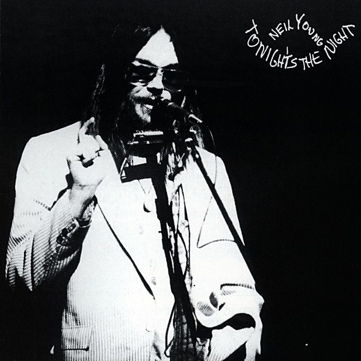

# Tonight’s the Night

By **Neil Young**

## Album Data

- **Catalog:** Beets
- **Format:** Digital, Album
- **Album:** Tonight’s the Night
- **Artist:** Neil Young
- **Albumartist:** Neil Young
- **Genre:** Folk Rock
- **MusicBrainz Album Artist ID:** [75167b8b-44e4-407b-9d35-effe87b223cf](https://musicbrainz.org/artist/75167b8b-44e4-407b-9d35-effe87b223cf)
- **MusicBrainz Album ID:** [d9ecef28-8f1e-457e-a2c4-561a33534aaf](https://musicbrainz.org/release/d9ecef28-8f1e-457e-a2c4-561a33534aaf)
- **MusicBrainz Release Group ID:** [e0207e33-af06-3862-baba-f42ca722de0d](https://musicbrainz.org/release-group/e0207e33-af06-3862-baba-f42ca722de0d)
- **Year:** 1987
- **Catalog #:** 2221-2
- **Label:** Reprise Records
- **Total Tracks:** 12

## Album Tracks

### Track 01 - Tonight’s the Night

- **Artist:** Neil Young
- **Format:** MP3
- **Genre:** Folk Rock
- **Length:** 4:40
- **MusicBrainz Track ID:** [7120cf10-477f-4b7f-a75d-67c11596e4d0](https://musicbrainz.org/recording/7120cf10-477f-4b7f-a75d-67c11596e4d0)
- **Title:** Tonight’s the Night
- **Track:** 01
- **Year:** 1987

### Track 02 - Speakin’ Out

- **Artist:** Neil Young
- **Format:** MP3
- **Genre:** Folk Rock
- **Length:** 4:58
- **MusicBrainz Track ID:** [b3ab3bd0-9a1d-4c6f-9fb2-4139cdfaeb3d](https://musicbrainz.org/recording/b3ab3bd0-9a1d-4c6f-9fb2-4139cdfaeb3d)
- **Title:** Speakin’ Out
- **Track:** 02
- **Year:** 1987

### Track 03 - World on a String

- **Artist:** Neil Young
- **Format:** MP3
- **Genre:** Folk Rock
- **Length:** 2:25
- **MusicBrainz Track ID:** [1716d968-ded8-406f-a792-b2c2848111df](https://musicbrainz.org/recording/1716d968-ded8-406f-a792-b2c2848111df)
- **Title:** World on a String
- **Track:** 03
- **Year:** 1987

### Track 04 - Borrowed Tune

- **Artist:** Neil Young
- **Format:** MP3
- **Genre:** Folk Rock
- **Length:** 3:18
- **MusicBrainz Track ID:** [9db857c5-010c-47bc-a07f-0a83bbca5389](https://musicbrainz.org/recording/9db857c5-010c-47bc-a07f-0a83bbca5389)
- **Title:** Borrowed Tune
- **Track:** 04
- **Year:** 1987

### Track 05 - Come On Baby Let’s Go Downtown

- **Artist:** Neil Young
- **Format:** MP3
- **Genre:** Folk Rock
- **Length:** 3:35
- **MusicBrainz Track ID:** [b91ffa2b-b1c4-44e5-ba25-fe9dbfcf575b](https://musicbrainz.org/recording/b91ffa2b-b1c4-44e5-ba25-fe9dbfcf575b)
- **Title:** Come On Baby Let’s Go Downtown
- **Track:** 05
- **Year:** 1987

### Track 06 - Mellow My Mind

- **Artist:** Neil Young
- **Format:** MP3
- **Genre:** Progressive Rock
- **Length:** 3:12
- **MusicBrainz Track ID:** [c6a6a899-0367-4a18-91e4-7c32f5280433](https://musicbrainz.org/recording/c6a6a899-0367-4a18-91e4-7c32f5280433)
- **Title:** Mellow My Mind
- **Track:** 06
- **Year:** 1987

### Track 07 - Roll Another Number (for the Road)

- **Artist:** Neil Young
- **Format:** MP3
- **Genre:** Hard Rock
- **Length:** 3:03
- **MusicBrainz Track ID:** [f0d921d5-c6e7-4e55-920e-cef380326f01](https://musicbrainz.org/recording/f0d921d5-c6e7-4e55-920e-cef380326f01)
- **Title:** Roll Another Number (for the Road)
- **Track:** 07
- **Year:** 1987

### Track 08 - Albuquerque

- **Artist:** Neil Young
- **Format:** MP3
- **Genre:** Hard Rock
- **Length:** 4:02
- **MusicBrainz Track ID:** [85d5016c-ffb9-4329-93f6-7fac28e9cfc9](https://musicbrainz.org/recording/85d5016c-ffb9-4329-93f6-7fac28e9cfc9)
- **Title:** Albuquerque
- **Track:** 08
- **Year:** 1987

### Track 09 - New Mama

- **Artist:** Neil Young
- **Format:** MP3
- **Genre:** Soft Rock
- **Length:** 2:10
- **MusicBrainz Track ID:** [86a2c28f-a5a8-4da0-89bd-bd329a366b75](https://musicbrainz.org/recording/86a2c28f-a5a8-4da0-89bd-bd329a366b75)
- **Title:** New Mama
- **Track:** 09
- **Year:** 1987

### Track 10 - Lookout Joe

- **Artist:** Neil Young
- **Format:** MP3
- **Genre:** Grunge
- **Length:** 3:54
- **MusicBrainz Track ID:** [982c97f7-b55c-4323-877d-480ac8376989](https://musicbrainz.org/recording/982c97f7-b55c-4323-877d-480ac8376989)
- **Title:** Lookout Joe
- **Track:** 10
- **Year:** 1987

### Track 11 - Tired Eyes

- **Artist:** Neil Young
- **Format:** MP3
- **Genre:** Soft Rock
- **Length:** 4:31
- **MusicBrainz Track ID:** [4d04d151-ae6d-4706-81b8-27b5b3477107](https://musicbrainz.org/recording/4d04d151-ae6d-4706-81b8-27b5b3477107)
- **Title:** Tired Eyes
- **Track:** 11
- **Year:** 1987

### Track 12 - Tonight’s the Night, Part II

- **Artist:** Neil Young
- **Format:** MP3
- **Genre:** Folk Rock
- **Length:** 4:54
- **MusicBrainz Track ID:** [05ba3f54-0ce5-48a6-bf6d-490959ae5724](https://musicbrainz.org/recording/05ba3f54-0ce5-48a6-bf6d-490959ae5724)
- **Title:** Tonight’s the Night, Part II
- **Track:** 12
- **Year:** 1987

## See also

- [After the Gold Rush](After_the_Gold_Rush.md)
- [Everybody Knows This Is Nowhere](Everybody_Knows_This_Is_Nowhere.md)
- [Harvest](Harvest.md)
- [Neil Young](Neil_Young.md)
- [On the Beach](On_the_Beach.md)
- [Roon: After The Gold Rush (50th Anniversary)](../../Roon/Neil_Young/After_The_Gold_Rush_50th_Anniversary.md)
- [Roon: Barn](../../Roon/Neil_Young/Barn.md)
- [Roon: Decade](../../Roon/Neil_Young/Decade.md)
- [Roon: Everybody Knows This Is Nowhere](../../Roon/Neil_Young/Everybody_Knows_This_Is_Nowhere.md)
- [Roon: Harvest](../../Roon/Neil_Young/Harvest.md)
- [Roon: Neil Young Archives Vol. II (1972 - 1976)](../../Roon/Neil_Young/Neil_Young_Archives_Vol_II_1972_-_1976.md)
- [Roon: Neil Young Archives Volume I [1963 - 1972] (DMD Album)](../../Roon/Neil_Young/Neil_Young_Archives_Volume_I_[1963_-_1972]_DMD_Album.md)
- [Roon: Psychedelic Pill](../../Roon/Neil_Young/Psychedelic_Pill.md)
- [Roon: Rust Never Sleeps (2016 Remaster)](../../Roon/Neil_Young/Rust_Never_Sleeps_2016_Remaster.md)
- [Roon: Sleeps with Angels](../../Roon/Neil_Young/Sleeps_with_Angels.md)
- [Roon: The Visitor](../../Roon/Neil_Young/The_Visitor.md)
- [Roon: Tonight's The Night](../../Roon/Neil_Young/Tonights_The_Night.md)
- [Roon: Way Down In The Rust Bucket (Live)](../../Roon/Neil_Young/Way_Down_In_The_Rust_Bucket_Live.md)
- [Roon: Zuma (2016 Remaster)](../../Roon/Neil_Young/Zuma_2016_Remaster.md)
- [Vinyl: Harvest](../../Vinyl/Neil_Young/Harvest.md)
- [Vinyl: ](../../Vinyl/Neil_Young/Neil_Young.md)
