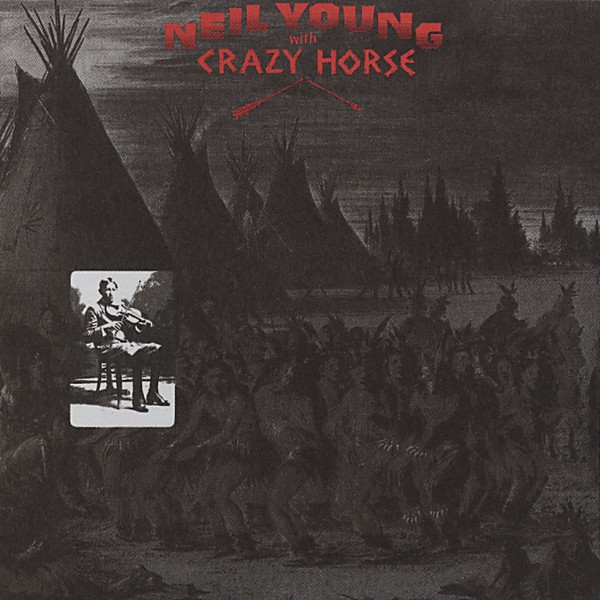

# Broken Arrow

By **Neil Young with Crazy Horse**

## Album Data

- **Catalog:** Beets
- **Format:** Digital, Album
- **Album:** Broken Arrow
- **Artist:** Neil Young With Crazy Horse
- **Albumartist:** Neil Young with Crazy Horse
- **Genre:** Hard Rock
- **MusicBrainz Album Artist ID:** [75167b8b-44e4-407b-9d35-effe87b223cf](https://musicbrainz.org/artist/75167b8b-44e4-407b-9d35-effe87b223cf)
- **MusicBrainz Album ID:** [b267fe53-fb40-4b1e-a5fc-9f2ec0a0390e](https://musicbrainz.org/release/b267fe53-fb40-4b1e-a5fc-9f2ec0a0390e)
- **MusicBrainz Release Group ID:** [65920f83-a9d1-3127-8496-ee9cada5920b](https://musicbrainz.org/release-group/65920f83-a9d1-3127-8496-ee9cada5920b)
- **Year:** 1996
- **Catalog #:** 9 46291-2
- **Label:** Reprise Records
- **Total Tracks:** 08

## Album Tracks

### Track 01 - Big Time

- **Artist:** Neil Young with Crazy Horse
- **Format:** MP3
- **Genre:** Hard Rock
- **Length:** 7:26
- **MusicBrainz Track ID:** [46ae601a-acbb-4f95-8e72-dbce31b3f89e](https://musicbrainz.org/recording/46ae601a-acbb-4f95-8e72-dbce31b3f89e)
- **Title:** Big Time
- **Track:** 01
- **Year:** 1996

### Track 02 - Loose Change

- **Artist:** Neil Young with Crazy Horse
- **Format:** MP3
- **Genre:** Hard Rock
- **Length:** 9:10
- **MusicBrainz Track ID:** [5a19c448-9785-4e4b-ba9b-9fc88fa24d70](https://musicbrainz.org/recording/5a19c448-9785-4e4b-ba9b-9fc88fa24d70)
- **Title:** Loose Change
- **Track:** 02
- **Year:** 1996

### Track 03 - Slip Away

- **Artist:** Neil Young with Crazy Horse
- **Format:** MP3
- **Genre:** Hard Rock
- **Length:** 8:36
- **MusicBrainz Track ID:** [7f152150-2588-4093-b3b0-75e46be542a0](https://musicbrainz.org/recording/7f152150-2588-4093-b3b0-75e46be542a0)
- **Title:** Slip Away
- **Track:** 03
- **Year:** 1996

### Track 04 - Changing Highways

- **Artist:** Neil Young with Crazy Horse
- **Format:** MP3
- **Genre:** Folk Rock
- **Length:** 2:23
- **MusicBrainz Track ID:** [21605cd1-7711-48c8-afad-c6afbb538213](https://musicbrainz.org/recording/21605cd1-7711-48c8-afad-c6afbb538213)
- **Title:** Changing Highways
- **Track:** 04
- **Year:** 1996

### Track 05 - Scattered (Let’s Think About Livin’)

- **Artist:** Neil Young with Crazy Horse
- **Format:** MP3
- **Genre:** Hard Rock
- **Length:** 4:13
- **MusicBrainz Track ID:** [1d695cdc-e346-48aa-9214-1a997ffe9f43](https://musicbrainz.org/recording/1d695cdc-e346-48aa-9214-1a997ffe9f43)
- **Title:** Scattered (Let’s Think About Livin’)
- **Track:** 05
- **Year:** 1996

### Track 06 - This Town

- **Artist:** Neil Young with Crazy Horse
- **Format:** MP3
- **Genre:** Folk Rock
- **Length:** 3:01
- **MusicBrainz Track ID:** [d7580912-e89e-4715-ac0e-3fc07d698acd](https://musicbrainz.org/recording/d7580912-e89e-4715-ac0e-3fc07d698acd)
- **Title:** This Town
- **Track:** 06
- **Year:** 1996

### Track 07 - Music Arcade

- **Artist:** Neil Young with Crazy Horse
- **Format:** MP3
- **Genre:** Folk Rock
- **Length:** 4:01
- **MusicBrainz Track ID:** [5583c422-72f3-4656-9ceb-62585e01e870](https://musicbrainz.org/recording/5583c422-72f3-4656-9ceb-62585e01e870)
- **Title:** Music Arcade
- **Track:** 07
- **Year:** 1996

### Track 08 - Baby What You Want Me to Do

- **Artist:** Neil Young with Crazy Horse
- **Format:** MP3
- **Genre:** Hard Rock
- **Length:** 8:08
- **MusicBrainz Track ID:** [4b47fe63-d7ec-40f6-8e35-5f1a009c60e6](https://musicbrainz.org/recording/4b47fe63-d7ec-40f6-8e35-5f1a009c60e6)
- **Title:** Baby What You Want Me to Do
- **Track:** 08
- **Year:** 1996

## See also

- [Vinyl: ](../../Vinyl/Neil_Young_With_Crazy_Horse/Neil_Young_With_Crazy_Horse.md)
- [Vinyl: Zuma](../../Vinyl/Neil_Young_With_Crazy_Horse/Zuma.md)
