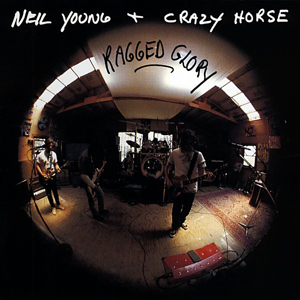

# Ragged Glory

By **Neil Young & Crazy Horse**

## Album Data

- **Catalog:** Beets
- **Format:** Digital, Album
- **Album:** Ragged Glory
- **Artist:** Neil Young & Crazy Horse
- **Albumartist:** Neil Young & Crazy Horse
- **Genre:** Grunge
- **MusicBrainz Album Artist ID:** [75167b8b-44e4-407b-9d35-effe87b223cf](https://musicbrainz.org/artist/75167b8b-44e4-407b-9d35-effe87b223cf)
- **MusicBrainz Album ID:** [62541aab-ed79-48f9-a6da-5bd5ee215151](https://musicbrainz.org/release/62541aab-ed79-48f9-a6da-5bd5ee215151)
- **MusicBrainz Release Group ID:** [91fdfd77-a868-3678-b9f2-11ad92118955](https://musicbrainz.org/release-group/91fdfd77-a868-3678-b9f2-11ad92118955)
- **Year:** 1990
- **Catalog #:** 9 26315-2
- **Label:** Reprise Records
- **Total Tracks:** 10

## Album Tracks

### Track 01 - Country Home

- **Artist:** Neil Young & Crazy Horse
- **Format:** ALAC
- **Genre:** Rock And Roll
- **Length:** 7:05
- **MusicBrainz Track ID:** [fcdbba61-f5c5-4e1f-98e3-f72bf7563d28](https://musicbrainz.org/recording/fcdbba61-f5c5-4e1f-98e3-f72bf7563d28)
- **Title:** Country Home
- **Track:** 01
- **Year:** 1990

### Track 02 - White Line

- **Artist:** Neil Young & Crazy Horse
- **Format:** ALAC
- **Genre:** Hard Rock
- **Length:** 2:57
- **MusicBrainz Track ID:** [7b69a727-735b-4cb0-ae2d-e1c62ab6d430](https://musicbrainz.org/recording/7b69a727-735b-4cb0-ae2d-e1c62ab6d430)
- **Title:** White Line
- **Track:** 02
- **Year:** 1990

### Track 03 - F*!#in’ Up

- **Artist:** Neil Young & Crazy Horse
- **Format:** ALAC
- **Genre:** Grunge
- **Length:** 5:55
- **MusicBrainz Track ID:** [9eefc41c-1fe5-432d-9ac5-3f2861dea1ee](https://musicbrainz.org/recording/9eefc41c-1fe5-432d-9ac5-3f2861dea1ee)
- **Title:** F*!#in’ Up
- **Track:** 03
- **Year:** 1990

### Track 04 - Over and Over

- **Artist:** Neil Young & Crazy Horse
- **Format:** ALAC
- **Genre:** Southern Rock
- **Length:** 8:28
- **MusicBrainz Track ID:** [d1d33f73-5183-40d8-bc92-d28ca34d287c](https://musicbrainz.org/recording/d1d33f73-5183-40d8-bc92-d28ca34d287c)
- **Title:** Over and Over
- **Track:** 04
- **Year:** 1990

### Track 05 - Love to Burn

- **Artist:** Neil Young & Crazy Horse
- **Format:** ALAC
- **Genre:** Hard Rock
- **Length:** 10:00
- **MusicBrainz Track ID:** [128c160a-4d0f-47ed-b470-b5e0c80f1f93](https://musicbrainz.org/recording/128c160a-4d0f-47ed-b470-b5e0c80f1f93)
- **Title:** Love to Burn
- **Track:** 05
- **Year:** 1990

### Track 06 - Farmer John

- **Artist:** Neil Young & Crazy Horse
- **Format:** ALAC
- **Genre:** Hard Rock
- **Length:** 4:14
- **MusicBrainz Track ID:** [aeebfff7-d217-493f-848c-1f9801bb37f4](https://musicbrainz.org/recording/aeebfff7-d217-493f-848c-1f9801bb37f4)
- **Title:** Farmer John
- **Track:** 06
- **Year:** 1990

### Track 07 - Mansion on the Hill

- **Artist:** Neil Young & Crazy Horse
- **Format:** ALAC
- **Genre:** Hard Rock
- **Length:** 4:48
- **MusicBrainz Track ID:** [82fd25bb-ad4c-4e8d-952d-834b405bb0d4](https://musicbrainz.org/recording/82fd25bb-ad4c-4e8d-952d-834b405bb0d4)
- **Title:** Mansion on the Hill
- **Track:** 07
- **Year:** 1990

### Track 08 - Days That Used to Be

- **Artist:** Neil Young & Crazy Horse
- **Format:** ALAC
- **Genre:** Hard Rock
- **Length:** 3:42
- **MusicBrainz Track ID:** [fe823e0c-5567-44a7-a1d5-747df81b1ac3](https://musicbrainz.org/recording/fe823e0c-5567-44a7-a1d5-747df81b1ac3)
- **Title:** Days That Used to Be
- **Track:** 08
- **Year:** 1990

### Track 09 - Love and Only Love

- **Artist:** Neil Young & Crazy Horse
- **Format:** ALAC
- **Genre:** Southern Rock
- **Length:** 10:18
- **MusicBrainz Track ID:** [b3e296ca-22b7-42e8-8fd2-724c0977c02e](https://musicbrainz.org/recording/b3e296ca-22b7-42e8-8fd2-724c0977c02e)
- **Title:** Love and Only Love
- **Track:** 09
- **Year:** 1990

### Track 10 - Mother Earth (Natural Anthem)

- **Artist:** Neil Young & Crazy Horse
- **Format:** ALAC
- **Genre:** Hard Rock
- **Length:** 5:11
- **MusicBrainz Track ID:** [8d310d65-ac7a-4de7-8c82-5a6e38129d55](https://musicbrainz.org/recording/8d310d65-ac7a-4de7-8c82-5a6e38129d55)
- **Title:** Mother Earth (Natural Anthem)
- **Track:** 10
- **Year:** 1990

## See also

- [Psychedelic Pill](Psychedelic_Pill.md)
- [Roon: Barn](../../Roon/Neil_Young_and_Crazy_Horse/Barn.md)
- [Roon: Everybody Knows This Is Nowhere](../../Roon/Neil_Young_and_Crazy_Horse/Everybody_Knows_This_Is_Nowhere.md)
- [Roon: Psychedelic Pill](../../Roon/Neil_Young_and_Crazy_Horse/Psychedelic_Pill.md)
- [Roon: Rust Never Sleeps (2016 Remaster)](../../Roon/Neil_Young_and_Crazy_Horse/Rust_Never_Sleeps_2016_Remaster.md)
- [Roon: Sleeps with Angels](../../Roon/Neil_Young_and_Crazy_Horse/Sleeps_with_Angels.md)
- [Roon: Way Down In The Rust Bucket (Live)](../../Roon/Neil_Young_and_Crazy_Horse/Way_Down_In_The_Rust_Bucket_Live.md)
- [Roon: Zuma (2016 Remaster)](../../Roon/Neil_Young_and_Crazy_Horse/Zuma_2016_Remaster.md)
