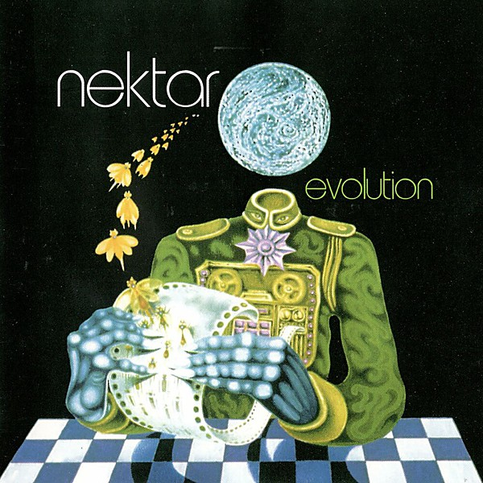

# Evolution

By **Nektar**

## Album Data

- **Catalog:** Beets
- **Format:** Digital, Album
- **Album:** Evolution
- **Artist:** Nektar
- **Albumartist:** Nektar
- **Genre:** Space Rock
- **MusicBrainz Album Artist ID:** [8a5c294f-8d3b-452d-a6f9-6332cfb408f3](https://musicbrainz.org/artist/8a5c294f-8d3b-452d-a6f9-6332cfb408f3)
- **MusicBrainz Album ID:** [83770a31-3ef9-45dd-af48-57d593ede3d9](https://musicbrainz.org/release/83770a31-3ef9-45dd-af48-57d593ede3d9)
- **MusicBrainz Release Group ID:** [1ea9722f-d2aa-3ef9-8cd0-ec8d5aeb93a0](https://musicbrainz.org/release-group/1ea9722f-d2aa-3ef9-8cd0-ec8d5aeb93a0)
- **Year:** 2004
- **Catalog #:** DNECD 1205
- **Label:** Dream Nebula
- **Total Tracks:** 08

## Album Tracks

### Track 01 - Camouflage to White

- **Artist:** Nektar
- **Format:** AAC
- **Genre:** Psychedelic Rock
- **Length:** 7:06
- **MusicBrainz Track ID:** [07c16c44-f8ae-44b9-a774-395f2dd80af3](https://musicbrainz.org/recording/07c16c44-f8ae-44b9-a774-395f2dd80af3)
- **Title:** Camouflage to White
- **Track:** 01
- **Year:** 2004

### Track 02 - Old Mother Earth

- **Artist:** Nektar
- **Format:** AAC
- **Genre:** Psychedelic Rock
- **Length:** 7:42
- **MusicBrainz Track ID:** [3fec2c99-f3af-44d2-b397-a51c481a931f](https://musicbrainz.org/recording/3fec2c99-f3af-44d2-b397-a51c481a931f)
- **Title:** Old Mother Earth
- **Track:** 02
- **Year:** 2004

### Track 03 - Child of Mine

- **Artist:** Nektar
- **Format:** AAC
- **Genre:** Psychedelic Rock
- **Length:** 6:46
- **MusicBrainz Track ID:** [51042326-eba3-4e7d-ad54-970888949e80](https://musicbrainz.org/recording/51042326-eba3-4e7d-ad54-970888949e80)
- **Title:** Child of Mine
- **Track:** 03
- **Year:** 2004

### Track 04 - Phazed by the Storm

- **Artist:** Nektar
- **Format:** AAC
- **Genre:** Progressive Rock
- **Length:** 9:24
- **MusicBrainz Track ID:** [2ed0c5cb-591f-4f16-a8f6-f7080b907303](https://musicbrainz.org/recording/2ed0c5cb-591f-4f16-a8f6-f7080b907303)
- **Title:** Phazed by the Storm
- **Track:** 04
- **Year:** 2004

### Track 05 - Always

- **Artist:** Nektar
- **Format:** AAC
- **Genre:** Progressive Rock
- **Length:** 7:03
- **MusicBrainz Track ID:** [e9f01dde-856c-4e7d-b21f-ba3eefb25c95](https://musicbrainz.org/recording/e9f01dde-856c-4e7d-b21f-ba3eefb25c95)
- **Title:** Always
- **Track:** 05
- **Year:** 2004

### Track 06 - Dancin’ Into the Void

- **Artist:** Nektar
- **Format:** AAC
- **Genre:** Space Rock
- **Length:** 8:20
- **MusicBrainz Track ID:** [6a3e22bc-57cf-4413-986d-068ef7936985](https://musicbrainz.org/recording/6a3e22bc-57cf-4413-986d-068ef7936985)
- **Title:** Dancin’ Into the Void
- **Track:** 06
- **Year:** 2004

### Track 07 - The Debate

- **Artist:** Nektar
- **Format:** AAC
- **Genre:** Psychedelic Rock
- **Length:** 9:32
- **MusicBrainz Track ID:** [c14d68d4-d7cf-4b7e-8276-f8a5c1991050](https://musicbrainz.org/recording/c14d68d4-d7cf-4b7e-8276-f8a5c1991050)
- **Title:** The Debate
- **Track:** 07
- **Year:** 2004

### Track 08 - After the Fall

- **Artist:** Nektar
- **Format:** AAC
- **Genre:** Progressive Rock
- **Length:** 5:37
- **MusicBrainz Track ID:** [fabdd1a3-7a89-425e-8208-1a66f9d73949](https://musicbrainz.org/recording/fabdd1a3-7a89-425e-8208-1a66f9d73949)
- **Title:** After the Fall
- **Track:** 08
- **Year:** 2004

