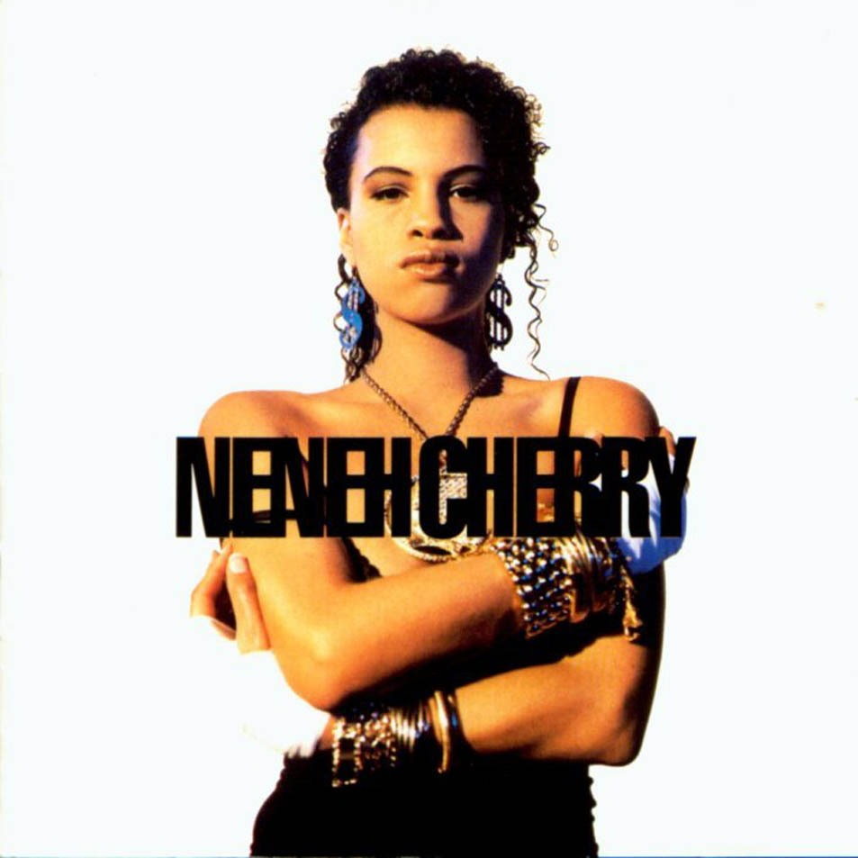

# Raw Like Sushi

By **Neneh Cherry**

## Album Data

- **Catalog:** Beets
- **Format:** Digital, Album
- **Album:** Raw Like Sushi
- **Artist:** Neneh Cherry
- **Albumartist:** Neneh Cherry
- **Genre:** Dance-Pop
- **MusicBrainz Album Artist ID:** [527c65d1-9fdb-4482-8796-dde2980bd63a](https://musicbrainz.org/artist/527c65d1-9fdb-4482-8796-dde2980bd63a)
- **MusicBrainz Album ID:** [8c16f543-94f0-34b6-a8f2-b1d6ab7db0e2](https://musicbrainz.org/release/8c16f543-94f0-34b6-a8f2-b1d6ab7db0e2)
- **MusicBrainz Release Group ID:** [daf52bf4-9abf-353e-b226-ef69e1f3e95d](https://musicbrainz.org/release-group/daf52bf4-9abf-353e-b226-ef69e1f3e95d)
- **Year:** 1989
- **Catalog #:** 7 91252-2
- **Label:** Virgin
- **Total Tracks:** 10

## Album Tracks

### Track 01 - Buffalo Stance

- **Artist:** Neneh Cherry
- **Format:** AAC
- **Genre:** Uk Garage
- **Length:** 5:48
- **MusicBrainz Track ID:** [2900b938-6c05-4bc4-a8f6-a448ab6ea446](https://musicbrainz.org/recording/2900b938-6c05-4bc4-a8f6-a448ab6ea446)
- **Title:** Buffalo Stance
- **Track:** 01
- **Year:** 1989

### Track 02 - Manchild

- **Artist:** Neneh Cherry
- **Format:** AAC
- **Genre:** Soul
- **Length:** 3:59
- **MusicBrainz Track ID:** [8a080d82-3446-4c1a-b9b6-8d5bd4f8f266](https://musicbrainz.org/recording/8a080d82-3446-4c1a-b9b6-8d5bd4f8f266)
- **Title:** Manchild
- **Track:** 02
- **Year:** 1989

### Track 03 - Kisses on the Wind

- **Artist:** Neneh Cherry
- **Format:** AAC
- **Genre:** Soul
- **Length:** 4:00
- **MusicBrainz Track ID:** [8b2a209e-42b2-4bd5-a6f0-aa21c8e1c739](https://musicbrainz.org/recording/8b2a209e-42b2-4bd5-a6f0-aa21c8e1c739)
- **Title:** Kisses on the Wind
- **Track:** 03
- **Year:** 1989

### Track 04 - Inna City Mamma

- **Artist:** Neneh Cherry
- **Format:** AAC
- **Genre:** Soul
- **Length:** 4:58
- **MusicBrainz Track ID:** [1e829c63-5809-437d-b27c-89876d6507eb](https://musicbrainz.org/recording/1e829c63-5809-437d-b27c-89876d6507eb)
- **Title:** Inna City Mamma
- **Track:** 04
- **Year:** 1989

### Track 05 - The Next Generation

- **Artist:** Neneh Cherry
- **Format:** AAC
- **Genre:** Soul
- **Length:** 5:11
- **MusicBrainz Track ID:** [c18596f4-0a6e-4e02-a125-2166d9b17c61](https://musicbrainz.org/recording/c18596f4-0a6e-4e02-a125-2166d9b17c61)
- **Title:** The Next Generation
- **Track:** 05
- **Year:** 1989

### Track 06 - Love Ghetto

- **Artist:** Neneh Cherry
- **Format:** AAC
- **Genre:** Funk
- **Length:** 4:30
- **MusicBrainz Track ID:** [3cc12d14-95e8-4335-b299-814d13cf5846](https://musicbrainz.org/recording/3cc12d14-95e8-4335-b299-814d13cf5846)
- **Title:** Love Ghetto
- **Track:** 06
- **Year:** 1989

### Track 07 - Heart

- **Artist:** Neneh Cherry
- **Format:** AAC
- **Genre:** Dance-Pop
- **Length:** 5:11
- **MusicBrainz Track ID:** [3ec89829-818e-4bd9-baab-8d1a2ffc8086](https://musicbrainz.org/recording/3ec89829-818e-4bd9-baab-8d1a2ffc8086)
- **Title:** Heart
- **Track:** 07
- **Year:** 1989

### Track 08 - Phoney Ladies

- **Artist:** Neneh Cherry
- **Format:** AAC
- **Genre:** Funk
- **Length:** 4:04
- **MusicBrainz Track ID:** [d09f5990-ff51-4990-a521-cbef661a5028](https://musicbrainz.org/recording/d09f5990-ff51-4990-a521-cbef661a5028)
- **Title:** Phoney Ladies
- **Track:** 08
- **Year:** 1989

### Track 09 - Outré Risqué Locomotive

- **Artist:** Neneh Cherry
- **Format:** AAC
- **Genre:** Funk
- **Length:** 5:13
- **MusicBrainz Track ID:** [be7a1f08-4f14-4862-bbc2-f3afb310ebb3](https://musicbrainz.org/recording/be7a1f08-4f14-4862-bbc2-f3afb310ebb3)
- **Title:** Outré Risqué Locomotive
- **Track:** 09
- **Year:** 1989

### Track 10 - So Here I Come

- **Artist:** Neneh Cherry
- **Format:** AAC
- **Genre:** Funk
- **Length:** 4:08
- **MusicBrainz Track ID:** [bd68bb42-13cc-4b62-b75e-9cf485620aef](https://musicbrainz.org/recording/bd68bb42-13cc-4b62-b75e-9cf485620aef)
- **Title:** So Here I Come
- **Track:** 10
- **Year:** 1989

