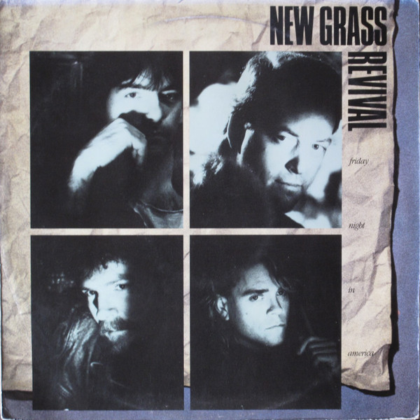

# Friday Night in America

By **New Grass Revival**

## Album Data

- **Catalog:** Beets
- **Format:** Digital, Album
- **Album:** Friday Night in America
- **Artist:** New Grass Revival
- **Albumartist:** New Grass Revival
- **Genre:** Progressive Bluegrass
- **MusicBrainz Album Artist ID:** [9b6f3084-7bd7-444a-b0a5-d2dc78c19284](https://musicbrainz.org/artist/9b6f3084-7bd7-444a-b0a5-d2dc78c19284)
- **MusicBrainz Album ID:** [00e933bd-93b2-433b-b101-19aba6ea33f2](https://musicbrainz.org/release/00e933bd-93b2-433b-b101-19aba6ea33f2)
- **MusicBrainz Release Group ID:** [7745b8ff-3f88-3f55-882f-879820571252](https://musicbrainz.org/release-group/7745b8ff-3f88-3f55-882f-879820571252)
- **Year:** 1989
- **Catalog #:** 
- **Label:** Southern Music
- **Total Tracks:** 10

## Album Tracks

### Track 01 - Hold to a Dream

- **Artist:** New Grass Revival
- **Format:** MP3
- **Genre:** Bluegrass
- **Length:** 3:38
- **MusicBrainz Track ID:** [fd02ee3a-23ba-4d00-9853-5afa73df904b](https://musicbrainz.org/recording/fd02ee3a-23ba-4d00-9853-5afa73df904b)
- **Title:** Hold to a Dream
- **Track:** 01
- **Year:** 1987

### Track 02 - One Way Street

- **Artist:** New Grass Revival
- **Format:** MP3
- **Genre:** Progressive Bluegrass
- **Length:** 2:50
- **MusicBrainz Track ID:** [beb0948f-c0a0-45b9-a5ef-d457ac4be05c](https://musicbrainz.org/recording/beb0948f-c0a0-45b9-a5ef-d457ac4be05c)
- **Title:** One Way Street
- **Track:** 02
- **Year:** 1987

### Track 03 - Can't Stop Now

- **Artist:** New Grass Revival
- **Format:** MP3
- **Genre:** Bluegrass
- **Length:** 4:01
- **MusicBrainz Track ID:** [ecd1c104-e118-4791-8c6c-e9a20fa1696e](https://musicbrainz.org/recording/ecd1c104-e118-4791-8c6c-e9a20fa1696e)
- **Title:** Can't Stop Now
- **Track:** 03
- **Year:** 1987

### Track 04 - I'll Take Tomorrow

- **Artist:** New Grass Revival
- **Format:** MP3
- **Genre:** Progressive Bluegrass
- **Length:** 2:55
- **MusicBrainz Track ID:** [974c04f2-6c0e-4dcf-ac38-ad04d198e0dc](https://musicbrainz.org/recording/974c04f2-6c0e-4dcf-ac38-ad04d198e0dc)
- **Title:** I'll Take Tomorrow
- **Track:** 04
- **Year:** 1987

### Track 05 - Before the Heartache Rolls In

- **Artist:** New Grass Revival
- **Format:** MP3
- **Genre:** Progressive Bluegrass
- **Length:** 5:22
- **MusicBrainz Track ID:** [d4a1bd9c-4815-486c-a723-ea39d2fb713c](https://musicbrainz.org/recording/d4a1bd9c-4815-486c-a723-ea39d2fb713c)
- **Title:** Before the Heartache Rolls In
- **Track:** 05
- **Year:** 1987

### Track 06 - Looking Past You

- **Artist:** New Grass Revival
- **Format:** MP3
- **Genre:** Bluegrass
- **Length:** 2:57
- **MusicBrainz Track ID:** [ac3e9e8b-df14-4aa9-8a5d-6ec80e15a903](https://musicbrainz.org/recording/ac3e9e8b-df14-4aa9-8a5d-6ec80e15a903)
- **Title:** Looking Past You
- **Track:** 06
- **Year:** 1987

### Track 07 - How About You

- **Artist:** New Grass Revival
- **Format:** MP3
- **Genre:** Progressive Bluegrass
- **Length:** 4:25
- **MusicBrainz Track ID:** [5d6e80a1-aabf-4be7-ac2c-cc92373ca740](https://musicbrainz.org/recording/5d6e80a1-aabf-4be7-ac2c-cc92373ca740)
- **Title:** How About You
- **Track:** 07
- **Year:** 1987

### Track 08 - Metric Lips

- **Artist:** New Grass Revival
- **Format:** MP3
- **Genre:** Bluegrass
- **Length:** 4:37
- **MusicBrainz Track ID:** [f8d09819-a135-49f9-9738-271076f679bf](https://musicbrainz.org/recording/f8d09819-a135-49f9-9738-271076f679bf)
- **Title:** Metric Lips
- **Track:** 08
- **Year:** 1987

### Track 09 - I Can Talk to You

- **Artist:** New Grass Revival
- **Format:** MP3
- **Genre:** Progressive Bluegrass
- **Length:** 3:21
- **MusicBrainz Track ID:** [79eb2d5d-9b3b-49c4-8676-7e935ed5a7c3](https://musicbrainz.org/recording/79eb2d5d-9b3b-49c4-8676-7e935ed5a7c3)
- **Title:** I Can Talk to You
- **Track:** 09
- **Year:** 1987

### Track 10 - Unconditional Love

- **Artist:** New Grass Revival
- **Format:** MP3
- **Genre:** Bluegrass
- **Length:** 3:21
- **MusicBrainz Track ID:** [54812a7c-b586-4ae7-9b21-dc3d39beebca](https://musicbrainz.org/recording/54812a7c-b586-4ae7-9b21-dc3d39beebca)
- **Title:** Unconditional Love
- **Track:** 10
- **Year:** 1987

## See also

- [Hold to a Dream](Hold_to_a_Dream.md)
